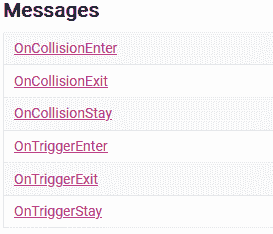
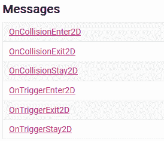

# 游戏开发第 12 天:OnCollisionEnter 和 OnTriggerEnter 的区别！

> 原文：<https://blog.devgenius.io/day-12-of-game-dev-the-difference-between-oncollisionenter-and-ontriggerenter-d365f70c218d?source=collection_archive---------8----------------------->

**目的:**了解在什么情况下我可能要使用[**oncolisionenter**](https://docs.unity3d.com/ScriptReference/Collider.OnCollisionEnter.html)**和 [**OnTriggerEnter**](https://docs.unity3d.com/ScriptReference/Collider.OnTriggerEnter.html) 。**

**这篇文章将假设你对什么是**碰撞器**和 **Unity** 以及**硬表面碰撞器**和**触发碰撞器**之间的区别有所了解。如果你不知道上述主题，那么这篇文章会有些混乱。我有一篇名为“**游戏开发的第 11 天:Unity 中的碰撞和物理介绍！”**如果你需要的话，这将涵盖这些话题。**

**我将使用一些真实世界的例子来演示何时您可能想要使用**oncolisionenter**或 **OnTriggerEnter** 。**

**首先，**oncolisionenter**和 **OnTriggerEnter** 都内置在 **Unity** 的方法中，它们与碰撞器一起工作。它们主要用于在检测到两个带有碰撞器的游戏对象接触或撞到彼此的碰撞器时运行代码。又名他们**进入**彼此的“地带”。**

**假设你想在你的游戏中加入一个功能，当玩家撞到一堵本该让他们留在地图上的墙时，它会把他们向后推。有点像让玩家知道“嘿，你不能走这条路”的反弹。**

**您想在**上使用碰撞输入**还是**上使用触发输入**？让我们考虑一下。如果你使用 **OnCollisionEnter** 碰撞器将需要被设置为**硬** **表面碰撞器**而不是**触发碰撞器**。而如果你想用**控制输入**则相反。无论哪种方式，你都可以运行代码，如果玩家进入**硬表面碰撞器**或**触发碰撞器**，代码会将玩家弹回。但是根据你想要的感觉(在这种情况下是一堵固体墙)，最好使用**oncolisionenter**，因为碰撞器将被设置为一个固体表面，而不仅仅是一个触发器。**

**如果你想有一个电源，当玩家触摸它的时候，他们得到电源？如果你想使用 **OnCollisionEnter** 就像上面的墙壁例子一样，那么碰撞器必须设置为硬表面碰撞器。这意味着当你的玩家的碰撞器进入 power ups 碰撞器并调用 **OnCollisionEnter** 方法时，你可以运行你想要的加电效果的代码，但玩家会表现得好像加电是一个坚硬的表面，这意味着它会停止他们一会儿。大多数时候，这不是我们想要的感觉。我们希望玩家简单地走过或穿过它们，并在保持速度的情况下捡起它，例如在马里奥车上捡起一个电源。要做到这一点，只需使碰撞器成为**触发碰撞器**而不是**硬表面碰撞器**，并使用**触发输入器**而不是**碰撞输入器**。**

**在我结束这篇文章之前，我还想提一下还有其他方法可以用来检查其他类型的**碰撞**。从 [**官方 Unity API**](https://docs.unity3d.com/ScriptReference/Collider.html) 查看此列表！**

****

**例如，如果你想要一个熔岩机械师，如果玩家坐在熔岩中，你想要造成伤害，那么你会使用 **OnTriggerStay** ，因为它将使用**触发碰撞器**，而不是**硬表面碰撞器** **碰撞器**，允许玩家移动到熔岩中，同时还检查玩家是否停留在熔岩中，而不仅仅是检查玩家是否进入了熔岩！**

**如果你正在制作一个 2D 游戏，你使用了一个 [**碰撞器 2D**](https://docs.unity3d.com/ScriptReference/Collider2D.html) 来代替，那么所有的方法都还在，只是一个 2D 版本。**

****

**很酷吧？感谢 **Unity** 的伟大人们为我们制作了那些方法和对撞机系统，这样我们就不用再做了！**

**继续学习，我希望你能享受在游戏中实现这些以达到预期效果的乐趣。如果你需要，可以随时提问，我很乐意回答。**