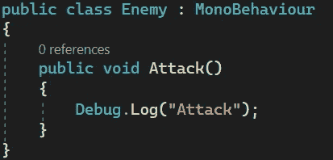
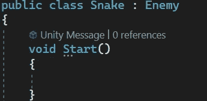
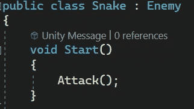
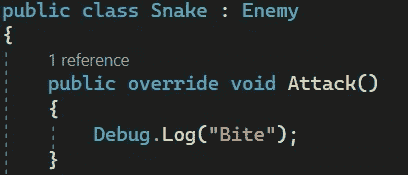
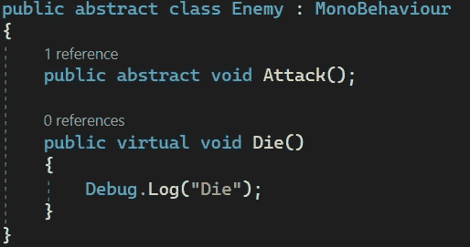
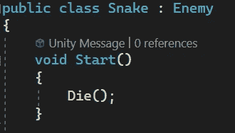
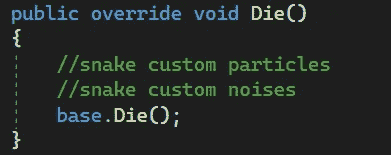

# 游戏开发的第 120 天:什么是抽象类和方法——c#？

> 原文：<https://blog.devgenius.io/day-120-of-game-dev-what-are-abstract-classes-and-methods-c-1f80f14c6585?source=collection_archive---------8----------------------->

**目的:**复习抽象类及其用途。

抽象类允许我们强制继承。抽象方法允许我们强制实现这些方法。

这意味着我们基本上可以创建一个继承类的模板，然后他们可以完成自己的添加。

我要举的例子是一个敌人职业，它将作为不同类型敌人的模板。然后我将创建一个继承敌人职业的蛇职业。

在非抽象或标准的类设置中，您会注意到，尽管一个类继承了另一个类，但调用基类方法仍然是可选的。

这里我有一个敌方类的 Attack()方法。

Snake 类可以选择使用该方法。

唯一的问题是，有时我们希望一个继承类使用一个方法，而不给它一个选项。我们如何设置它？

首先，我们需要确保这个类是一个抽象类。

请记住，如果一个类是一个抽象类，它不能被附加到游戏对象上。

仅仅这一点并不能使 Attack()方法成为 Snake 类的非可选方法。我们还需要将 Attack()方法抽象化。

请记住，抽象方法不能被基类赋予功能。取而代之的是，每个继承类将会选择它们赋予该方法什么功能。在这里，我在敌人类中声明了一个抽象的 Attack()方法，任何从它继承的类都将选择给 Attack()方法提供什么功能。

既然这个方法是抽象的，那么 Snake 类就会出现一个错误，提示您必须实现 Attack()方法。

这样做之后，错误就消失了，抽象方法的目的也实现了。

如果你想知道为什么我们必须把 override 放在那里，那是因为默认情况下抽象方法的行为就像虚方法一样，需要继承类来覆盖它的功能。关于重写方法和虚拟方法的更多信息，请查看我以前的[文章](/day-111-of-game-dev-overriding-methods-from-inheriting-classes-in-c-d54a429c1e30)。

现在你可能会问另一个问题:如果我们希望一些方法共享相同的功能，而不是被迫实现它们自己的功能，那会怎么样？

例如，假设在敌人类中有一个 Die()方法，Die()中的功能(大部分)在所有敌人中都是相同的，不像 Attack()方法会根据敌人的不同而不同。

不是抽象类中的所有方法都必须是抽象的。这意味着我可以用标准实现向我的敌人类添加一个虚拟的 Die()方法。

因为这个方法不是抽象的，所以我没有被迫在 Snake 类中调用它。但是如果我想调用它，因为它是虚拟的，我可以像平常一样调用它，这将默认调用基类的(敌人)实现。

或者我可以覆盖它，调用基类实现，并根据它是什么敌人添加我自己的定制代码。

您也可以只添加自定义代码并完全覆盖 Die()方法，而不是像上面那样添加。

我希望这能帮助你更好地理解抽象类。如果你有任何问题或想法，请随意评论。让我们制作一些令人敬畏的游戏！