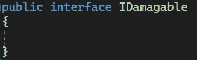

# 游戏开发的第 121 天:什么是接口——c#？

> 原文：<https://blog.devgenius.io/day-121-of-game-dev-what-are-interfaces-c-8763dd9b7855?source=collection_archive---------7----------------------->

**目标:**回顾什么是接口，它们通常用于什么。

什么是接口？

接口，像抽象类一样，强制实现。你可能会听到接口被描述为契约，这是因为它们确实如此。当一个类被分配一个接口时，就像分配一个契约，这个类必须实现契约中的任何东西。

接口不能包含字段，只能包含方法和属性。

另一件要记住的事情是，接口通常遵循以“I”开始并以“able”结束的命名方案，例如:IKillable、IEdible、IPushable。

让我们来看一下如何设置接口。

首先，我将创建一个名为 IDamagable 的新脚本。

然后，为了让它真正成为一个接口，我需要用 interface 替换 class 这个词。请记住，接口不能继承 form MonoBehavior，只能继承其他接口。

接口的所有成员都被认为是公共的，不能有私有成员。另一件要记住的事情是，你不能添加字段，因为它们不允许出现在接口中。

尽管您可以添加属性。

你可以声明一个只有签名的方法，这是接口的标准做法。

如果需要，您还可以为该方法提供默认功能。

[演职员表](https://education.launchcode.org/csharp-web-development/chapters/interfaces-and-polymorphism/interfaces.html)

为了继续这个例子，我将创建一个玩家和敌人的职业。

那么接口的部分好处就是一个类可以继承尽可能多的接口。这非常有用，因为类只能继承一个类，如果你想从类外部获得更多的功能，接口可以帮助你。当涉及到使你的代码更加模块化时，这是非常重要的。

要让一个类继承一个接口，我们需要这样做:

尽管您会注意到一个错误

这正是我们需要界面做的事情。Player 类与 IDamagable 签订了合同，并且必须实现合同中的内容。这里说的是玩家没有实现它应该实现的。

您可以手动键入健康属性，或者让 visual studio 为您完成，然后删除它添加的“额外”内容。

再给你一个例子，在敌人类中，我将设置 2 个接口。

我希望这有助于你对接口的理解。如果你有任何问题或想法，请随意评论。让我们制作一些令人敬畏的游戏！