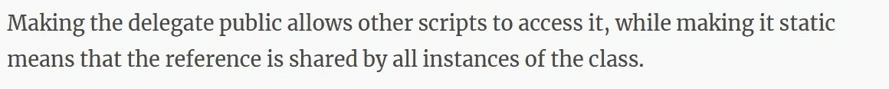
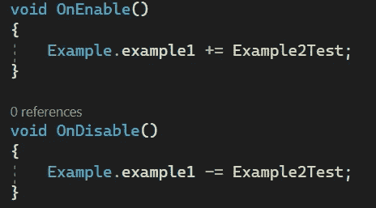
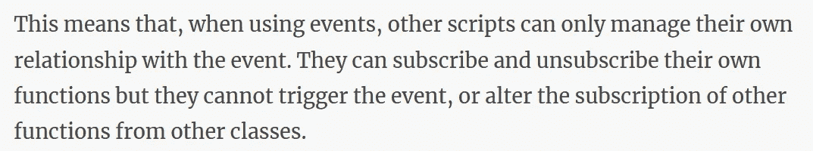
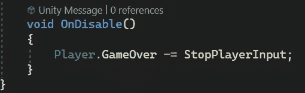

# 游戏开发的第 122 天:代表和事件——Unity/c#！

> 原文：<https://blog.devgenius.io/day-122-of-game-dev-delegates-events-unity-c-44225f250ffc?source=collection_archive---------1----------------------->

**目标:**回顾如何在事件驱动系统中使用委托和事件来创建更清晰的代码。

我的目标是把一个有点复杂的主题变成一种容易理解的格式。如果你好奇的话，我发现还有一篇更长的[文章](https://gamedevbeginner.com/events-and-delegates-in-unity/)，对我理解本文的主题非常有帮助。我从多个来源获得了我的信息，但是我发现上面的文章非常有帮助，我在这篇文章中引用了很多。这篇文章将包含很多信息，知道这些信息将非常有价值，所以请不要认为这是一个快速、快速、完成的话题。

具有讽刺意味的是，一旦你理解了这个概念，你可能会注意到它的代码实际上只有几行简单的代码。这篇文章将解释为什么代码是这样的，这样你就知道如何使用它，而不是复制粘贴它。

进入状态:

假设你有一个玩家可能死亡的小项目。当它们死亡时，你将不得不调用某些代码，而这些代码可能存在于多个不同的脚本中。例如，你可能必须让敌人停止攻击，也许时间计数器停止，关闭玩家输入，注册成就，并通过 UI 调出一些游戏。即使是在一个小项目中，也可能很多。我们怎样才能使我们的脚本更加模块化，联系不那么紧密，从而使它们不那么严重地依赖彼此？

[演职员表](https://gamedevbeginner.com/events-and-delegates-in-unity/)

使用委托和事件，我们可以创建一个事件驱动的系统。系统基本上可以让你有一个事件和事件监听器。不同的脚本将监听事件的触发，当事件触发时，它们将做出相应的反应。我们需要更直观地了解这一点，并更好地了解这种类型的系统还能提供什么。

[学分](https://gamedevbeginner.com/events-and-delegates-in-unity/)

要开始创建这个系统，我们首先需要了解什么是委托。它很像一个普通的变量，但它保存的不是 int 或 float，而是一个方法。我还应该提到它可以保存多种方法。我们一会儿会详细讨论这个问题。

让我们先看看如何声明委托。我们需要包含 delegate 关键字，并且不添加主体。它应该只有一个签名。

请记住，从类是蓝图而对象是蓝图的实际实例的意义上来说，这就像一个标准类。

基本上，在上面的代码中所做的是，我们为一个委托制作了一个蓝图，但是还没有使用这个蓝图实际创建一个委托。您可以在下面的代码中看到如何做到这一点。

需要记住的是:我制作的委托蓝图(通常称为委托类型)只能创建具有相同签名的委托。

签名/正文示例

如您所见，该委托属于 void 类型，没有参数。这意味着我只能从该蓝图创建返回类型为 void 且没有参数的委托。

现在我想创建一个测试方法，并将该测试方法分配给 Start()中的委托。请记住，委托保存方法就像普通变量保存 int 或 float 一样。

这里我们说委托现在等于 TestMethod()

如果我们想让 example1 委托像这样接受一个 int 参数呢？

我会得到一个错误，因为现在签名不匹配。该委托属于 void 类型，并接受一个 int 参数，而我试图分配给它的 TestMethod()属于 void 类型，但不接受 int 参数。

如果我让 TestMethod()接受一个 int 参数，问题就解决了。

我现在将从委托蓝图和 TestMethod()中删除 int 参数。

因此，我们现在所做的是创建一个代表蓝图。创建了该委托蓝图的实例(也称为对象)。然后我们给这个委托分配了一个方法。因此，如果从代码中的某个地方调用该委托，它将调用分配给它的 TestMethod()。到目前为止，它有点没用，也没什么特别的。但是我们将很快看到如何利用这一点，以及为什么它有助于创建干净的模块化系统，其中脚本不严重依赖彼此。

在我们前进的过程中，还需要记住一点:试图在没有分配方法的情况下调用委托将会导致空引用错误。因此，请确保像这样进行空检查:

或者用这个简写版本进行空检查。

您可以对当前实现做的一件事是更改分配给委托的方法。为了给你看一个例子，我有三种测试方法。

我会根据游戏中的输入给代表分配一个不同的。然后，每当我单击 space 时，我就调用委托，委托将调用分配给它的任何方法。

在游戏作品中测试它。

还不是超级有用。这是因为代理本身并不能真正用于创建一个完整的事件驱动系统。我们需要更多的东西来让它工作。

在我们继续讨论事件之前，非常值得一提的是，委托具有多播特性，这意味着我们可以为一个委托分配多个方法。我们可以添加多个方法，而不是像这样覆盖前面的方法。

现在，当我单击 Space 调用 example1 委托时，它将调用分配给它的所有方法。

好了，我们开始看到这在哪里更有用了。尽管目前我们只在这个脚本中调用方法。为了真正解决本文开头提到的问题，我们需要在某个事件发生时从多个脚本中调用多个方法，比如玩家死亡。

一种解决方案是当玩家失去所有生命值时调用游戏结束代理，理论上游戏结束代理会有与敌人、UI、玩家输入等相关的方法(来自多个脚本)。这将大大清理代码，无论是在视觉上还是在编程上，因为系统允许可伸缩性，并使代码更加模块化，因为代理充当媒介，脚本甚至不需要知道彼此的存在。

那么，我们如何将多个脚本中的方法连接到一个委托呢？

首先，委托需要是公共的和静态的，如下所示:

[学分](https://gamedevbeginner.com/events-and-delegates-in-unity/)

我将创建名为 Example2 的第二个脚本，这样您就可以看到如何从另一个脚本添加一个委托，不仅如此，还有一个静态委托。

因为委托是静态的，所以我可以使用引用在类级别访问它，而不是在实例(对象)级别。如果你感兴趣，我可以看看我的另一篇关于静力学的[文章](/day-113-of-game-dev-what-are-static-types-c-unity-13e3dbbd66a6)。

我知道在前面的例子中，我已经用不同的方式给委托分配了不同的方法，但是有一个最佳实践是使用 OnEnable 和 OnDisable 方法。

这将确保每当一个对象被启用时(发生在 Awake()之后但在 Start()之前)，方法被添加，并且当对象被禁用或销毁时，它将从委托中移除方法，因为您将由于不能访问不再存在的对象上的方法而得到错误。这意味着只有当对象实际存在时，它允许您访问分配给委托的方法，该方法才会被分配给委托，从而避免程序出错和内存泄漏。

请记住，无论您在代码中的什么位置向委托添加方法，都要确保这些方法以某种方式从委托中移除。

通过前面的设置，我们有了一个非常好的模块化系统，允许我们将不同脚本中的方法分配给一个委托，并在代码中的任何地方调用这个委托。如果你走到了这一步，就给自己一个鼓励吧！太多了。但是为什么你可以向下滚动更多呢？抱歉，这不是本文的结尾，因为还有一些事情需要“修复”或改进，以使这种类型的系统更好地工作。在您的项目中，您的实现可能会有所不同，但这不仅可以帮助您解决像我这样的系统所带来的问题，还可以帮助您理解其他选项。

这种类型的系统的目标是提供一个干净的代码，模块化的系统，虽然我们已经在一定程度上做到了这一点，但它仍然有一些问题可以很容易地解决。我们需要了解问题，然后再进行修复。

[学分](https://gamedevbeginner.com/events-and-delegates-in-unity/)

这里我给代表打电话。此外，我将它设置为 null，有效地删除了其中的任何方法。但是我是从 Example2 脚本中这样做的，它不需要这种能力。当谈到 OOP 编程中的最佳实践时，你不应该在不需要访问的地方提供访问。意外可能发生在代码不应该调用或干扰其他代码的地方，当涉及到你希望人们付费的专业项目时，值得确保他们的体验尽可能愉快，这意味着尽可能少的错误，尤其是很少或没有崩溃。我们如何限制这个委托的可访问性，同时又允许其他脚本将它们的方法分配给它？

我们可以活动。

我们需要将 event 关键字添加到委托实例中。

然后你会注意到另一个试图调用并使委托为空的脚本现在得到了一个错误，因为这是不允许的。

你可能想知道，为什么要使用委托呢？事件似乎是优越的，对不对？答案是:视情况而定。

[演职员表](https://gamedevbeginner.com/events-and-delegates-in-unity/)

回到最初的例子，玩家死亡需要通过 UI 触发游戏，移除玩家输入，阻止敌人攻击等等，我们现在可以很容易地做到这一点。

我用 GameOver 委托设置了一个玩家脚本。一个 UIManager 脚本和一个敌方脚本。给每个人一个测试方法，并在 OnEnable()中分配给他们。每当我点击“杀死玩家”的空格，所有的方法都会被调用。我还确保取消了 OnDisable()中方法的赋值。现在，将来添加或删除方法变得非常容易，代码遵循可靠的 OOP 原则。

我希望这篇文章能帮助你，并确保检查我在开始时链接的文章，因为那个人真的帮助我突破了我对这些主题的心理障碍。

***如有任何问题或想法，欢迎评论。让我们制作一些令人敬畏的游戏！***