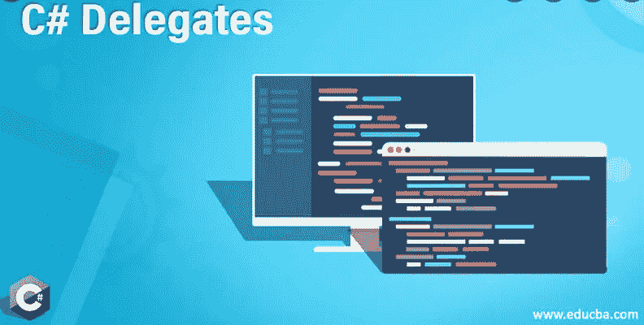

# 游戏开发的第 123 天:动作和函数类型委托——Unity/c#！

> 原文：<https://blog.devgenius.io/day-123-of-game-dev-action-and-function-type-delegates-unity-c-6eb832d0c21c?source=collection_archive---------9----------------------->

**目标:**回顾动作和功能类型的代理如何在创建代理时提供更多选项。

[图片来源](https://www.educba.com/c-sharp-delegates/)

动作允许我们用更少的代码创建事件类型委托。

这就是通常创建事件委托的方式。

首先，我创建一个 delegate 类型的蓝图，这样我就可以使用这个蓝图创建代理。然后我将创建一个名为 example 的实际可用的委托(对象)。

要创建一个动作，您需要 System 命名空间。

动作的语法略有不同。

如果您将鼠标悬停在动作类型上，您会注意到它也是一个委托。只是创造的方式不同而已。

如果您想在前面创建委托的方法中添加参数，可以这样做:

对于一个动作，你会这样做:

委托的动作类型基本上就是创建事件委托的简写版本。它们的工作原理几乎完全一样。与普通类型委托相比，事件委托的优势在于，事件允许其他类订阅或取消订阅事件，但不允许对委托进行任何额外的访问，从而提供了更高的安全性。你不会失去动作类型委托的功能。这只是后来添加的一种更简洁的写法。

函数委托非常相似，因为目标是缩短需要返回值的委托的语法。

如您所见，Func 类型是一种委托类型，它接受一个返回变量和参数。

这是手写版本。

这是使用 Func 类型的 delegate 的简化版本。

这基本上与动作做同样的事情，因为它被用来简化某些类型的委托的创建。Func 类型需要记住的一点是，当其他类访问它们时，它们不会提供与事件/动作类型相同的保护。

如本文前面所述，事件和动作类型允许其他脚本订阅和取消订阅事件，除此之外别无它用。使用普通委托和 Func 委托，其他类可以访问委托变量，并做他们想做的任何事情，比如将它设置为 null 或覆盖分配给它的内容，即使它与他们自己的类无关，这不是很好，但这是一种折衷，取决于你想要什么。

最后，你可能不得不尝试一些不同的选择，看看什么适合你的项目。记住，不要让完美扼杀了你的进步。有时候，实现一些可能需要以后修复的东西是可以的。这是学习的一部分。

***如有任何想法或问题欢迎评论。让我们制作一些令人敬畏的游戏！***