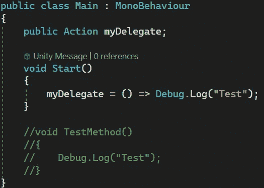

# 游戏开发的第 124 天:Lambda 表达式— Unity/C#！

> 原文：<https://blog.devgenius.io/day-124-of-unity-dev-lambda-expressions-unity-c-524dd467c2?source=collection_archive---------1----------------------->

**目标:**回顾什么是 lambda 表达式，以及我们如何使用它们。

Lambda 表达式就是其中之一。没错。我就知道这些。至少这是我最初的感觉，因为说实话，它们是一个相当高级的话题，我进入这个话题的时候，只是希望“理解”它，然后继续前进。

我们不仅会讨论如何使用 lambda 表达式，还会讨论为什么我们一开始会认为它们看起来有点像胡言乱语？

我们将在委托的上下文中使用 lambda 表达式，因为它们经常一起使用。如果你感兴趣的话，下面链接的我之前的两篇文章非常广泛地讨论了这个话题。

 [## 游戏开发的第 122 天:代表和事件——Unity/c#！

### 目标:回顾如何在事件驱动系统中使用委托和事件来创建更清晰的代码。

blog.devgenius.io](/day-122-of-game-dev-delegates-events-unity-c-44225f250ffc)  [## 游戏开发的第 123 天:动作和函数类型委托——Unity/c#！

### 目标:回顾动作和功能类型委托在创建委托时如何提供更多选项。

blog.devgenius.io](/day-123-of-game-dev-action-and-function-type-delegates-unity-c-6eb832d0c21c) 

我们将复习转换代理的动作和函数类型。请记住，动作类型是一种专用委托，它简化了创建 void 返回类型的事件类型委托的过程。Func 类型是创建带有返回值选项的普通委托的委托。我们还将讨论带参数和不带参数的 Action 和 Func 类型的转换。

做好准备，因为如果你像我一样是一个初级开发人员，那么你可能会进入 lambda 表达式，当解释它们时，我们不知道的其他单词也会被抛出，例如，匿名方法和内联方法。让我们回顾一下这些，以便更好地理解 lambda 表达式的用途。

什么是 lambda 表达式？

[演职员表](https://docs.microsoft.com/en-us/dotnet/csharp/language-reference/operators/lambda-expressions)

[演职员表](https://www.infoworld.com/article/3516071/how-to-use-lambda-expressions-in-csharp.html)

好的，如果你和我一样，你听说过:“Lambda 表达式就像另一个东西，我不知道，但是更干净”

所以我们来问一个问题，什么是匿名方法？

[学分](https://www.geeksforgeeks.org/anonymous-method-in-c-sharp/)

好了，我们现在知道的是，lambda 表达式是一个匿名方法的更干净的版本，它被用来创建一个内联方法，但是带有参数。嗯。

什么是内联方法..？

关注“带有移除原始方法声明的选项”的部分

“好吗？”已经成了我说到这个话题的常用表达。

看了一些文章，看了几个视频，这是我得到的:

总体思想是，lambda 表达式用于消除对提供更干净代码的单独定制方法的需要(在某些情况下)。让我们利用这些基础知识，看看它们是如何工作的。

我将从一个没有参数的动作委托开始。

在这个脚本中，我声明了一个动作委托。创建了一个自定义方法。然后，我将该方法分配给委托。这是我们大多数人最初学习的方式。

lambda 表达式的目标是消除创建单独的自定义方法 TestMethod()的需要。它将允许我们不必命名这个方法，并允许我们在需要时传递参数。

我们如何做到这一点？

让我们先看看最终结果，我将分解语法。

这里提供了与前面相同的功能，只是我们不需要创建一个单独的方法并命名它，这样对于像这样的小操作来说更简洁。

首先，我们说委托等于一些参数。这里我们没有任何想要传入的参数，所以括号可以留空。然后我们使用= >操作符，意思是“转到”。这意味着到目前为止，我们说委托等于一些参数，这些参数指向一些代码。然后代码是相同的调试。在自定义方法中设置的日志。我们在前面做了同样的事情，除了一行。我们不需要为它起一个名字，这个名字很好，因为它的操作非常简单。请记住，对于更复杂的方法，lambdas 可能不是您的最佳选择。

如果您愿意，还可以添加更多代码，如下所示:

不要忘记了；在{ }之后

让我们做同样的事情，但是使用一个带参数的**动作委托。**

这里我声明了一个接受 2 个 int 参数的委托。这意味着如果我想给它分配一个方法，这个方法也需要接受 2 个 int 参数。因此，我还创建了一个方法，将 2 个 int 相加，并将总和打印到控制台。然后，我在 Start()中将该方法分配给委托。我们如何使用 lambda 表达式来缩短它？

我注释掉了 CalculateSum()方法，并在这里使用 lambda 表达式做了同样的事情。就像上次一样，我接受委托，将它设置为一些参数(在这种情况下，我们实际上有一些参数)，并使用= >操作符来说明这些参数指向一些代码。在这种情况下，将两个整数相加，然后将总数写入控制台。

这里还有一些其他需要记住的事情。你不必明确地说参数 a 和 b 是 int 的。相反，它会自动检测它。无论哪种方式都有效，这取决于你。

如果你愿意，你也可以把整个表达式放在一行，就像这样:

如果我在 Start()中调用 Sum 委托，它就像应该的那样工作。

到目前为止，我们已经了解了如何使用带有 void 委托的 lambda 表达式，包括带参数和不带参数的情况。但是带参数和不带参数的返回类型委托又如何呢？

前面我们使用了动作类型委托，它用于创建空事件类型委托。如果我们想要一个返回值的委托，我们必须使用 Func 类型的委托。**让我们从返回一个值并且不接受任何参数的 Func 委托开始**。然后我们会继续讨论一个接受参数的函数。

这里我有一个返回 int 的 Func 类型的委托。我还有一个返回 int 的方法。然后我把这个方法分配给 Start()中的委托。

让我们把这个转换成 lambda 表达式。

就像其他人期望的那样，我在这里返回值，这意味着如果我想调用它，我需要把返回值赋给一个变量，就像这样:

让我们继续讨论带有参数的**返回类型。**

这里 Func 按顺序接受两个参数和一个返回类型。这意味着第一个和第二个 int 是参数，第三个 int 是我们想要的返回类型。

然后我有一个方法返回两个整型数的总和。最后，该方法被分配给委托。

让我们用一个 lambda 表达式来解决这个问题。

就像我之前说的，如果你愿意，你可以删除显式的 int 关键字，因为它会自动检测参数是什么。

然后，我可以将返回值赋给一个变量，并将该值从 Start()打印到 test。

值得注意的是，如果在任何时候 lambda 表达式看起来令人困惑，请记住= >意味着转到。参数转到下面的代码行，就像在普通方法中调用的代码行一样。

如果这个话题有点令人泄气，请不要感到气馁。不要介意花一些时间来巩固你的知识。我知道这会花费我更多的时间。

***如有任何问题或想法欢迎评论。让我们制作一些令人敬畏的游戏！***