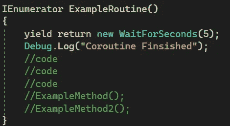
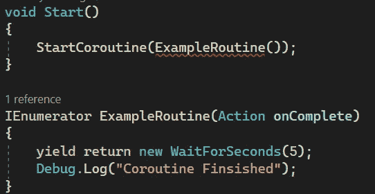

# Unity 开发的第 125 天:使用委托和协程的简单回调系统——Unity/c#！

> 原文：<https://blog.devgenius.io/day-125-ofunity-dev-simple-callback-system-using-delegates-coroutines-unity-c-8b83219577ea?source=collection_archive---------5----------------------->

目标:使用代理和协程创建一个系统，当事情结束时通知其他人。

[图片来源](https://www.avenga.com/magazine/future-csharp-programming-language/)

这将是一个简单的演示，可以很好地推断，为您的程序提供灵活性。虽然这是一个简单的演示，但是如果你不熟悉委托、动作、协程或 lambdas，请不要觉得太难了。如果你想熟悉这些话题，我会把它们链接到这里

[协程](/day-94-of-game-dev-how-do-coroutines-work-behind-the-curtains-507f11b4d6a7)篇

[代表们](/day-122-of-game-dev-delegates-events-unity-c-44225f250ffc)条

[动作和 Func 类型委托](/day-123-of-game-dev-action-and-function-type-delegates-unity-c-6eb832d0c21c)条

[Lambdas](/day-124-of-unity-dev-lambda-expressions-unity-c-524dd467c2) 文章

假设在我们的项目中，我们想在一个协程完成后调用一些代码。

如果需要，我们还可以加入一个或两个自定义方法。

但是，如果我们只需要一个在协程完成后运行的简单函数，并且我们不想创建一个像 ExampleMethod()这样的自定义方法来执行这个简单函数，但是我们也不想将所有代码都塞进协程中，那该怎么办呢？我们可以用一个动作+一个匿名方法(lambda 表达式)。

例如，在协程中，我们可以添加一个 Action 类型的参数。

正如你在这里看到的，我们得到了一个错误，因为当我调用协程时，我没有向它传递任何东西，这意味着我没有填充参数。

如果我在参数中将 onComplete 动作设置为 null，它就变成了一个选项。现在我可以调用协程，不管有没有传入那个参数。

附注:确保从协程中实际调用 onComplete 操作，并且在调用时对其进行空检查。

回到 Start()，当我调用协程时，我可以用两种不同的方式使用 lambda 创建一个匿名方法。

单线方式

多线方式

使用它，我不必为这些简单函数(或其他简单函数)创建一个带有名称的定制方法，也不必在我的协程中包含所有内容。虽然在大多数情况下，对于这样一个小例子来说，这并不是一个很大的改进。当你试图构建你的程序时，试着保持这种可能性。

我的协程易于阅读，代码被分离出来。现在，当我在 Unity 编辑器中按下 play 时，5 秒钟后，传入的动作委托中的代码将被调用

***如有任何想法或问题，欢迎评论。让我们制作一些令人敬畏的游戏！***