# Unity Dev 的第 126 天:什么是 LINQ——Unity/c#？

> 原文：<https://blog.devgenius.io/day-126-of-unity-dev-what-is-linq-unity-c-d9a74d5bb21f?source=collection_archive---------9----------------------->

**目标:**回顾 LINQ 的基础知识，包括它是什么，以及我们如何在 C#/Unity 环境中使用它。

注意:如果你不熟悉 lambda 表达式，语法可能会令人困惑。如果你只是想要 LINQ 的高级信息，你可以忽略确切的语法，但是如果你想使用它，并且不确定 lambdas 是如何工作的，请查看我以前关于它们的文章或其他来源，因为我假设你知道如何在本文中使用它们。

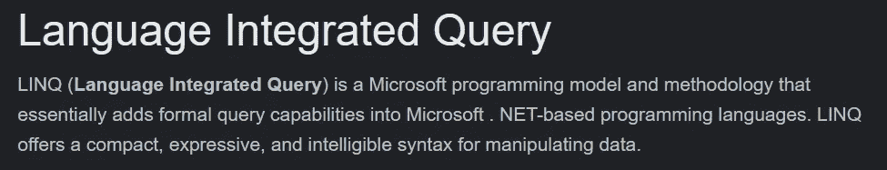

[演职员表](https://www.techtarget.com/whatis/definition/LINQ-Language-Integrated-Query)

LINQ 类似于 MySQL，它允许我们以更简单的方式过滤数据，特别是数组和列表。

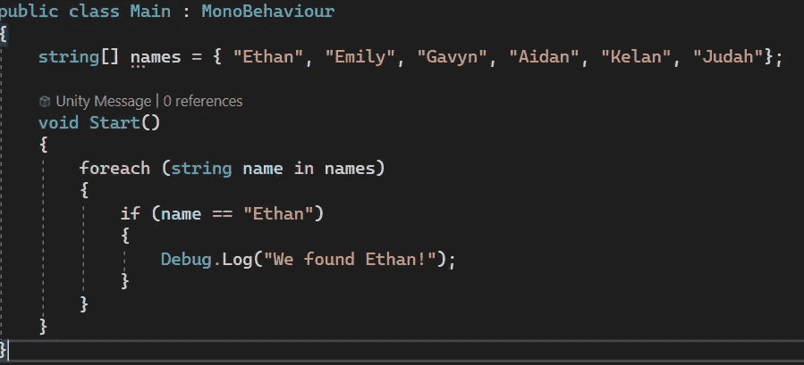

这是一个名称数组和一个查找某个名称的 foreach 循环。这是可行的，但是使用 LINQ 可以减少到 1 行代码(在 LINQ 命名空间之外，这是**系统。Linq**

我将移除 foreach 循环，并使用 LINQ 名称空间附带的 Any()方法来搜索我的名字。

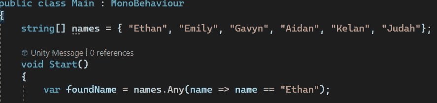

Any()返回一个布尔值，所以我们需要将返回值赋给一个变量。

要使用 Any()方法，我们需要访问数组，调用该方法并使用 lambda 表达式，返回一个等于 Ethan 的参数。如果 Ethan 存在于数组中，它将返回 true。

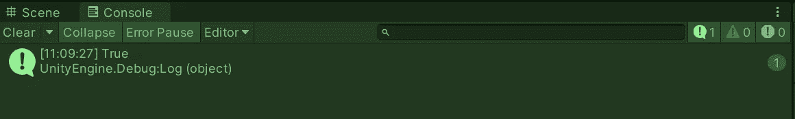

如果我输入一个不存在的名字，甚至拼错了 Ethan，那么它将返回 false。

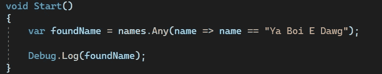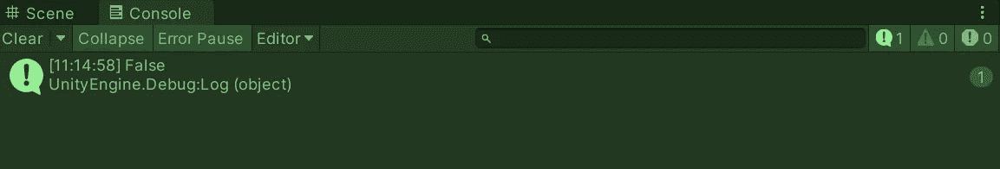

让我们再来看看我们能为 LINQ 做些什么！

您可以使用 Contains()方法做上面同样的事情，但是更简单。

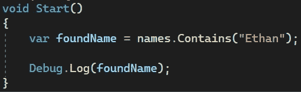

另一个有趣的方法是 Distinct()方法。例如，它基本上删除数组中的任何重复元素，只返回唯一的元素。

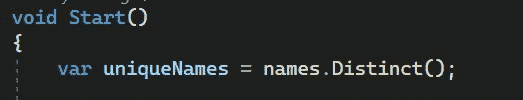

这里的返回类型是 IENumerable，它是一个集合，我们可以像数组或列表一样对其使用 forreach 循环。

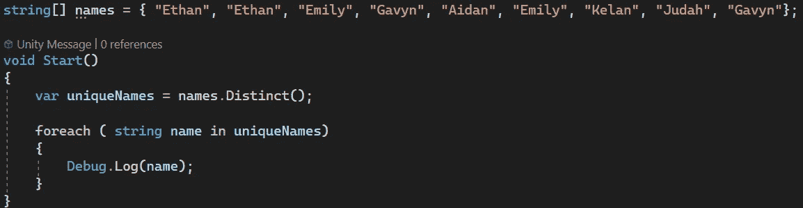

这里我有一个包含一些重复元素的数组。然后，我调用数组上的 Distinct()方法，并将该值返回给一个名为 uniqueNames 的新变量。最后，我只将唯一的名称打印到控制台进行测试。

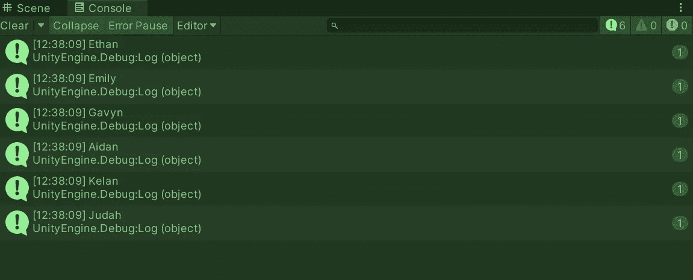

正如你所看到的，每个名字只打印一次，因为重复的已经被删除了。

还有稍微复杂一点的 LINQ 方法，Where()方法。像 Distinct()方法一样，它允许我们创建数组或列表的新版本。但与 Distinct()不同，它允许我们在整理这个数组或列表时使用一些设定的条件。

对于这个例子，我将返回一个新的数组，其中只返回长度超过 5 个字符的名字。

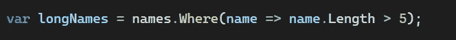

我在里面放了几个额外的名字，只有超过 5 个字符的名字会被打印到控制台上。

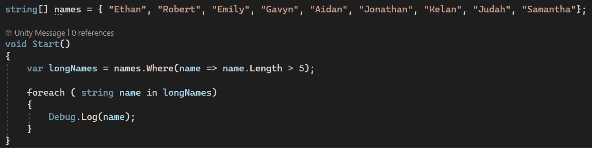

测试结果表明，它的工作。

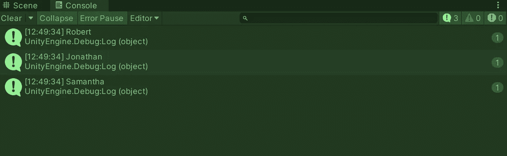

让我们复习一下另一个有用的 LINQ 方法。首先，我将为这一个设置场景。

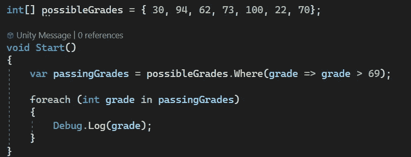

我有一个包含不同学生考试成绩的 int 数组。

然后使用 Where()方法，如果学生的分数高于 69，他们将被分配给 passingGrades 变量。

最后，我将每个及格分数打印到控制台，结果是这样的。

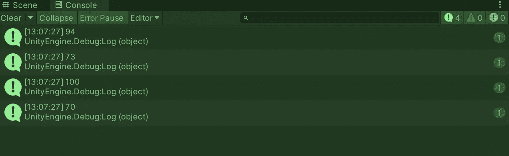

如果我想让这个新的及格分数数组按降序排列(从最高到最低)会怎样？

我可以使用 OrderByDescending()方法。注意:还有一个 OrderBy()方法，您可以对它进行更多的定制。

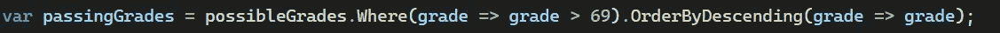

在 lambda 表达式中，我们不必检查条件，只需填充表达式即可。现在，当我在 Unity 编辑器中按下 play 时，这就是结果。

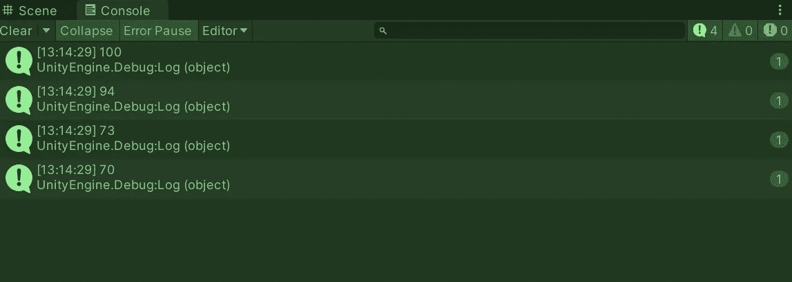

如果我想从最低到最高，我可以在最后加上 Reverse()方法。

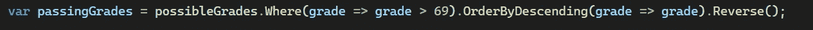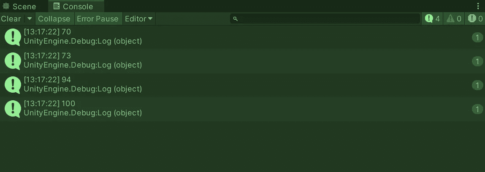

另一个很好使用的 LINQ 方法是 Average()方法，它将返回某些东西的平均值。

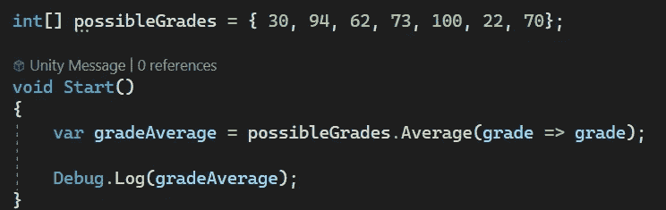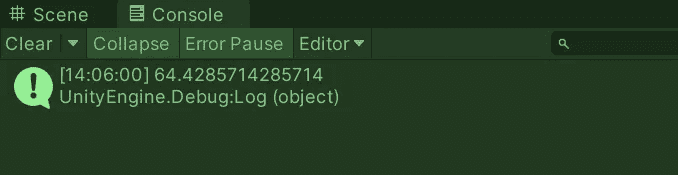

需要注意的是，LINQ 有两种不同的语法，倾向于使用它。有我在这篇文章中使用的方法语法和查询语法。请记住，它们的功能稍有不同，你想用什么取决于你自己。我会说方法语法在我看来更干净，但是 LINQ 的大多数官方文档倾向于使用查询语法，这可能是因为它有额外的功能。相信我，一开始看起来很奇怪，但它们没什么不同。

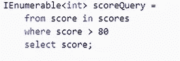

查询语法

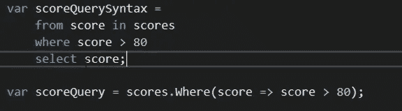

查询语法到方法语法的转换

微软有一些很好的信息，告诉你在两个不同的语法版本之间，什么会影响你的决定。

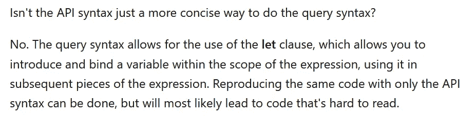

这里他们指的是 API 语法，它与本文通篇使用的方法语法相同。

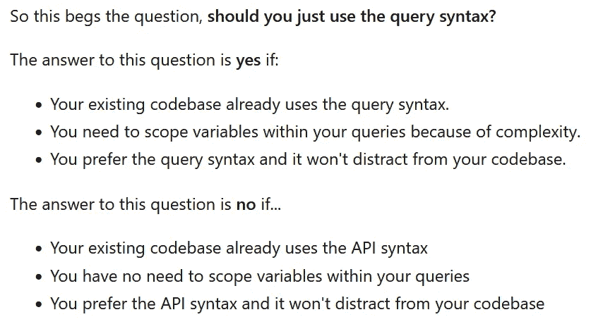

***希望这有助于你对 LINQ 的了解！如果你有任何问题或想法，请随意评论。***