# 游戏开发第 128 天:MonoSingleton — Unity/C#！

> 原文：<https://blog.devgenius.io/day-128-of-game-dev-monosingleton-unity-c-83ecc8775072?source=collection_archive---------5----------------------->

**目的:**复习什么是单体及其用途。

[图片来源](http://www.unitygeek.com/unity_c_singleton/)

本文假设你知道什么是 singleton 以及如何设置它。如果你需要的话，我的[前一篇文章](https://medium.com/dev-genius/day-127-of-unity-dev-singletons-unity-c-781e8c34adf0)涵盖了这个主题，并且与本文一起很好地工作。你可能还想知道什么是泛型，但这不是绝对必要的。

MonoSingleton 基本上是一个单例生成类。我的意思是，你可以创建一个单例类，它是一个将其他类变成单例的模板，省去了在每个你想成为单例的类中重复单例创建过程。

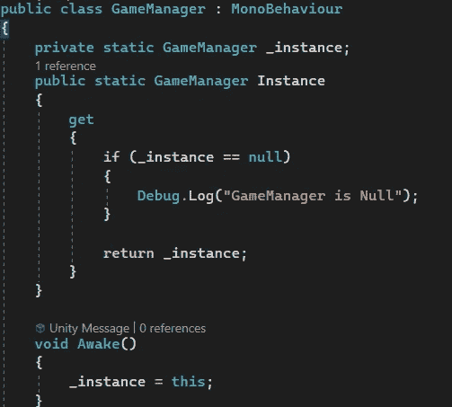

比如，这个 GameManager 类被做成一个 singleton。你必须在每一个你想成为单例的类中都这样做。或者我们可以创建一个新类，它传入另一个类并自动将其转换为 singleton，这样我们就不必这么做了。

但是我们如何设置它呢？

我将首先创建一个名为 MonoSingleton 的新脚本。

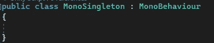

因为这个类将作为一个可定制的模板，我应该使它成为一个抽象类。

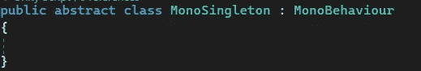

接下来，我需要让这个类接受一个泛型类型，这意味着任何类都可以被传入，成为一个单例。

这意味着在我的 GameManager 脚本中，例如，我将从 MonoSingleton 继承并作为类型传递给 GameManager，它将把它转换成 Singleton。

我可以在任何课上做到这一点。请记住，到目前为止，MoneSingleton 类还没有真正做任何事情。我们仍然需要设置它。

从这里开始，我只需要像往常一样创建一个 singleton，除了我没有在我想要成为 singleton 的类中进行硬编码，而是使用传入的任何泛型类型。

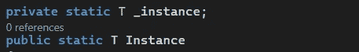

T 变量代表泛型类型，我们已经设置好了，T 变量等于传入的任何类(类型)。

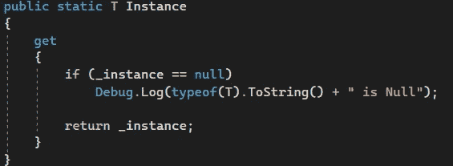

同样，这里我用 T 变量来表示一切。你会注意到，在处理泛型类型时，有一些小夸克让它们做你想做的事情，但是一旦你意识到这一点，事情就变得非常简单了。这个调试还有一个很酷的地方。Log，因为它使用的是通用类型，取决于它是 GameManager 还是其他类型的类，它会告诉你哪个类是空的。所以它会说“游戏经理为空”或“UIManager 为空”等。

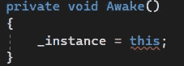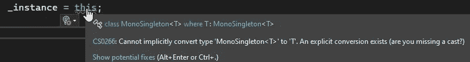

最后，我们必须将 _instance 设置为这个类。唯一的问题是我们得到了一个错误，那是因为它被 T 是什么搞混了，所以我们只需要对它进行造型。这里有两种不同的方法来铸造它，两者的工作原理相同。

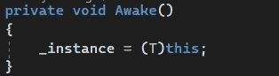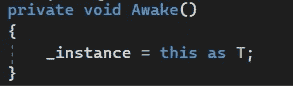

使用前面的同一个例子，GameManager 类将继承 MonoSingleton 类，并自动转换为 Singleton 类。因为 MonoSingleton 继承了 MonoBehavior，所以 GameManager 也将继承 MonoBehavior。

我将为 GameManager 类放入一个示例变量，并尝试从我的 Player 类访问。

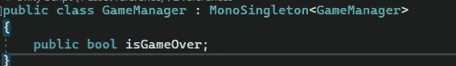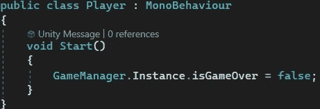

它运行得非常好。

***如有任何想法或问题，欢迎评论。让我们制作一些令人敬畏的游戏！***