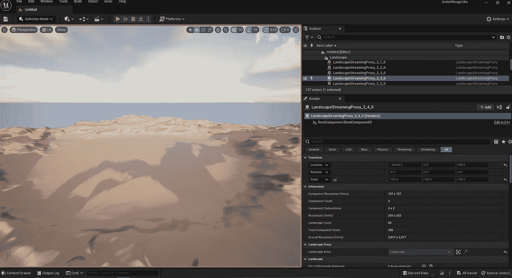
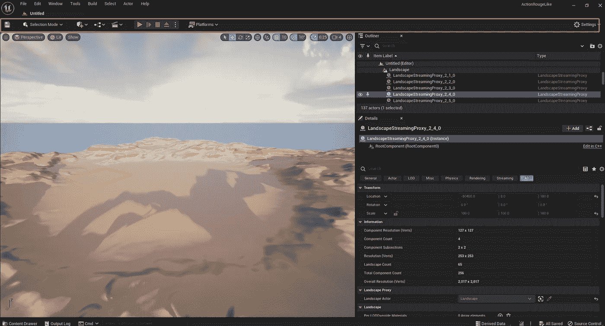
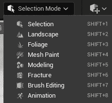
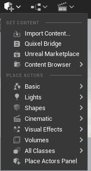
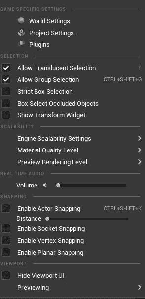
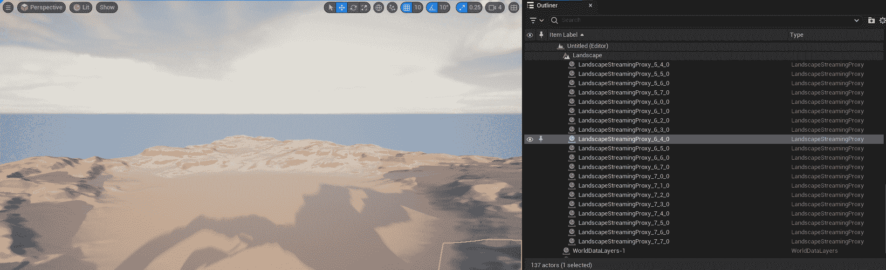
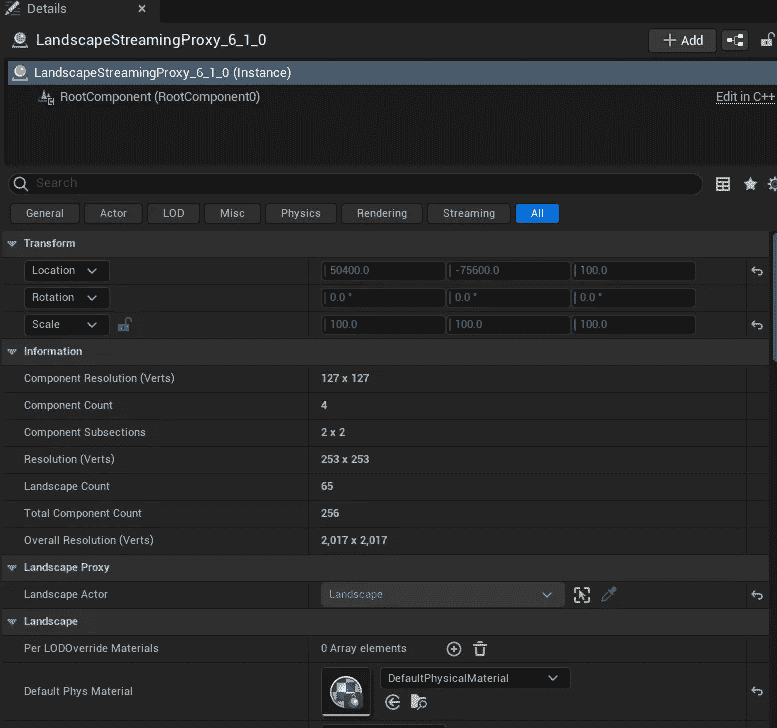
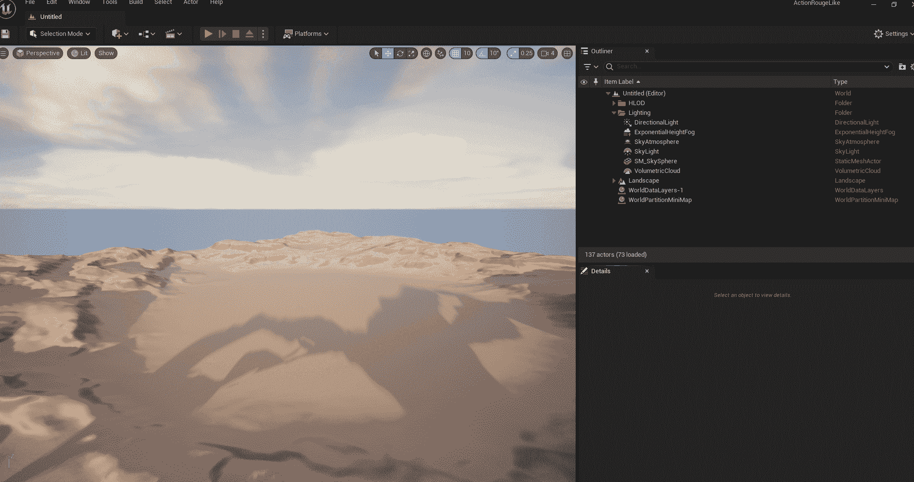

# 游戏开发的第 129 天:虚幻引擎 5 编辑器概述。

> 原文：<https://blog.devgenius.io/day-129-of-game-dev-unreal-engine-5-editor-overview-bafdd24bec7c?source=collection_archive---------14----------------------->

**目标:**虚幻引擎 5 的编辑器窗口简介。

如果你是新来的，这篇文章会给你一个快速更新的不同编辑器窗口。你不需要，但是如果你熟悉 Unity，那么我也会将这些窗口与 Unity 等同物进行比较。

开始我们有**视窗**。在这里，你可以直观地看到你所创建的游戏，并且可以在你的世界中放置物品。在这个窗口中有许多其他的设置，像游戏视图，沉浸式模式，摄像机视角，以及用于调整对象的位置，旋转和缩放的对象编辑工具。Unity 等同于场景视图/游戏视图窗口。

接下来我们有工具栏。工具栏包括选择模式等设置，用于编辑或处理不同的对象。

此外，快速添加按钮允许我们快速添加对象的基本版本到我们的场景中。

工具栏还有一些其他设置，比如用于选择当前构建平台的平台按钮。“设置”按钮在最右边，那里有很多你可能会用到的窗口，比如项目设置。这相当于 Unity 的工具栏。

移动到大纲视图窗口。这相当于 Unity Hierarchy 窗口。该窗口包含场景中的所有对象。可以将对象组织到文件夹中，并将其视为仅用于场景中对象的文件结构。

基于您在大纲视图窗口中选择的对象，该对象的详细信息将显示在详细信息窗口中。这相当于 Unity 的检查员窗口。在这里，我们可以看到所选对象的位置、旋转、缩放和组成该特定对象的其他组件。

这里我们要看的最后一个主窗口是内容抽屉。这在视觉上类似于大纲视图窗口。你可以用 ctrl + space 热键点击打开它(假设你没有设置它总是打开)。

与大纲视图窗口类似，内容抽屉基本上是游戏对象的文件结构。两者之间的区别在于大纲窗口仅保存您工作的特定场景中的对象，而内容抽屉保存所有脚本、贴图、纹理和项目中的几乎所有内容。通常，您可以将内容抽屉中的任何内容拖到正在处理的特定场景中，然后该对象将显示在您的场景和大纲视图窗口中。Unity 的对等物是项目窗口。

有很多方法可以定制你想打开的窗口，你想在哪里打开窗口，以及所有有趣的东西。

***希望这能帮助你更快地在虚幻中工作！让我们制作一些令人敬畏的游戏！***