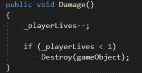
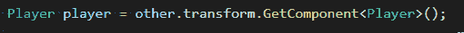
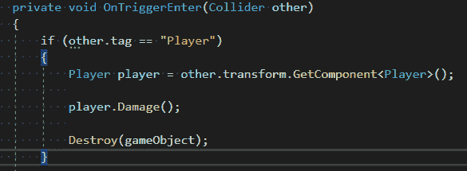

# 游戏开发的第 13 天:使用 GetComponent()在脚本之间进行通信！

> 原文：<https://blog.devgenius.io/day-13-of-game-dev-communication-in-between-scripts-using-getcomponent-349e837c5e6b?source=collection_archive---------16----------------------->

**目的:**通过使用 **GetComponent()** 进行通信来修改或使用另一个脚本中的数据。

我将在一个 2D 银河射击游戏的上下文中使用 **GetComponent()** 。当然，它也可以很容易地应用到您的项目中，这里有一个 GetComponent**()**上官方 [**Unity API** **的链接，这对我帮助很大。**](https://docs.unity3d.com/ScriptReference/Component.GetComponent.html)

**重要！请记住，当你在检查器中查看一个游戏对象时，你会看到变换、碰撞器、刚体、脚本或其他任何东西，它们都是组件。例如，如果你想访问另一个对象的脚本，你可以使用 **GetComponent()** 并将其保存到你的脚本变量中。这是这里的基本概念。请记住，您应该能够在另一个游戏对象拥有的、您需要访问的任何组件上使用 **GetComponent()** 。**

正如你在这里看到的，我在**玩家脚本**上有一个**伤害()**方法。想让**敌方脚本**在敌方与玩家碰撞时调用**伤害()**方法。**敌方脚本**要如何调用另一个脚本拥有的方法？简单，使用 **GetComponent()** 允许脚本进行通信(共享数据)。

在**敌方脚本**中的 **OnTriggerEnter()** 方法将生成一个名为 player 的 Player 类型变量。然后我会使用 **GetComponent()** 将它“=”设置为**播放器脚本**。

因为我是从 **OnTriggerEnter()方法**中调用它的，所以我选择以这种方式使用 **GetComponent()** 。要从游戏对象中获取组件，你首先需要知道要从哪个游戏对象中获取组件。在我的例子中，在 **OnTriggerEnter()** 中，每当我与“ **other** ”游戏对象发生冲突时，我已经有了对它的引用。但是有时你会在碰撞或触发方法之外调用 **GetComponent()** ，所以你可能不得不用另一种方式来获得你想要的游戏对象组件。喜欢用 [**GameObject。Find()**](https://docs.unity3d.com/ScriptReference/GameObject.Find.html) 或 [**GameObject。FindWithTag**](https://docs.unity3d.com/ScriptReference/GameObject.FindWithTag.html) 然后使用游戏对象引用调用 **GetComponent()** 。

对于您的具体实现，我会阅读 API 并以最适合您的方式调用该方法。无论哪种方式，基本思想都是创建一个 Player 类型的变量，并使用 **GetComponent()** 将它" = "设置为**播放器脚本**。

因为我们现在引用了保存在我们的玩家变量中的玩家脚本，所以我们可以访问某些东西，在这个例子中是方法。如果这个方法被设置为 private，我们将无法访问它，但是因为它被设置为 public，我们可以从**敌方脚本**中调用 **Damage()** 方法，如下所示:

上面的代码意思是当敌人的‘对撞机’进入玩家的对撞机或者反之，我们会从**玩家脚本**中调用 **Damage()** 方法然后敌人就会被消灭。如果你之前没有注意到，玩家有 3 条生命，并且处理自我毁灭的代码。我们只需要从**敌方脚本**中调用**伤害()**方法。

厉害！这就是我们如何使用 **GetComponent()** 从其他脚本中访问数据！我希望这能帮助你，如果你有任何问题，请随时提问！