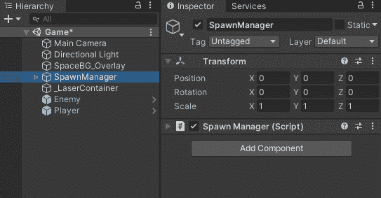
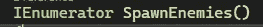
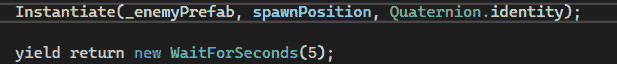
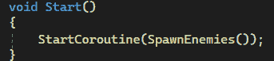

# 游戏开发的第 14 天:如何在 Unity 中使用协程产生敌人！

> 原文：<https://blog.devgenius.io/day-14-of-game-dev-how-to-spawn-enemies-using-coroutines-in-unity-b37b9b071910?source=collection_archive---------8----------------------->

**目的:**设置一个**协程**每 5 秒产生一个敌人。

[**协程官方统一 API**](https://docs.unity3d.com/ScriptReference/Coroutine.html)

注意，老实说，我在理解一个**协程**是做什么的以及如何从 **API** 中使用它时遇到了一些麻烦，所以我会推荐一些 YouTube 视频或一些可能对你更好的东西。大多数情况下, **Unity API** 很容易理解，但是请记住, **Unity** 上有大量的资源！

在我的 2D 银河射击游戏中，我想每 5 秒钟产生一个敌人。在实际设置**协程**代码之前，我想做一些事情。如果您只想要**协程**代码，那么现在跳到粗体标题为“**设置协程代码！”**

让我们考虑一下。如果我需要一些代码来管理正在繁殖的敌人，我需要这些代码吗？在播放器上？在敌人身上？

好吧， **OOP** ( **面向对象编程**)的一个最佳实践是使用一个编程模型 **C#** 使你的所有脚本模块化，这意味着每个脚本服务于一个目的。因此**玩家脚本**处理与玩家相关的一切，而**敌人脚本**处理与敌人相关的一切，仅此而已。将代码模块化的做法使得阅读、调试等变得更加容易，因为一切都更有条理。如果播放器有问题，你不必去看每个脚本，因为你知道所有与播放器相关的代码都在**播放器脚本**中。请记住，这是一个最佳实践，但并不总是 100%可以实现，因为不同的脚本会相互引用，并且可能会出现其他特定的情况，但这确实比什么都不做更有条理。

回到我们可能希望产卵代码被设置的地方:如果这个产卵代码被连接到一个特定的敌人，那么我们实际上只能在敌人在场景中的时候从那个脚本中调用任何东西。也就是说，如果我们杀死了一个有产卵脚本的敌人，代码就不能被调用了。将代码放入**播放器**或**敌人脚本**中是没有意义的。

请记住，从 **MonoBehaviour** 继承的脚本只有在附加到场景中的游戏对象时才能工作或调用它的任何代码。

如果我们做一个不会被破坏的空游戏对象，在这个对象上放一个新的脚本，代码是用来繁殖敌人的，会怎么样？然后，我们都实现了一种模块化的设置方法，因为只有该脚本将负责管理游戏对象(在这种情况下是敌人)的生成，并且由于空的游戏对象将始终在场景中，它还将处理我们之前遇到的问题，即场景中的什么对象需要附加脚本。

因为这种产生游戏对象的方法在 Unity 中很常见，所以我会走这条路，做一个空的游戏对象**，并把它叫做 **SpawnManager** 。我还将创建一个名为 **SpawnManager** 的脚本，并将该脚本附加到**空游戏对象**。为了便于组织，我将把现在称为 **SpawnManager** 的空游戏对象设置为场景中的 0，0，0 位置。**

****

****现在进入设置协程代码！****

**在 **SpawnManager** 脚本中，我需要创建一个类型为 **IEnumerator()** 的方法，我将其命名为 **SpawnEnemies()** 。**

****

**在 **SpawnEnemies()** 方法中，我想设置一个“ **while 循环**”。因此，如果一个条件为真，那么一个" **if 语句**"调用一些代码，但是当一个条件为真时，一个" **while 循环**"调用代码。这使得 **while 循环**更适合倒计时或数字之类的东西，因为它更容易阅读，而且就是为此而设计的。**

**小心，你可能会意外地制造一个无限循环，导致 **Unity** 崩溃。在使用 **while 循环**之前，确保查看 **while 循环**以及什么是无限循环。你需要设置一个 **while 循环**来离开或结束循环，这样就不会使 **Unity** 或你的应用程序崩溃。**

**在这种情况下，由于 **while 循环**嵌套在**协程**内，我们可以使 **while 循环**成为一个“无限”循环，因为它的条件总是真。虽然这通常会导致崩溃，如果 **while 循环**在这个**协程之外，**因为它在**协程**之内。这是因为无论 **while 循环**是否嵌套在**协程**中，都需要一个 **yield 语句**。这意味着你必须时常停止**协程**，使得 **while 循环**也停止，因为它嵌套在**协程**中。**

**当你学习如何使用一个**协程**时，你会更明白我的意思，所以不要紧张。**

**那么我想让循环做什么呢？我想让它每 5 秒产生一个敌人。我将使用 **Instantiate()** 来生成它们，在生成 1 之后，我将放入一个**协程**需要的**产出语句**。**

****

**正如你可能注意到的，在那个 **WaitForSeconds()方法**中，我加入了 5，因为我想每 5 秒钟产生一个新的敌人。**yield return new WaitForSeconds()**是我刚才说的 **yield 语句**，它的基本意思是在那一行停止代码，等待 5 秒钟再调用它。**

**最后，我们实际上不得不称这个**为协程**。到目前为止，它只是一个从未被调用过的方法。因为我不想每一帧都启动这个**协程**，所以我不会从 **Update()** 中调用 **SpawnEnemies()** 。我将从 **Start()** 开始调用它。**

**调用**协程**有不同的语法方式，但我将使用的方式和我见过的大多数开发人员使用的方式是这样的:**

****

**我使用 **StartCoroutine()** 方法调用了我想要的特定**协同程序**(在一个项目中很可能有多个)。**

**当游戏开始时，将调用**协程**并运行方法中的所有代码，包括实例化一个敌人，让步 5 秒并重新开始。**

**我将为这个产卵特性添加更多的东西，比如在 while 循环中停止产卵的条件，但是当涉及到**协程**时，几乎涵盖了如何使用、生成和调用一个！有许多变化和情况可以设置一个**协程**，但这应该让你开始！**

****我希望这能帮到你，有什么问题尽管问！****