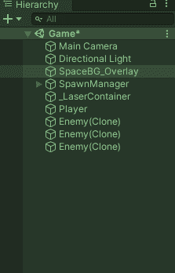
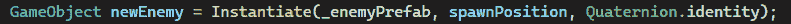
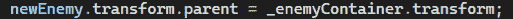
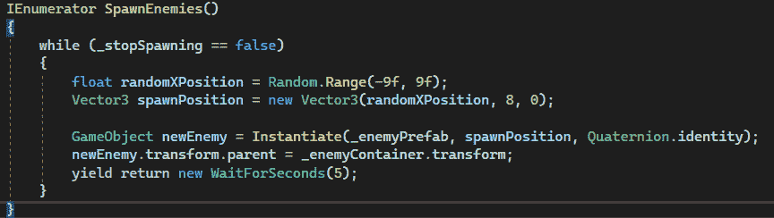
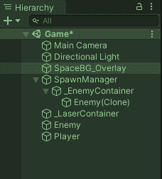

# 游戏开发的第 15 天:在 Unity 中生成对象，同时保持清晰的层次结构！

> 原文：<https://blog.devgenius.io/day-15-of-game-dev-spawning-objects-in-unity-while-keeping-a-clean-hierarchy-1817ed078def?source=collection_archive---------7----------------------->

**目标:**为我游戏中产生的敌人设置一个不填满**等级**的方法，让事情变得更加有条理。

这是一个**等级**在场景中产生敌人时的样子的例子:

随着时间的推移，随着不同的敌人或者力量或者其他我们想要产生的东西，这将会变得非常混乱。

老实说，我将要向您展示的这个特性让我大吃一惊，它只需要几行代码！直到最近我才知道这是可能的。

通常当清理一个**层级**时，你会创建一个新的**空游戏对象**并将其命名为“敌人”,你会将你所有的敌人作为那个**空游戏对象**的子对象，就像一个文件一样。这样你就可以打开和关闭空的游戏对象，这些对象就像一个文件夹一样保存着所有的敌人游戏对象，这样**层次结构**就不会那么混乱。但是如果敌人还没有出现呢？你不能将它们拖放到你创建的“文件夹”中，因为它们还不存在。

为了解决这个问题，我们首先需要一个**空游戏对象**来收集物品。其次，我们需要在这些游戏对象产生之后，让它们成为空游戏对象的子对象 **。让我们进入代码！**

在我的 **SpawnEnemy()** **协程**中，我每 5 秒就实例化一个新的敌人，如你所见。

我需要一个这些敌人的引用，这样我就可以让他们成为我的新**空游戏对象**(我称之为 _EnemyContainer)的子对象……老实说，在这一点上，我的头脑是混乱的。但后来有人给我指了条路！

我可以得到每个被实例化的游戏对象的引用！我所要做的就是创建一个类型为 **GameObject** 的变量，我想怎么命名就怎么命名(我把我的命名为 **newEnemy** ，并把它" = "设置为 **Instantiate()** **方法**，这就是生成游戏对象！我甚至不知道这是可能的。这也意味着每当一个新的敌人产生时，新敌人变量就会更新为新的敌人。

下面的代码将敌人的父对象设置为我们想要的游戏对象！就这么简单！

最终结果:

再一次，每当一个新的敌人产生时,**新敌人**变量被更新为" = "最新的敌人产生，这意味着每一个产生父对象的新敌人都被设置为我们制作的**新敌人**游戏对象！

现在看看在**层级**中发生了什么！

这么干净！在一个大项目中，大量不同的游戏对象被衍生和去衍生，这是非常有价值的。

**我希望你能从中学到一些又酷又新的东西，如果你有任何问题，欢迎提问！**