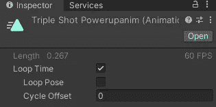

# 游戏开发的第 18 天:如何在 Unity 中激活精灵！

> 原文：<https://blog.devgenius.io/day-18-of-game-dev-how-to-animate-sprites-in-unity-7fd9e5885d6?source=collection_archive---------8----------------------->

**目标:** **使用**精灵** **工作表**制作**一个**精灵**的动画，并了解**动画**和**动画师**标签之间的区别。

请记住，这不是一个关于如何使用**动画**以及**动画**和**动画窗口**的详尽教程。这将涵盖什么是**精灵**以及如何使用**精灵表**来制作 2D 对象动画的基础知识，以及对**动画**和**动画窗口的简要概述。**

**Unity** 中的一个 **sprite** 就是一张图片。 **Sprite sheets** 是一系列图片，每张通常会略有差异。

如果我们将**子画面** **工作表**中的所有**子画面**按顺序排列并循环通过它们，我们就有了一个**动画**。

这和在一些便利贴上画一个棍子人并快速翻动它们的想法是一样的，这样看起来就像他在走路。但是我们如何在 **Unity** 中做到这一点呢？

**Unity** 使得用**精灵表**制作**动画**变得非常容易。确保你已经打开了**动画标签**，并且你已经选择(左击)了你想要制作**动画**的游戏对象。

单击“创建”创建一个新剪辑。我建议在主资源文件夹下创建一个“动画”文件夹。

回到**动画标签**点击录制，这样它就知道你想要开始编辑这个**动画剪辑**。

然后，您只需通过左键单击第一个精灵并按住 shift 键左键单击最后一个精灵，将所有不同的精灵拖放到**动画**窗口**中。这将使所有的动画按顺序排列，并在**动画**激活时播放。**

你可以点击“播放”按钮来播放**动画**而不在游戏视图中，甚至编辑**动画**但是大部分是为了一篇更长的文章。

当你对**动画**满意或者只是想暂时结束时，通过再次点击播放按钮点击停止。

默认情况下，**动画**将一直处于循环状态。要查看该选项，请在**项目标签**中找到您的**动画**，左键单击它，在检查器中您应该会看到循环选项。

另一个名为**动画师**的选项卡用于管理单个对象上的多个**动画**等等。你甚至可以用它来设置像布尔值这样的东西，它允许你判断什么时候**动画**应该通过代码播放。

请记住，当使用**动画师**或**动画**标签时，如果有东西关闭，请确保您选择了正确的游戏对象。

关于**动画**和**动画师**选项卡还有很多要说的，但这应该让你快速了解使用**精灵表**到**动画**精灵**精灵**的初始设置，以及**动画**和**动画师**选项卡的基本用途！

我希望这能帮助你，如果你有任何问题或建议，请随时提问。