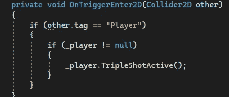
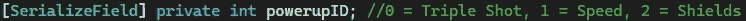
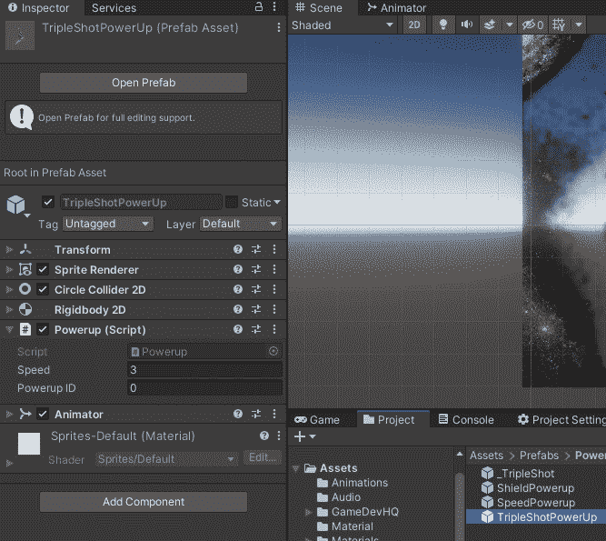
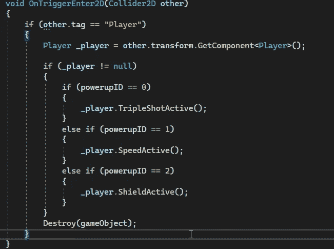

# 游戏开发的第 19 天:使我的启动代码模块化！

> 原文：<https://blog.devgenius.io/day-19-of-game-dev-making-my-powerup-code-modular-71447471bc51?source=collection_archive---------12----------------------->

**目的:**设置加电代码更加模块化，不重复代码。

请记住，在编程中有许多不同的方法来做同样的事情。这只是我使用的一种方法，它实现了更干净的代码的最终结果。

在我的 2D 银河射击游戏中，我有三个电源。一个三连击，一个加速和一个盾牌。每次开机都有相同的**开机** **脚本**。

在**加电脚本**中有一个 **OnTriggerEnter2D()** 方法，该方法将从**播放器脚本**中调用 **tripleShotActive()** 方法。这个方法调用了三次加电代码，但是我需要它知道玩家碰到了哪个加电，并调用那个特定的加电，而不是只调用三次加电代码。

我可以通过相同的代码为每个加电副本创建一个新的脚本，然后用给定的加电替换该方法。例如，如果是我的 speed powerup，我会用 speedPowerupActive()方法替换 tripleShotActive()。这是不必要的，想象一下，如果我们有 10 个电源。谈谈多余的代码。

我不打算这么做，相反，如果每个 powerup 方法都有一个唯一的整数与之配对会怎么样。这意味着我们只需要用 if 语句替换这个方法，而不是检查我们在你碰撞的物体上设置的整数值是多少。然后它将调用设置了整数的任何 powerup。

让我们通过创建一个名为 _powerupID 的 int 类型的私有变量来形象化地说明这一点。也使它成为一个[SerializedField],这样我们就可以从检查器中设置它。我要 0 =三连发，1 =加速，2 =护盾。

所以我会确保脚本附在我的每一个启动预置上。我将进入每一个不同的启动预设，并确保 _powerupID 在 tripleShotPowerup 预设上设置为 0，在 speedPowerup 预设上设置为 1，在 shieldPowerup 预设上设置为 2。

回到代码，在 **OnTriggerEnter2D()** 中，我会做一些 if 语句，检查玩家碰到的 powerup 的 _powerupID 是什么，并基于与之相关的 _powerupID 调用一个方法。

如您所见，如果 _powerupID 为 0，我们将调用 tripleShotActive()方法，对于其他 ID/powerup 组合，以此类推。

你可能会觉得这是一个很大的工作量，但请记住，我们只是避免了多行重复的代码，这将提高代码的性能和可读性。在一个真实的游戏开发环境中，你可能会有 3 个以上的电源，这比简单地复制代码效率更低。

此外，我已经添加了更多的电源，只需要几行代码，因为大部分已经存在了！

最后，这并不仅仅适用于电动汽车！任何使用已经在其他地方编写的代码的东西都应该在复制代码之前进行评估。有时，编写重复的代码可能是有意义的，但是如果可以避免的话，应该避免。

我希望这能帮助你的编程努力！编写干净的代码可能很有趣，但这需要一些时间，因为这肯定是一条学习曲线。请记住，在大多数现实世界的环境中，学习创建干净的代码是非常重要的，所以请确保不要走那些捷径！—除非是游戏堵塞，否则请黑客攻击:)