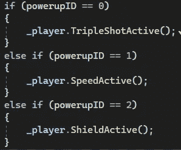
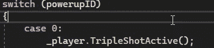
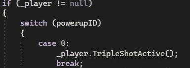
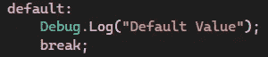
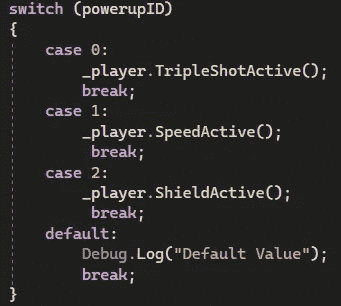

# 游戏开发的第 20 天:何时以及为什么使用 Switch 语句？

> 原文：<https://blog.devgenius.io/day-20-of-game-dev-when-and-why-to-use-switch-statements-871348120c44?source=collection_archive---------9----------------------->

**目标:**将我的 **if else 语句树**替换为一个 **switch 语句**用于清理代码。

这是我想要替换的 **if 语句树**:

一个 **switch 语句**的全部要点是基本上清理一个长 if **语句树**而不损失功能。根据我的经验，截止时间通常是 3 **if 语句**。

一个 **switch 语句**像一个**如果语句**检查一个条件，那么基于条件的值，switch 将调用你想要它调用的代码。除了它允许你输入初始条件的多个可能值，并基于当前值运行代码，但没有一堆 **if** **语句**带来的混乱。你也可以设置一个**开关**来提供更好的性能，但那是另一篇文章了。

一个**开关**的语法与你在 **C#** 中可能习惯的语法有一点不同，但并不疯狂。在你做出你的第 2 个**开关语句**之后。它变成了第二天性。

语法包括:声明开关，放入您想要检查的参数，建立一个 case 并破坏该 case，最后添加一个默认 case，但这是可选的。让我们仔细研究每一个问题，它们的含义，并将其形象化！

在我们声明了**开关**并放入我们想要检查的**参数**之后，我们需要建立一个案例。

在我的例子中，powerupID 是一个 int

每种情况都等于参数的值。因此，如果我们把情况 0:我们说，如果我们检查的参数= 0，然后调用这个代码。您想为每个案例调用的代码将放在案例下面。

然后告诉计算机你不想调用任何其他代码，在你调用的代码下面加上 break。你只是告诉计算机“这是基于我们检查过的参数，我想要调用的代码，所以脱离开关”。

您还可以将可选的默认案例(如果条件不是=则调用该案例)添加到您正在查找的任何案例中。

如果我用开关替换 If 语句，最终结果如下:

现在想象一下，我们有 3 个以上的 if 语句，比如可能是对话系统之类的。那将会有很多 if 语句和重复的代码。开关清理它，也可以提高性能！

我希望这能帮助你理解什么是开关以及何时使用开关！想和快乐编程的话随时提问:)