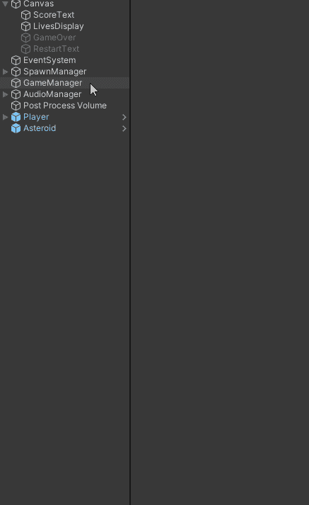

# 游戏开发的第 21 天:在 Unity 中轻松设置 UI！

> 原文：<https://blog.devgenius.io/day-21-of-game-dev-easily-setup-ui-in-unity-a51110f8f9bf?source=collection_archive---------15----------------------->

**目的:**使用 **UI** 给我的游戏添加一个玩家生命计数器和一个分数计数器。

注意:我将专注于制作 **UI** 并通过代码操纵它，而不是如何通过代码让玩家生命计数器和分数计数器。虽然我可能会展示其中的一些过程，但这里主要关注的是用户界面。

使用预建游戏引擎的明显好处和使用预建锤子的明显好处是一样的。它是为你制造东西而制造的，你不必担心制造工具本身。在这种情况下，我们可以使用 **Unity 的 UI** 系统来专注于制作一些令人敬畏的 **UI** ，而不必制作 **UI** 系统本身，除非你真的很奇怪并且喜欢这样做；)

为了开始使用 **UI** 系统，我们需要一个**画布**。这就是 **Unity** 用来保存所有 **UI** 元素并使它们“工作”的东西。

现在我已经有了**画布**，我可以添加其他 **UI** **元素**到其中。让我们从玩家分数计数器开始。以下是 **UI 元素**的选项:

**文本网格专业版(TMP)** 版本提供了更多的定制选项，并且是免费的。你只需要从包管理器下载它。在使用 **TMP** 版本时，你需要知道一些事情，但是对于本文，我们将只关注标准版本。

我需要一个**文本 UI 元素**来表示玩家的分数。我将右键单击**画布**并添加一个 **UI 文本元素**。改变字体，调整一下大小。然后，我希望文本位于右上角，如下所示:

要记住的一件事是你的 **UI** 在不同屏幕尺寸上的缩放。 **UI** 要么占据整个屏幕，要么离开屏幕，要么做一些你可能不想发生的事情。由于 **Unity 的**努力工作，很容易修复！

我们想要添加的任何 **UI** 都需要将**锚定到它的屏幕部分。我的意思是，如果玩家的屏幕尺寸不同， **UI** 将确保停留或**锚定**本身到你**锚定**它的屏幕部分。因此，在这种情况下，我会将我的文本锚定在右上角，这样当屏幕大小不同时，它将总是在右上角！**

记住**锚定**需要在你制作的每个 **UI 元素**上完成。我们需要更改的另一个设置只需要更改一次，它在**画布**本身上。在**画布缩放组件**内，将**恒定像素尺寸**更改为**随屏幕尺寸**缩放，这样 **UI** 也会随不同屏幕尺寸缩放。

通过代码实际更新这个文本对象将是另一篇文章。不要让这吓到你，我的意思是我想保持我的文章的重点:)

我也希望玩家生活计数器 **UI** 设置。对于这一个，我有一个艺术资产，所以我不需要使用标准文本。为了使我的艺术资产成为一个用户界面元素，我将从用户界面列表中添加一张图片，并用我的玩家生命精灵替换掉源图片。实际上我有 4 个不同的精灵，一个是当玩家有 3 条生命时，一个是 2 条生命，1 条生命和 0 条生命，我需要用代码来切换。

我会确保**锚定**它就像我的**文本 UI** 一样，但是在左上方。我的艺术资产的一个问题是，当我把它们做成一个 UI 元素时，它们是畸形的。在**图像 UI 元素**上，我需要检查“保留方面”及其修复。在我确定它的位置正确并且看起来不错之后，我编写了基于玩家当前生活交换精灵的代码。

当谈到 **UI** 时，我最不想涉及的是通过代码操纵它。就像碰撞器或其他类型的游戏对象一样，你可以在代码中引用它，如下所示:

要记住的唯一一件事是访问与 UI 相关的数据，您将需要这个名称空间:

这涵盖了在 **Unity** 中设置 **UI** 的基本内容！如果觉得很难，那是因为你的学习！这很好，随着你越来越熟悉，会感觉更容易。去鬼混，搞点恶心的 **UI** ！尽情享受吧，欢迎在评论中提问！