# 游戏开发的第 22 天:通过 UI 沉浸在简单的复古游戏中！

> 原文：<https://blog.devgenius.io/day-22-of-game-dev-immersion-with-simple-retro-game-over-ui-a9ecf6bc033e?source=collection_archive---------14----------------------->

**目的:**通过在行为上增加一个复古风格的游戏来增强我的 2D 银河射击游戏的感觉。我说的复古是指让它闪光。

我将从在文本上添加游戏的 **UI** 开始:

1.向画布添加一个文本元素。

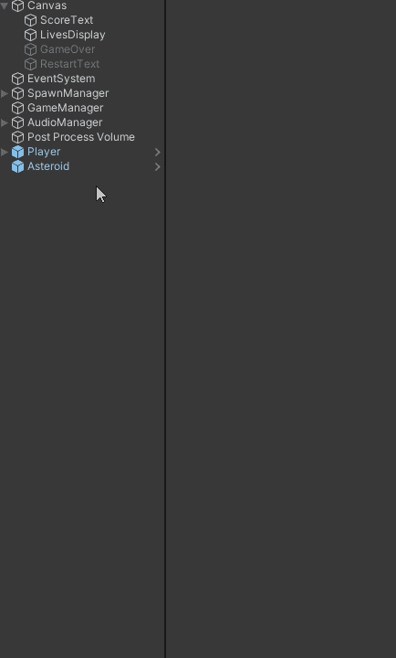

2.将文本改为游戏结束。(改变字体大小等。)

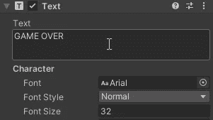

3.将文本放置在我想要的位置。

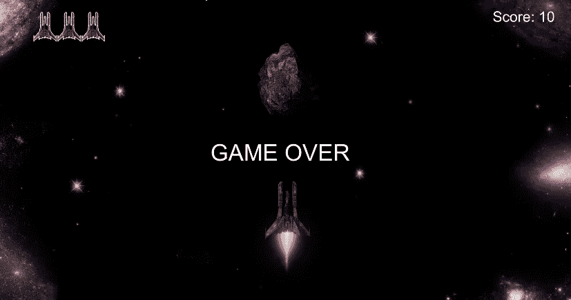

4.锚定它。

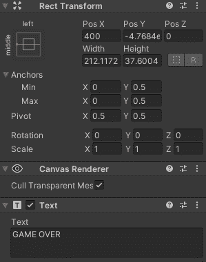

5.将游戏对象设置为非活动状态。

6.编码吧。

这里的编码非常简单。我有几个选项，但请记住，我只需要在游戏结束时，在屏幕上模拟一个文字闪烁的游戏。

我需要在我的脚本中引用游戏对象:

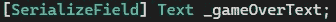

我可以每隔 0.75 秒启用/禁用文本，或者我可以操纵文本本身，这样每隔 0.75 秒文本就从“游戏结束”切换到“”(什么都没有)，然后再切换回来。在我的情况下，这两种方法都可以达到同样的效果。出于我自己的原因，我决定每 0.75 秒启用/禁用一次这个对象，但是你可以。代码需要从协程中调用，这样它才能继续重复。

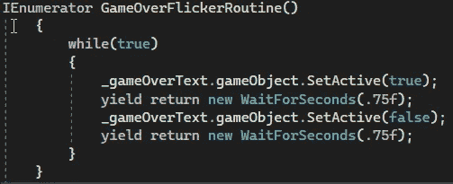

不管怎样，这段代码应该只在游戏结束时调用，这样你就不会看到“游戏结束”的文字一直闪烁。代码的最终结果将基本上是//如果游戏结束，然后开始在文本上显示游戏。我想通过来自 **UIManager 脚本**的文本来处理游戏，因为这将保持事情的整洁和模块化。这与从**游戏管理器脚本**通过文本用户界面操纵游戏形成对比，后者已经在寻找游戏是否结束。

因为游戏的相关行为是由“管理”游戏状态的**游戏管理器脚本**管理的，所以我需要在**ui manager**sc**r**ipt 中引用它。在 **GameManager 脚本**中，我有 **GameOver()** **方法**，它是公共的，所以我可以从其他脚本中调用它。这允许其他脚本知道游戏是否也结束了。

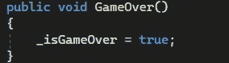

我将首先获取一个对**游戏管理器**脚本的引用，然后调用我用 **GameOver()** 方法制作的闪烁协程。

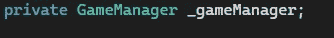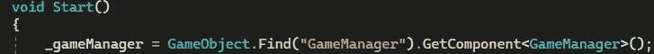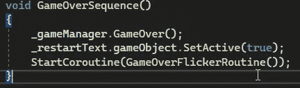

不要介意 _restartText 的东西(那是我做的一个单独的特性)

现在每当游戏结束，我们得到这个:

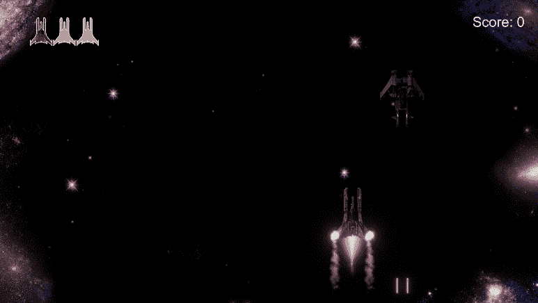

欢迎提出任何问题或提供任何建议，谢谢！我希望这有所帮助！