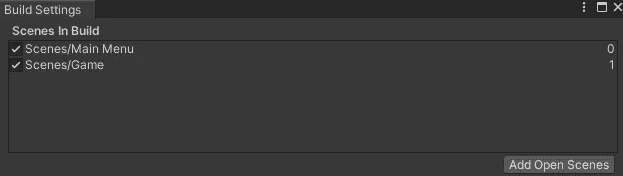
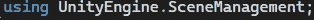
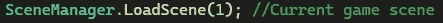
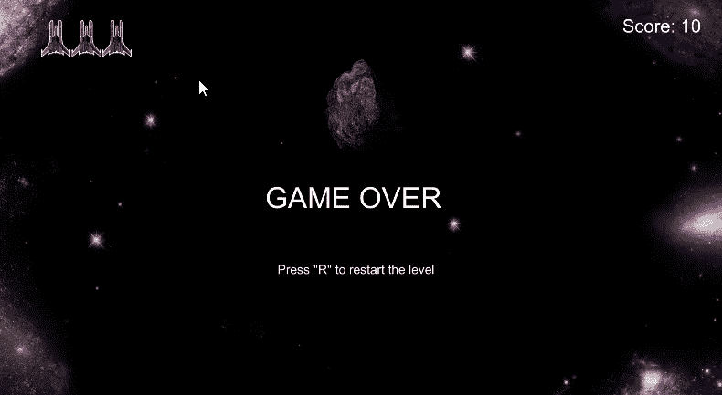
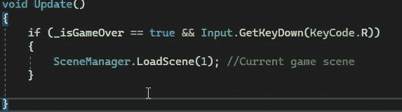

# 游戏开发第 23 天:如何通过代码加载 Unity 中的场景！

> 原文：<https://blog.devgenius.io/day-23-of-game-dev-how-to-load-scenes-in-unity-through-code-7193b42f9898?source=collection_archive---------9----------------------->

**目的:**每当玩家死亡时，为玩家增加重启功能。

载入不同的场景对大多数游戏来说是必不可少的，幸运的是，当涉及到 Unity 时，这非常简单。

首先，你需要确保你的场景被添加到构建设置中。从那里你可以看到你的场景分配给它什么索引。使用 UnityEngine 点击左上方的文件

Within the code you will need to have the **,进入构建设置。场景片段**名称空间:

然后在代码中任何你想改变场景的地方，你都可以调用**场景管理器。LoadScene()** 方法。在(括号)中，你可以放入你的场景的索引，也可以放入一个代表你的场景的确切名称的字符串。索引更有性能，所以我会推荐这条路线。然后它将读取 SceneManager。在我的例子中，LoadScene(1)是我想要加载的场景的索引。我还建议在方法调用的末尾添加一个注释，让其他开发人员或您未来的自己知道哪个场景正在被加载。

在我的游戏中，我想加载我们当前所在的相同场景(记住我想要一个重启功能)。我想只有当游戏结束时才能这样做，我想一些用户界面，让玩家知道，他们可以重新启动水平，当他们点击 r。

在将 UI 添加到我的场景中并确保它只在游戏结束时出现后，我想完成代码。

从代码中，我想调用**场景管理器。来自**游戏管理器脚本**的 LoadScene()** 方法，因为该脚本管理游戏的状态，例如:当游戏结束时。

当游戏结束时，我会启用重启文本。然后我会检查游戏是否结束，玩家按下 R 我会调用**场景管理器。LoadScene()** 方法将加载当前场景，有效地重启关卡。

用 UI 按钮而不是像“R”这样的键盘键来加载场景是非常相似的。应该有一篇专门的文章，但是基本的是调用一个包含 **SceneManager 的公共方法。LoadScene()** 方法。关于这个主题有很多资源，如果你想要一个播放器的 **UI** 按钮，我鼓励你去看看！

**本文到此为止。我希望这能帮助你，如果你有任何问题，请随时提问！做一些很棒的游戏！**