# 第 24 天的游戏开发:爆炸死亡的敌人！

> 原文：<https://blog.devgenius.io/day-24-of-game-dev-exploding-the-enemies-on-death-d7c2629a30ad?source=collection_archive---------7----------------------->

目标:给我的 2D 敌人添加一个爆炸动画，并清理任何可能随之而来的 bug。

最终结果在文章底部如果你想看的话！

我目前的设置是，每当敌人与玩家或玩家发射的激光发生碰撞时，敌人就会消失(通过代码被消灭)。

我想玩一个爆炸**动画**，然后消灭敌人，而不是让敌人诡异地突然出现。我有一个敌人爆炸精灵表，我将通过点击敌人并打开**动画**标签来制作一个**动画**。将所有精灵拖放到**动画**标签中。**动画**看起来是这样的:

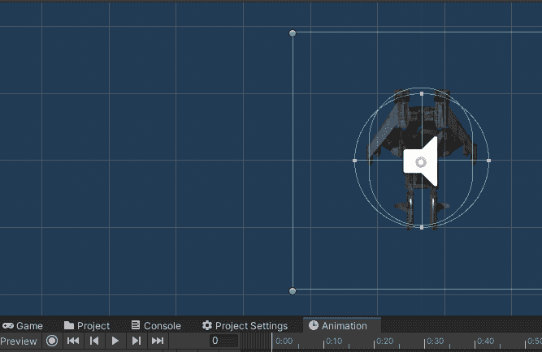

动画制作完成并保存后，我只想确保取消**动画**的循环参数，这样它就只播放一次。

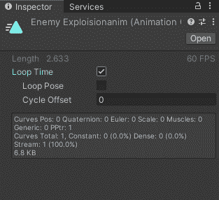

我也不希望在敌人第一次出现时默认调用**动画**,而是只在敌人与玩家或玩家激光碰撞时调用。为此，我需要确保我已经选择了敌人，并进入**动画师**选项卡。可以看到玩家动画的默认状态被设置为我制作的**爆炸**动画。

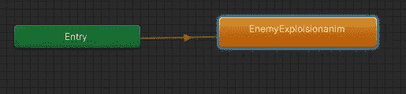

我想让它默认不动，只在满足特定条件时动，但是因为爆炸是默认的**它总是动。即使我取消了循环设置，动画也会在敌人出现时调用 right，因为它设置为**默认动作**。**

为了解决这个问题，我将首先创建一个空状态(意味着它没有动画)并使其成为默认状态。

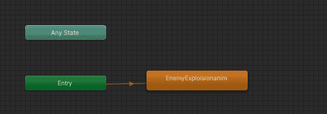

然后我将过渡到爆炸动画。

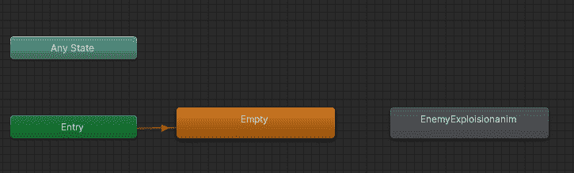

如果我单击转换，那么我可以分配参数，这样默认状态**将仅在满足该条件时转换。这由**检查员**完成。**

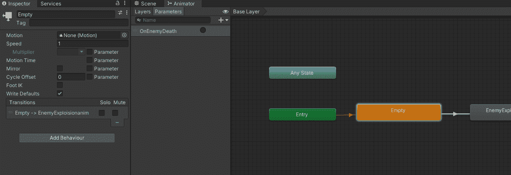

在我的例子中，我已经创建了一个参数

回到 **Animator** 选项卡，要制作一个参数，确保你已经打开了参数选项卡，然后点击加号。如你所见，我们有不同类型的参数。在这种情况下，我将使用一个**触发器**。它与 T4 布尔有点不同。这里是它的[**API**](https://docs.unity3d.com/ScriptReference/Animator.SetTrigger.html) ，如果你想的话，你可以看到不同之处。API 中有一个部分专门告诉你动画器中的**触发器**和 **bool** 之间的区别。

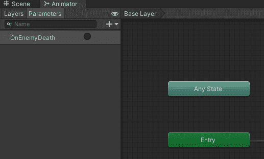

在我设置了**触发**参数后，我将返回到转换并将其作为一个条件添加。

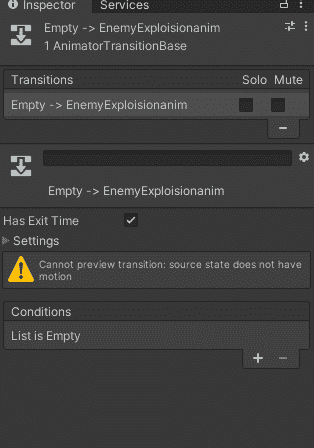

确保您没有填写方框，因为这意味着您已经将**触发器**设置为真。我们只希望敌人“死”的时候是真的。通过**默认**确保其设置为假。

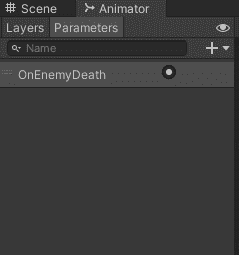

然后在我有摧毁敌人代码的脚本中，我将调用**触发器**，这将**触发**动画。

首先，我需要一个参考动画师。

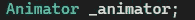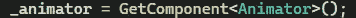

作为最佳实践，我还将在 **Start()** 中对其进行空检查。

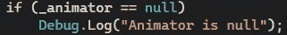

现在我应该可以在代码中的任何地方调用**触发器**。当我叫我的另一个敌人“死亡”代码时，我会叫它。基本上每当敌人与玩家或玩家的激光发生碰撞时。(对于本教程，我注释掉了您不需要担心的代码)

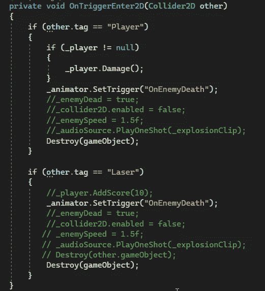

我需要在代码中改变的一点是，在我调用了动画之后，我仍然在破坏游戏对象，这意味着动画**永远不会播放。我将在 Destroy()方法中添加第二个参数，让敌人在这么多秒后才进行破坏。我会用我感觉动画**应该开始的时间来计时。****

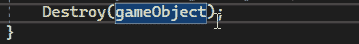

现在**动画**实际播放，然后敌人被消灭！但是…我还有一些问题。

现在你可以多次击中敌人，因为他们被击中后需要 2.8 秒才能真正摧毁。同样，如果你杀死敌人，然后撞上他们，你仍然会被击中，直到他们被完全摧毁。我不喜欢爆炸和敌人死亡的感觉，当播放爆炸动画时，敌人仍然像受到攻击前一样快速移动。

**让我们解决这些问题！**

为了让你不能在敌人死后受到伤害，或者在他们“死亡”后多次击中他们，我们只需要在敌人的“死亡”代码被调用时禁用他们的碰撞器。那是因为 **OnTriggerEnter2D()** 方法就是调用伤害玩家的代码和调用敌人被击中时受到伤害的代码。

通过获得对**碰撞器**的引用(并对其进行无效检查以获得最佳实践),每当“死亡”代码被这样调用时，我就能够禁用碰撞器:

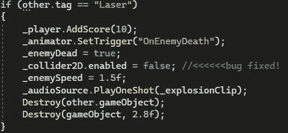

既然那些**的 bug**已经修复，我将会让爆炸的敌人没有普通敌人移动的快(在我看来更好的游戏感觉)。每当“死亡”代码被调用时，我也想减慢敌人的速度。我最初让敌人的速度= 0，让他们在被击中时完全停止，但我认为这看起来也很奇怪。所以一旦它们被击中，它们就停在原地爆炸。相反，我把他们的速度设置为 1.5 秒，我真的很喜欢它的样子！

每当“死亡”代码被这样调用时，我就简单地改变敌人的速度:

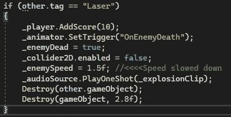

这是最终的结果:

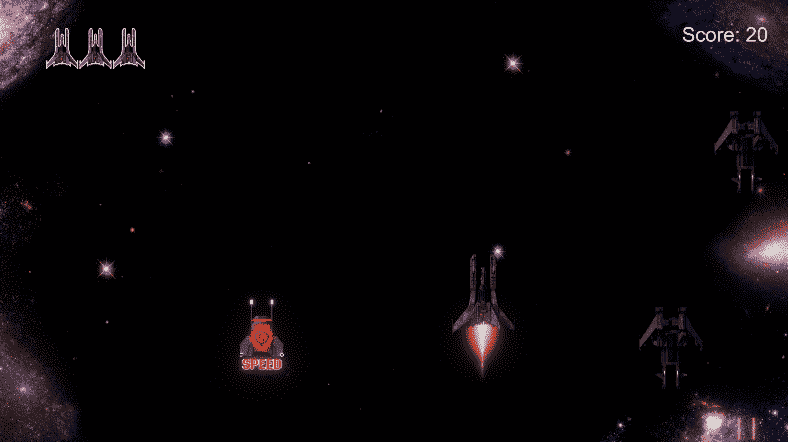

**牛逼！现在敌人死了感觉好多了，让玩家体验更好！如果你有任何问题，甚至建议，请随时让我知道！让我们做一些很棒的游戏吧！**