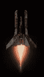
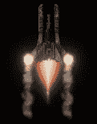
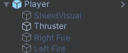
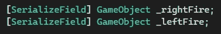
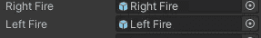
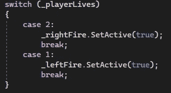
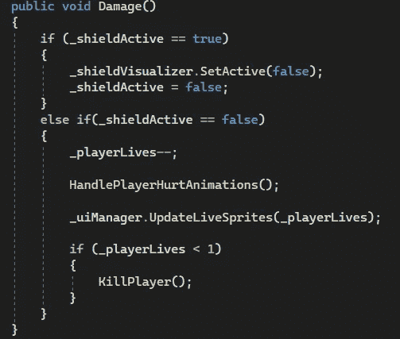
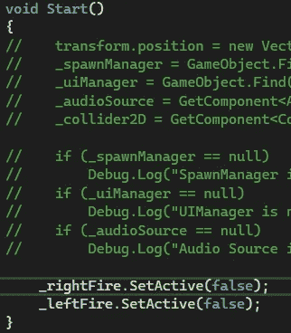

# 游戏开发的第 25 天:每当我的玩家受到伤害时，就把 VFX 加入到我的玩家中！

> 原文：<https://blog.devgenius.io/day-25-of-game-dev-adding-vfx-to-my-player-whenever-they-take-damage-a27bcbb8340d?source=collection_archive---------11----------------------->

目标:根据我的玩家目前有多少条生命，在他们的翅膀上添加一个动画游戏物体。

首先，我想用我的精灵表制作这些动画。作为创建动画的快捷方式，我将简单地通过拖动整个精灵表到场景中来创建动画，命名/保存动画，确保它循环，我们设置好了。(游戏开发的第 18 天将带你通过一个精灵表创建动画)

我会确保游戏对象的比例是我想要的。之后，我会把它做成一个预制体，并把第二个带到场景中。

我会让他们都成为玩家的孩子，并按照我想要的方式给他们定位。

我也将它们命名为**右火**和**左火**。然后我会确保它们被禁用。

在我处理玩家当前生活的脚本中，我还会根据玩家当前的生活启用这些对象。首先，我需要一个对它们的引用，这将生成一个**【serialized field】**变量，并通过 inspector 对它们赋值。

然后每当我有 2 条命的时候，我就会激活正确的火(玩家从 3 条命开始)。我也会在 1 点的时候开启左火。

我会确保在计算玩家生命的地方调用这个代码。(顺便说一下，上面的 switch 语句嵌套在我命名为**handleplayerhurtinations**的方法中)。在下面的代码中，我调用了**handleplayerhurtmanimations()**如果我的玩家受到伤害并且没有盾牌。

就这样，就这么简单！如果我决定增加一个让玩家获得生命的方法，我可能需要在将来将它们设置为禁用，但目前它是有效的！

作为最佳实践，我还将从 **Start()** 方法中显式禁用它们，以防它们意外地被启用。

我把一些东西注释掉了，这样你就可以更容易地关注这篇文章所讨论的内容

**我希望你会觉得这有些有趣和有用！去做一些很棒的游戏吧！**