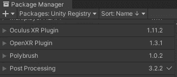
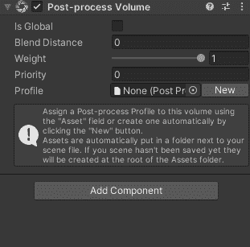
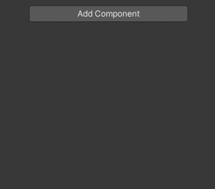
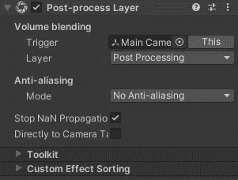
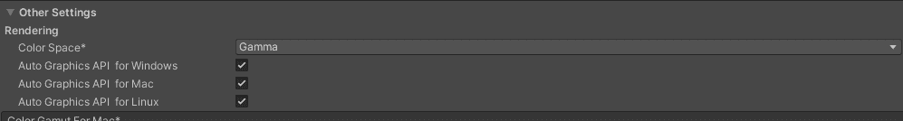
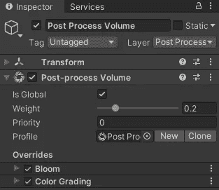
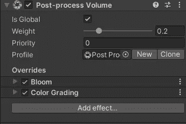
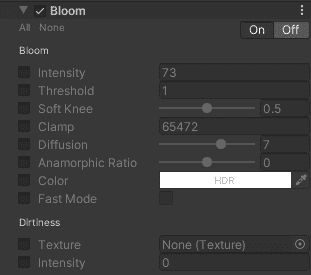
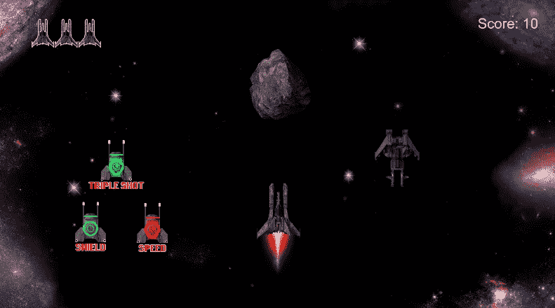
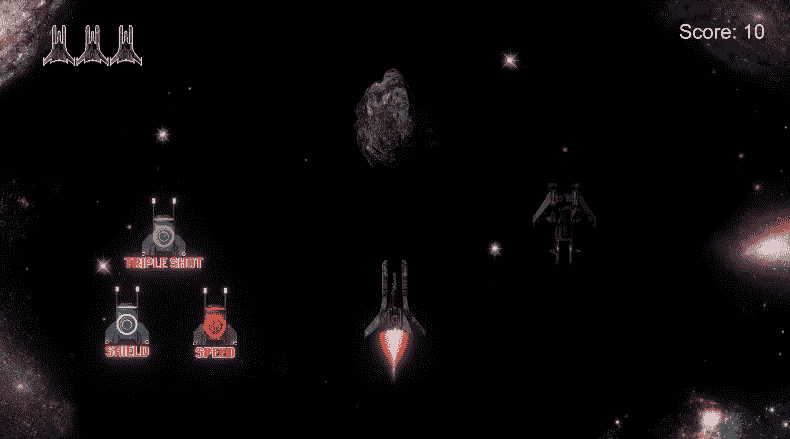

# 游戏开发第 26 天:如何在 Unity 中安装和使用后期处理效果！

> 原文：<https://blog.devgenius.io/day-26-of-game-dev-how-to-install-and-use-post-processing-effects-in-unity-79ae8228e9e6?source=collection_archive---------7----------------------->

**目的:**安装**后期处理**并在 Unity 中设置一些基本效果！

要安装**后处理**，进入包管理器，找到后处理包并下载。应该在 Unity 注册表里。

要在您的 Unity 场景中启用它:

1.  制作一个空的游戏对象，想怎么命名就怎么命名(我给我的命名为**后期处理卷**)。

2.将**后处理体积**组件添加到您的空游戏对象中。

3.检查“是全局的”设置是否为真。还可以通过单击“新建”来创建新的后处理配置文件。

4.将**后处理层**组件添加到主摄像机。

5.您需要为**后处理层**组件创建一个新层。我将 mine 称为“后处理**”**，并将其分配到**后处理层组件中。**

6.转到项目管理器>播放器>其他设置>色彩空间，改变伽玛为线性。

从这里你可以为你的场景设置效果。我不是一个设置特效的专家，我建议你尝试一下或者找一些其他的资源来制作一些疯狂的特效。不管怎样，我在场景中设置了一些花和颜色分级。

要添加效果，转到**后处理体积**组件并点击添加效果。

您可以启用效果的某些部分或全部。要启用所有这些功能，请单击左上角的“全部”。

这是我的游戏前后的后期处理，我只大麦摆弄它:

这只是后期处理功能的一个尝试！我希望这能帮助你开始使用 Unity 的后期处理效果！去做些恶心的游戏吧！