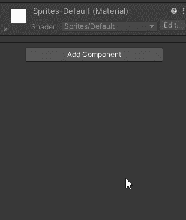
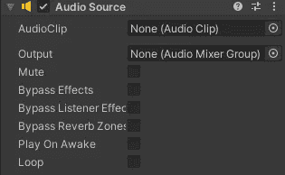
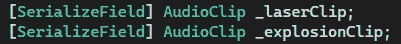
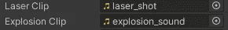
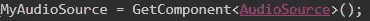
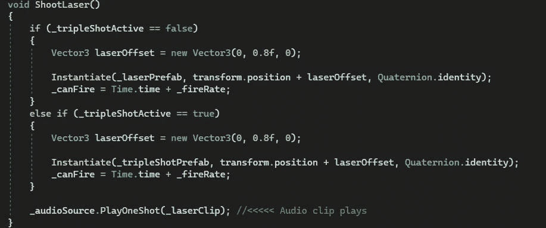
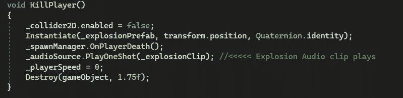
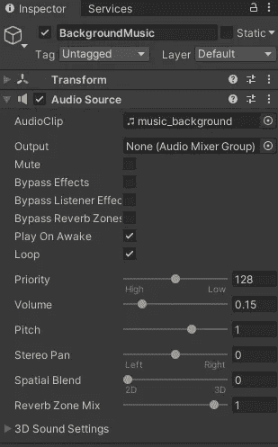
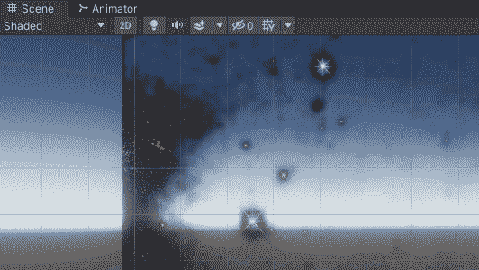

# 游戏开发的第 27 天:让玩家沉浸在 Unity 的 SFX 中！

> 原文：<https://blog.devgenius.io/day-27-of-game-dev-immersing-the-player-with-sfx-in-unity-d912408a8c26?source=collection_archive---------7----------------------->

**目的:**在我的游戏中加入音效，让游戏感觉更有活力。

谈到音频时， **Unity** 的工作方式是，你需要在你想要播放音频的对象上有一个**音频** **源**组件，你需要有一个**音频监听器**组件来拾取(听到)音频。通常只有主摄像头会有**音频监听器**，默认应该有一个。

我想把**音频**添加到:激光、爆炸和加电。我还想设置一些背景音乐。

激光、爆炸和加电的音频设置几乎都是一样的，除了你在代码中调用**音频剪辑**的地方，但是背景音乐会有一点不同。

我从激光开始。当我在我的**播放器**脚本中产生激光时，我将播放激光**声音剪辑**。我将为我的播放器添加一个音频源。

然后我会确保**循环**和**在唤醒状态下播放**参数为假。

你会注意到在**音频源**组件上有一个**音频剪辑**字段。在我的情况下，我将从我的播放器中播放激光**和**爆炸声音。但是如果只有 1 个字段来添加音频剪辑呢？添加第二个**音频**源**组件？没必要，而且我也不确定那是如何工作的……但是当我第一次试图解决这个问题时，我的大脑就是这么想的。**

有一种非常简单的方法可以播放特定的剪辑，而不必将其分配给音频源。从**玩家**脚本中，我将创建 2 个变量。每个都是**【serialized field】**，所以我可以在检查器中分配它们。它们属于**音频剪辑**类型。

为了能够访问音频源，我还需要一个对它的引用，但我将使用 **GetComponent()** 而不是通过**【serialized field】**来分配它，因为这更有意义，因为它不是我们必须在检查器中分配的东西(或者至少更容易)，就像特定的**音频剪辑**。在我创建了一个类型为 **AudioSource** 的变量后，我在 **Start()** 中使用 **GetComponent()** 来分配这个变量。

然后我会在代码中找到我想调用**音频片段**的地方。在这种情况下，每当我发射激光时，我想调用激光剪辑。如果我将我的音频剪辑分配给我的音频源，那么我将调用 **Play()** 方法。因为我知道我将需要不止一个音频片段从我的播放器中播放，所以我没有将一个片段分配给**音频源**。相反，它们被赋给前面的变量。

我不会调用将播放在**音频源**中分配的剪辑的 **Play()** 方法，而是调用将播放我在参数中分配的**音频** **剪辑**的 **PlayOneShot()** 方法。因此，在这种情况下，当我发射激光时，我想像这样调用激光音频剪辑:

我会对爆炸做同样的事情，就像这样:

我注意到的一个常见错误是，设置音频时不会给你错误信息，但不会播放音频。有时你可能会在调用**音频剪辑**后立即破坏游戏对象，这意味着你永远不会听到它，因为对象会在你开始剪辑后立即破坏。你必须在你的项目中调整它，记住 **Destroy()** 方法可以接受第二个参数来计算破坏游戏对象需要多少时间。你可能还必须禁用碰撞器和其他东西来防止其他错误，只是要意识到这一点。这就是我在上面的代码中要做的。

我将执行相同的过程来获取对**音频剪辑**和**音频源**的引用。确保我希望不同的信号源在唤醒时**循环**或**播放。确保将**音频源**添加到我想要播放音频的对象中。从脚本中的正确位置调用音频方法。我会在我的敌人身上检查他们的爆炸和激光，以及我发现的任何东西。**

现在是背景音乐。基本上是一样的，但首先我会创建一个空的游戏对象，并将其命名为“BackgroundMusic”。

然后我把一个**音频源**连接到它上面。将我想要的**音频剪辑**直接分配给背景音乐**和**音频源**，因为这将只播放一个剪辑。确保**在唤醒状态下播放**和**循环**设置为真，我们开始。不需要脚本，因为**音频源**会为我们做到这一点。(顺便说一句，从技术上讲，这也是一个剧本，只是不是我们制作的:)。现在我们有背景音乐了！**

请记住，当您添加新功能并继续在游戏中工作时，不得不一遍又一遍地听到声音有时会很烦人，所以您可以像这样静音:

这应该让你在使用 **Unity** 设置**音频**方面走得很远！如果您有任何问题或建议，请告诉我。让我们制作一些令人敬畏的游戏！