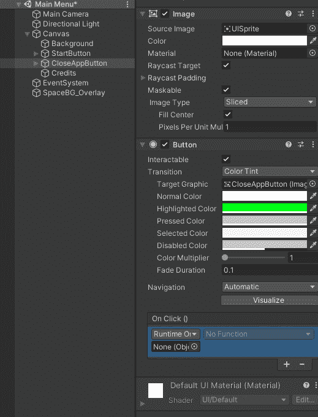

# 游戏开发的第 28 天:在 Unity 中增加一个关闭应用程序的功能！

> 原文：<https://blog.devgenius.io/day-28-of-game-dev-adding-a-close-application-feature-in-unity-f145f539ab16?source=collection_archive---------13----------------------->

**目的:**允许玩家关闭应用程序而无需使用任务管理器:)

对于我的例子，我将在主菜单上设置一个按钮，允许播放器关闭应用程序。

我将在画布上添加一个**按钮 UI** 元素:

然后我会调整它的大小，让它看起来更漂亮:

不知何故，从这里开始，我需要让按钮在按下时实际关闭应用程序。您可能已经知道，按钮有一个事件系统设置，当按下按钮时，它们将调用某个方法。如果你去**按钮** **组件** < **OnClick()** 你就会明白我的意思了。

我们还没有自己的方法，但要从按钮调用它，我们需要一个脚本和按钮来访问该脚本。在我的例子中，在大多数情况下，你要么已经有了一个 **MainMenu** 脚本(你可以随意命名)来处理主菜单上的所有 **UI** 。大多数时候，为了让按钮能够访问脚本，脚本会被附加到画布上，在我的例子中就是这样。

我们需要将画布从按钮拖到检查器中，如下所示:

我们这样做是因为按钮首先需要知道哪个游戏对象拥有它想要的脚本。

现在我们需要从脚本中调用方法。但首先我们必须成功。

在 **MainMenu** 脚本中，创建一个 void 类型的公共方法，并根据需要对其进行命名。然后调用**应用程序。Quit()** 方法内的那个方法。保存并返回到 **Unity** 。

从那里我们现在可以将我们想要调用的方法设置为我们从按钮创建的新方法。

请记住，这应该工作得很好，但**应用程序。Quit()** 方法不能从 **Unity** 编辑器中调用，所以你必须在构建中测试它。

这应该就够了，记住你不必调用**应用程序。从一个 **UI** 按钮中退出()**方法，我就是这么做的。很多人让 **ESC** 键关闭应用。做适合你的事情:)

***如有任何问题或建议，欢迎评论。让我们制作一些令人敬畏的游戏！***