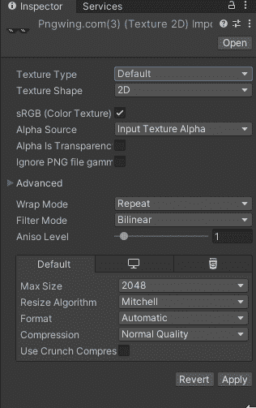
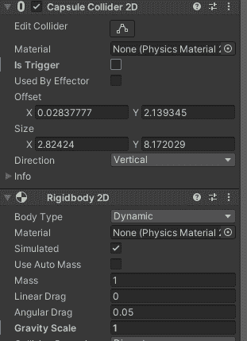
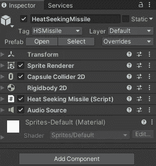
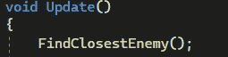
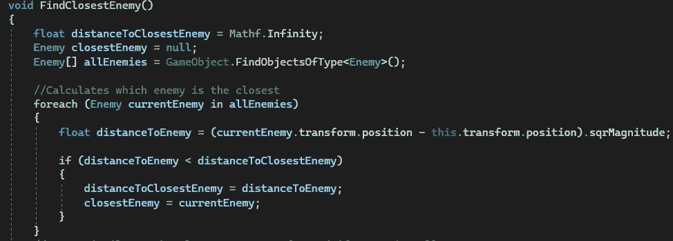
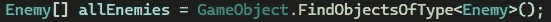
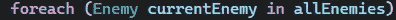
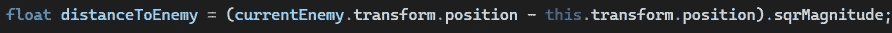
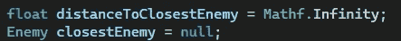
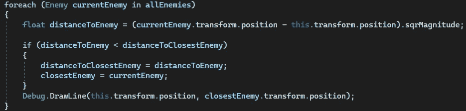

# 游戏开发的第 29 天:在 Unity 中创建一个热追踪导弹第 1 部分！

> 原文：<https://blog.devgenius.io/day-29-of-game-dev-creating-a-heat-seeking-missile-in-unity-part-1-3a3d044069ca?source=collection_archive---------10----------------------->

目标:给我的 2D 游戏增加一个新的动力。我希望它是一种热寻的导弹，能找到最近的敌人并摧毁他们。

这篇文章将非常深入地解释如何对此进行编码以及这些代码在做什么。如果你只是想要代码，在我解释它做什么之前，会有一个完整代码的概述。

**第 1 部分**包括设置寻找最近敌人的代码。第 2 部分将介绍如何将导弹移向敌人，并像真正的导弹一样旋转它。

(**剧透预警！**我不是一个超级天才，我花了整整三天时间花了 6-10 个小时才弄明白如何制作这个功能。不仅如此，我还发现人们有多种不同的方式来设置他们的代码，而我最终使用的方式是最简单的，也最适合我的项目。虽然有时令人沮丧，但我确实从这个特性中学到了很多！包括如何在列表中找到最近的游戏对象，如何将一个对象旋转到另一个对象，如何通过代码创建一个动态变化的列表等等！)

我将在我的 2D 银河射击游戏中实现这段代码。

我需要两个不同的脚本调整，我需要两个不同的游戏对象。一个是启动导弹的启动传感器，另一个是导弹本身。

我将从创建导弹开始，因为启动需要引用导弹来生成导弹。

我将从找到一个我喜欢的导弹的 png 开始。下载它，移动到我的 Unity 项目，并将其拖到场景中。我将把**纹理类型**设置从**默认**转换为 **2D(精灵和 UI)** 。调整比例和其他可能需要做的事情，让它看起来更好。

然后我会给我的导弹增加一个碰撞器 2D 和一个刚体 2D。在刚体 2D 上设置重力为 0，调整碰撞器 2d 来适应我的导弹，并使它成为一个触发器。

我要做一个新的 C#脚本，附加到我的导弹游戏对象上。

以破解代码为目标来思考这个问题，我需要计算出哪个敌人离导弹最近。我还需要把导弹转移到敌人那里。要记住的一件事是，我还需要确保导弹朝向敌人旋转，而不只是将游戏对象移向敌人。

为了移动和旋转导弹朝向最近的敌人，我首先需要知道谁是最近的敌人，所以我将开始设置代码来计算谁是最近的敌人。我将创建一个新方法，并从 **Update()** 中调用该方法，这样它就可以每帧更新一次。

这是代码的最终结果:

现在让我们对此进行编码，并深入了解发生了什么。我不会从上到下，会先跳过几行代码，然后再回头看。原因是我想带你从上到下的思考过程，而不是完成的代码，因为我认为它有助于更好的理解。

首先，我们将检查场景中的每个敌人，看看每一帧谁是最接近的敌人。请记住，对于大型游戏来说，这不是很明智的做法，因为可能会有很多敌人需要检查，而且有很多方法可以绕过它们。一种方法是只检查特定范围内的敌人，也许使用一个碰撞器作为触发器。现在，我将把重点放在检查场景中每个敌人的实现上。

为了检查每个敌人，我们需要每个敌人的参考。最简单的方法是将它们放在一个列表中。但是如果这个列表因为新敌人的出现和死亡而不断更新呢？那么你就不能只做一个列表，让它成为一个**【SerilazedField】**手动添加每个敌人。相反，你必须根据场景中当前的敌人来动态更新列表。

不要担心，有一些简单的方法可以做到这一点。在我的情况下，我所有的敌人的敌人脚本在他们身上。因此，如果我只是在场景中找到每个敌人的脚本，我将能够有一个动态列表，其中引用了活跃的敌人。因为当敌人被消灭时，他们的剧本也会被消灭。因此，当下一帧运行时，它不会发现敌人。它还会添加任何被繁殖的敌人，因为他们的脚本只有在游戏对象实际存在的时候才会被激活！

在代码中，我将创建一个类型为**敌人**的数组(如敌人脚本中所示)，并将其命名为**敌人**。我会将它设置为场景中所有的敌人脚本。还记得**游戏对象吗。FindObjectsOfType()** 方法将在每一帧被调用，所以每一帧列表都将被更新，就像我前面说的那样。

现在我们有了敌人的名单，我们需要计算出哪一个离导弹最近。也就是说我们需要检查名单上每个敌人的位置。

这就是每个循环的**派上用场的地方！如果你不熟悉每个循环的**，它们通常与**数组**和**列表**一起使用。它们将在您指定的条件下为每个对象运行您想要运行的代码。所以在这种情况下，每个循环的**将调用列表中每个敌人的计算距离代码。******

**每个循环的**需要一个变量来分配当前正在测试的敌人以及要通过的敌人列表。首先为每个循环**调用**，创建一个新的敌人类型变量(这将等于正在运行计算的当前敌人),并为每个** **循环**分配我们希望**通过的列表。****

****

**接下来是计算。数学有时令人困惑。现在用计算机能理解和你能阅读的方式做数学。现在你必须学习如何编写数学代码。现在在电子游戏的背景下做。现在让它好好表现。如果你在这方面有困难，不要紧张。做这些事情中的每一件已经够难的了，但是你要同时做所有的事情。如果你能 100%理解地做到这一点，那会很奇怪。继续前进！**

**作为计算的开始，我将创建一个变量，它等于我们正在计算的敌人的距离。记住找到最近的敌人，我们需要对所有的敌人进行计算，看看谁是最近的。因此，我们将有变量与当前被计算的敌人有关，变量与最终结果也就是最近的敌人有关。例如，我们将有一个名为 **distanceToEnemy** 的变量，我们将使它=到当前正在计算的敌人的距离。我们将有一个**距离，我们将使距离最近的敌人**。我们有两个不同的变量，所以我们可以相互比较。**

**为了将浮点值 **distanceToEnemy** =设置为当前敌人的距离，我们需要一些东西来进行比较，否则计算机会像“距离什么？”。在这种情况下，那将是我们的导弹。所以我们将设置**距离敌人** =当前正在计算的敌人位置(-)导弹位置。想想看，我们正在比较不同的数字，想知道它们之间的区别是什么。这就是从导弹位置中减去每个敌人的位置。**

****

****。sqrMagnitude** 部分是由社区中的其他人推荐的，因为他们认为检查每个敌人的位置平方可以提高性能，这是因为代码的工作方式。我同意了，但如果我说我完全理解，那是在撒谎。我明白这个概念，但我不确定它到底是如何工作的，但我会推荐它，因为它确实有一些意义。**

**现在我们已经计算出了当前敌人的位置，然后我们检查当前敌人的位置是否小于**distance closestenemy**。意思是如果当前敌人的位置比最近的敌人更近。从那里我们将**距离更新为当前敌人的距离。我们将**的亲密度**更新为当前的敌人。记住，只有当当前敌人的位置比最近的敌人的位置更近时，这两个才会更新。否则最接近的敌人保持不变，什么也不会更新。****

****

**回到我们跳过的几行代码，我们还有一些事情要做。 **distanceToClosestEnemy** 和 **closestEnemy** 需要默认设置，否则将来可能会有 bug。这是因为场景中可能不总是有敌人，这将使程序崩溃，因为没有进行空值检查。**

****

**在计算开始时将 **closestEnemy** 设置为空将使其保持为空，如果场景中没有敌人来检查修复该问题。**

**同时将**distanceToClosestEnemy**=设置为 **Mathf。Infinity** 将变量设置为一个非常大的数字。如果你确定除了 Mathf 之外，没有敌人的位置会超过那个位置，你也可以把它设置成 10，000 左右。无穷大更安全，因为它是一个非常大的数字，你非常安全，它看起来比 10，000 更好。这样做的全部目的是确保当你在 if 语句中检查**距离敌人**是否小于**距离最近的**敌人**距离敌人**实际上有机会比你的开始检查距离更近。**

**最后，为了可视化谁是最接近的敌人，添加一个**调试。DrawLine()** 方法调用像这样:**

****

**现在，您可以看到并确保计算正在进行！**

**请确保在测试完成后注释掉或删除它，这样它就不会在最终版本中被调用，因为它会降低性能，并且在最终版本中是不需要的。**

> **第一部分到此为止！我们设定了寻找最近敌人的计算方法！是时候让导弹向最近的敌人移动，并向他们旋转了！免费提问或提供建议！**