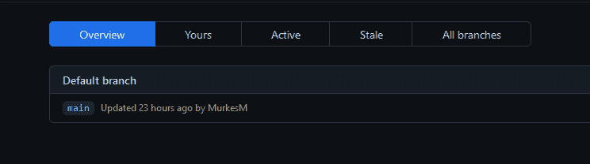
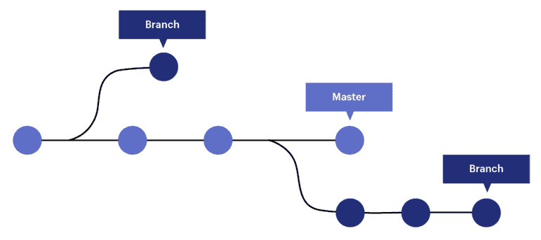
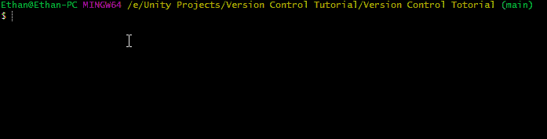
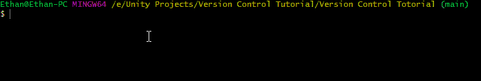
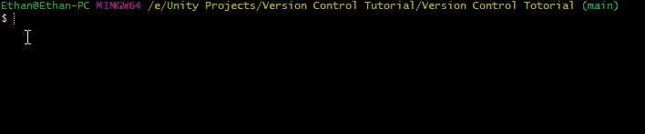
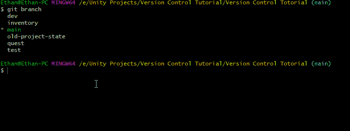
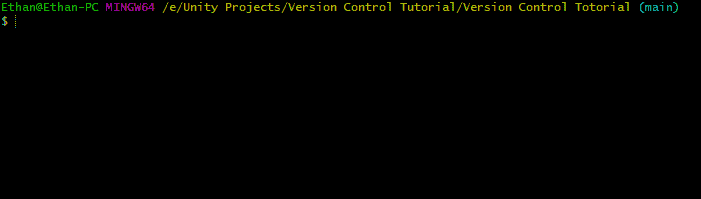

# 游戏开发的第 3 天:使用 Git 分支的基础！

> 原文：<https://blog.devgenius.io/day-3-of-game-dev-the-basics-of-branching-using-git-4ff22079127a?source=collection_archive---------3----------------------->

**目标:**在 **Git** (命令行版本)中设置一些测试**分支**，学习**分支**如何有用。还要熟悉一些与**分支**相关的基本命令。

首先，让我们快速回顾一下什么是**分支**以及它们为什么有用。然后我将介绍如何创建它们，接下来是一些有用的命令来帮助你浏览不同的**分支**等等。

默认情况下，当您第一次创建一个 **Git** 存储库时，会创建“main”**分支**。把“主要”分支**想象成一棵树的主干。树枝**只是树干的延伸。

在开发环境中，分支非常有用，尤其是在处理大型项目时。想象一个团队正在开发一个任务特性。他们需要对最初的任务逻辑进行编程，重新编程，重新编程，直到它做他们需要它做的事情，测试错误，等等。现在想象一下另外 4 个团队，他们在相同的开发环境中工作，分别负责库存系统、角色逻辑、照明和关卡构建。事情会很快变得一团糟，其他人会互相等待，错误会更难发现，等等等等。

**分支**解决了这些问题，让每个团队都有自己的**分支**(开发环境)来处理，当他们的特性准备好了，他们就可以把这些变化推到“主”主干或成品上。如果其他**分支**需要你的功能，你甚至可以推给他们，反之亦然！随着经验的积累，**分支**的许多其他用途将会出现，但这是理解**分支**概念的良好开端。

现在让我们在 **Git** 中制作一些**分支**！

要检查您当前在哪个**分支**中，请键入命令: **git 分支**

如你所见，我们在“main”**分支中。**我知道这一点，因为它会通过将当前的**分支**突出显示为绿色并在旁边打上*来显示您在中的位置。它还用蓝色显示你在右边的哪个**分支**。

要创建一个新的**分支**，输入命令: **git branch(分支名称)**

验证它是否被成功创建，并在任何时候查看所有分支的列表，就像前面一样，输入命令: **git branch**

要在这些**分支**之间切换，键入命令: **git switch(分支名称)**

正如你所看到的，我从“主”**分支**进入了“开发”**分支**。

要合并**分支**首先确保你在你想要合并的**分支**中，然后输入命令:**git merge(other branch name)**

厉害！现在我们对版本控制中的**分支**有了一个基本的了解，以及如何在 **Git** 中创建我们自己的**分支**！我们现在也知道了如何合并分支。还有更多的内容进入到**分支**中，包括恢复变更，但我希望这有助于为您继续构建打下坚实的基础。

**记得不断学习，不断前进！我希望你有美好的一天！**