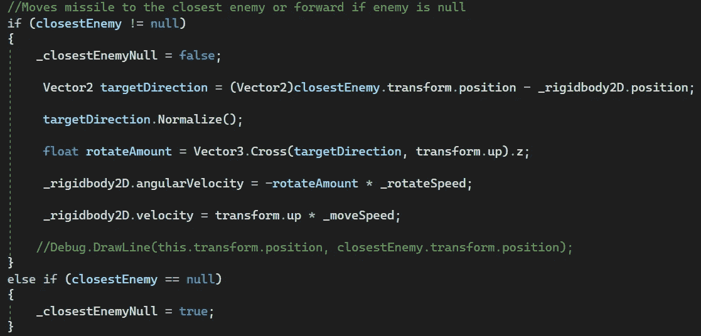
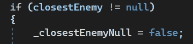

# 游戏开发的第 30 天:在 Unity 中创建热追踪导弹第 2 部分！

> 原文：<https://blog.devgenius.io/day-30-of-game-dev-creating-a-heat-seeking-missile-in-unity-part-2-cbbd0d419100?source=collection_archive---------13----------------------->

目标:给我的 2D 游戏增加一个新的动力。我希望它是一种热寻的导弹，能找到最近的敌人并摧毁他们。

在**第一部**中，我们设置了寻找最近敌人的代码。现在是时候将导弹移向敌人并旋转它朝向敌人。

我为此纠结了一段时间，尝试了很多不同的东西。我相信在它结束时，我使用了来自多个不同教程的代码以及一些我记得以前使用过的代码。然后我把理解它并与他人分享作为我的目标。

我将从完成的代码的图片开始，然后一步一步地带你看！

完成的代码:

**调试完毕。DrawLine()** 用于测试期间的可视化。

如果场景中有敌人，则将 **_closestEnemyNull** 布尔值设为**假**，如果没有敌人，则将**设为真**。我首先使用这个布尔值的原因是因为在 **FixedUpdate()** 中，我正在检查布尔值，如果导弹没有要追踪的敌人，我希望我的导弹只是上升并离开屏幕。当然，为导弹制作某种类型的断电动画或其他东西是最好的选择，但我并不拥有这方面的艺术。虽然这很有效，但看起来并不奇怪，因为在我的游戏中向上飞行会朝着敌人滋生的方向。我还调用了 **FixedUpdated()** 中的代码，因为我正在使用它的**刚体**移动对象(也就是使用**物理系统**)。

如果你是从第一部分开始的，你已经知道或者知道我有一个变量=到场景中最近的敌人。我需要那个变量来知道把我的导弹送到哪里。我首先检查 **closestEnemy** 变量是否为空，并基于该布尔值运行代码。

这也是我设置 **_closestEnemyNull** 布尔值为真或假的地方。

如果敌人为空，我将布尔值设置为真，并在 **FixedUpdate()** 中调用代码将导弹向上移动。

如果有一个敌人，我将设置布尔为假，移动导弹向敌人，并在敌人的方向旋转。

首先，我需要我希望导弹移动的方向。

在这里，我创建了一个新的变量，类型为 **Vector2** ，并将其设置为最近的敌人位置和导弹位置之间的距离。(记住这个脚本是附在导弹上的)。如果你想知道在**关闭之前的【T2(vector 2)】**是什么，我可以理解当我试图将**向量 3** 设置为**向量 2** 时出现了一个错误。所以我只是说我想要 **Vector2** 版本的 **closestEnemy** 因为那是我的 2D 项目所需要的。

然后我**归一化**这个向量。我不知道为什么不同的教程告诉我这样做，在一些挖掘之后。Normalize() 是的，我现在有点明白了。基本上矢量有位置和方向。标准化向量会移除位置数据。在这种情况下，这是有意义的，因为我只需要方向。我已经有了最近的敌人位置和导弹位置。我只需要从 a 点到 b 点的方向。这是我能解释它的最简单的方法，因为我阅读了许多不同的解释，这是我对它的理解。

现在让导弹转向敌人。

这里第二行代码设置了导弹的旋转方向。首先我们要得到我们想要旋转导弹的角度，这是第一行代码要做的。

我做了一个 float 类型的变量，名为 **rotateAmount** ，并将其设置为我之前得到的 **targetsDirection** 的“中间值”,导弹使用 **transform.up** 进行变换，这给了我导弹的绿色轴。绿色的轴表示我使用了导弹的前向方向作为第二个参数。因为这是一个 2D 游戏，所以我不想得到 z 轴的 Vector3“中间”值，我只是把。基本上忽略 z 轴。

了解更多关于什么 **Vector3 的信息。Cross()** 正在获取“中间”值，查看一下 [Unity API](https://docs.unity3d.com/ScriptReference/Vector3.Cross.html) ，如果您没有得到它，请不要担心。只要你知道你可以用它为你应该没问题。

使用那个**旋转架**我可以改变导弹**刚体**朝向目标方向的旋转。我需要在**旋转架**前面放一个 **-(减号)**符号，否则导弹会真正旋转远离敌人。我还输入了一个**转速**来确保旋转感觉正确。

这将使导弹朝着最近的敌人移动并旋转！请理解，虽然我得到了这个工作，并尽力向他人解释，但我不是专家。如果这让你感到困惑，不要觉得自己很笨。随着时间的推移，它对我来说慢慢变得更有意义了，我不得不在复制代码并确保它正常工作后进行大量的研究。

记住，复制别人的代码是可以的。但是如果你想学习，那么确保你在抄袭之后知道它在做什么，否则你就失去了一个坚实的学习机会。让别人的代码来工作也给你一个坚实的模板来了解正在发生的事情，因为你可以一行一行地剖析它，而不是从上到下想出它，并试图把它们放在一起。如果最终你学会了如何实现这个特性(即使你使用了别人的代码),不要担心！继续努力，继续学习，向其他人展示如何做他们需要帮助的事情！