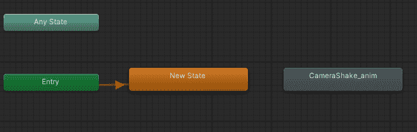

# 游戏开发的第 31 天:如何在 Unity 中创建相机抖动功能！

> 原文：<https://blog.devgenius.io/day-31-of-game-dev-how-to-create-a-camera-shake-feature-in-unity-efa200e9848f?source=collection_archive---------11----------------------->

**目的:**每当玩家受到伤害时，使相机抖动。

一开始，我想解释有多种方法来制作一部电影，每种方法都有不同的效果和难度，相机抖动也不例外。

当谈到在 Unity 中设置相机抖动时，我遇到了两种不同的方法:1:为你的相机制作动画或 2:编码相机抖动。

你将为自己的项目做出选择，但我选择了第一个选项。原因是它对我来说更快，它完成了任务。这对我来说更快，因为我习惯了动画和动画窗口，但你可以决定你想怎么做。

在本文中，我将重点讨论选项 1。

制作相机抖动动画并通过代码步骤调用它:

1:在相机上制作新的动画剪辑。

2:使动画包含轻微移动相机的位置(我调整了多次)。

3:确保动画没有被设置为循环播放，并且在被调用时只播放一次(在我的例子中，它将在玩家受到伤害时被调用)。

4:在 Animator 选项卡中，将默认状态设置为空状态，这样默认情况下相机不会抖动。

5:从默认状态过渡到相机抖动动画。也要做一个回归的转变。

6:为过渡设置触发参数。

我将我的参数命名为“Shake”

7:用触发参数设置转场。并确保将退出时间设置为 false。

8:做一个脚本，贴在相机上(我把我的叫做 CameraShake)。

9:在脚本中获取一个对动画师的引用。

10:创建一个公共方法，以便可以从其他脚本中调用它。

11:在方法中调用触发器，该触发器将默认状态转换为摇动动画。

12:在我的例子中，我将从玩家脚本中调用那个公共方法，在那里我有玩家受到伤害的代码(在你需要的地方也调用它)。我需要一个对 CameraShake 脚本的引用，为了最佳实践，我将对它进行空检查。然后每当支付者受到伤害，不管他们有没有盾，相机都会抖动。所有这些都在玩家脚本中完成。

这就对了，如果你跟着的话，每当玩家受到伤害时，你的相机就会抖动。当我在真实的游戏中测试时，我不得不稍微调整一下实际的动画，但是设置本身是有效的，并且会在你需要的时候调用动画。

这是最终结果:

***如果你有什么问题可以随时问，或者有什么建议可以随时告诉我。让我们做一些很棒的游戏吧！***