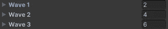
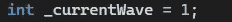
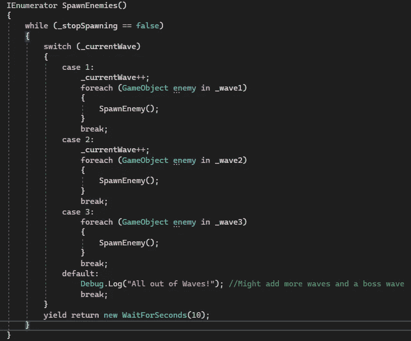
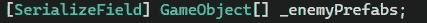
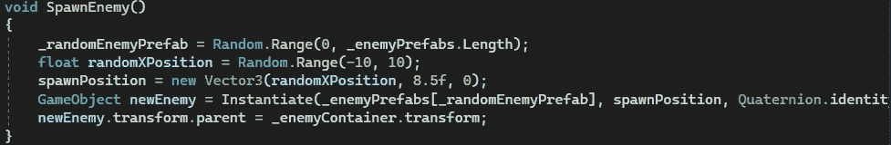
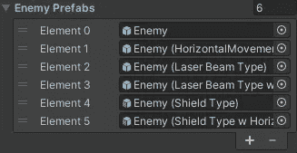

# 游戏开发的第 32 天:使用 Unity 大量繁殖敌人！

> 原文：<https://blog.devgenius.io/day-32-of-game-dev-spawning-enemies-in-waves-using-unity-a52bd42aa298?source=collection_archive---------3----------------------->

**目的:**为我的游戏设置一个敌波系统。

目前我每 5 秒就有一个敌人产卵，但是我想通过使用波动系统让它更有趣一点。

Wave 系统可以以多种方式设置，但是对于我的实现，我保持它非常简单。我将解释我的设置和其他一些选项，我可能会在稍后添加。

我设置的最终结果是 3 个不同的波。每一个都会产生更多的敌人。它在同一时间产生了所有的敌人。

这是最终结果的样子(但是请记住，为了这个演示，我故意让波浪产生得更快！)

哈哈，这么快的海浪让我有点害怕

下一波产卵需要满足的唯一条件是 10 秒钟。你可以很容易地设置它，只有在当前的浪潮被完全摧毁后，才能产生下一个浪潮，这是我以后可能会添加的东西，但现在这是可行的。

我也可以设置波开始产卵每个敌人，但在不同的时间，而不是在同一时间。但是对我现在的游戏来说，它工作得很好。

大部分(如果不是全部的话)与繁殖敌人相关的代码都在我的 **SpawnManager** 脚本中。

为了设置这个波形特征，我将创建 3 个敌人类型的变量。我还会确保它们是敌人的**阵列**，并且是**【序列化字段】**，这样我就可以在编辑器中编辑波数。

现在我有 3 个领域，我可以从检查员拖放敌人。

我会在第一波增加 2 个敌人，第二波增加 4 个，第三波增加 6 个。

我还将创建一个 int 类型的变量，并在默认情况下将其设置为 1。这将代表当前的波。

然后，我将在我的**span enemies**协程中创建一个 switch 语句，检查当前的 wave 变量。如果当前的 wave 变量= 1，那么我产生第一个 wave。如果 2 是第二波，3 是第三波。我还将确保在每次调用新的 wave 时将当前 waves 值增加 1，这样值就会改变，我们就可以调用下一个 wave。

对于这个基本的波浪生成设置/原型，我将在 3 个波浪处停止。如果每当第三波产生时，我不增加当前波的价值，那么我将一次又一次地产生第三波。这对这个原型来说很好。

然后，我将在我的开关中添加一个默认案例，作为空检查的一种形式。基本上，如果当前的 wave 不等于我们检查的任何值(在我的例子中是 1，2，3)，那么默认情况下，它将调用我在默认情况下放置的任何代码。

用 **WaitForSeconds()** 结束协程将重启协程并产生下一波。

我已经添加和调整了这个 wave 系统的更多部分。例如，在 **SpawnEnemy()** 方法中，我从我拥有的一系列敌人预设中随机产生一个敌人。

我也将很快在这里添加一个老板。无论哪种方式，这应该让你开始一个基本的波浪系统。

***让我知道你是否有任何问题或想为你的特定系统做些改动，我很乐意帮忙。让我们做一些很棒的游戏吧！***