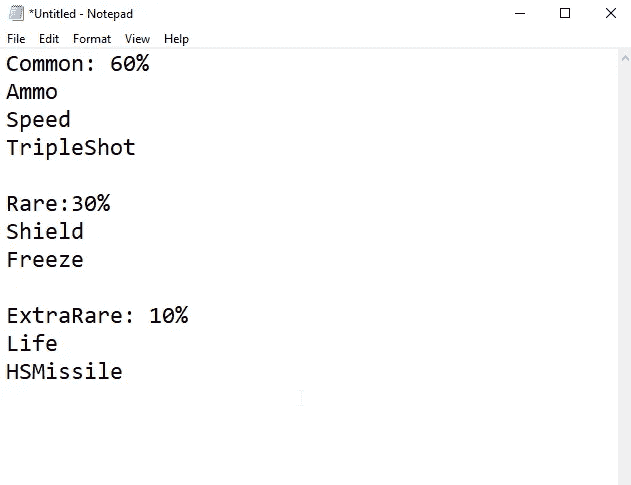
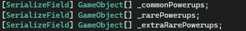
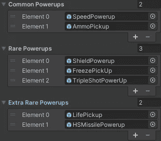
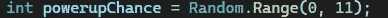
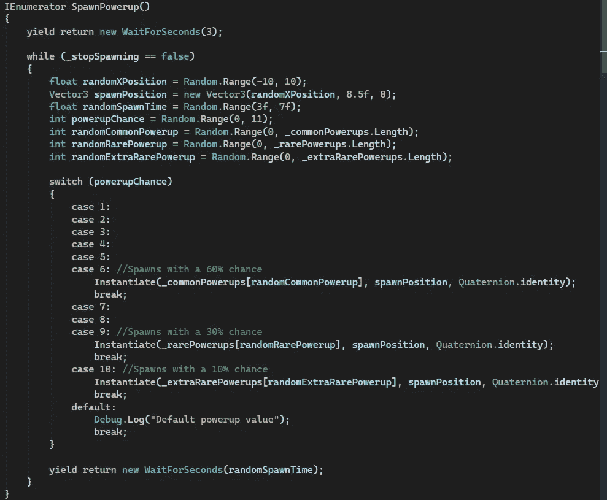

# 游戏开发的第 33 天:在 Unity 中平衡拾音器和一个常见-罕见的功能！

> 原文：<https://blog.devgenius.io/day-33-of-game-dev-balancing-pickups-with-a-common-rare-feature-in-unity-b258771f098c?source=collection_archive---------9----------------------->

**目标:**让我的一些皮卡变得罕见，而另一些变得常见。

为了做到这一点，我需要一些可视化的帮助。因此，我写下了我游戏中所有拾取的列表，并根据我认为对我的游戏最有效的方式将它们分为常见、罕见和特别罕见三组。写完这篇文章后，我也对这些做了一些改动，只是想找到正确的平衡。

例如，在我的游戏中，弹药产卵比生命值多是有意义的，而热寻的导弹产卵很少有意义。

我也有一个冻结，这是一个消极的拾取冻结球员在他们的地方。我认为这应该是玩家需要在相当长的时间内注意的事情，而不是过于烦人或游戏的主要威胁，所以我把它变成了稀有物品，而不是常见或特别稀有的物品。

我在代码中创建了 3 个数组，并在编辑器中给它们赋值。

继续，我们只需要给每一组项目一定的产卵机会。我很乐意带你浏览一下，幸运的是 **Unity** 有一些很棒的内置方法，帮了大忙。

在进入代码之前，我将给出我的解决方案的概念性概述。我有 3 组皮卡，他们要么是常见的，罕见的或非常罕见的。我不想每 5 秒钟产生一个随机的拾音器，我想先检查哪组拾音器应该随机产生。然后从随机拾取组中产生一个随机拾取。每个组都需要比其他组更低或更高的概率成为随机组。

我把所有的拾音器放在一个组中(在我的代码中，术语“电源”被使用，但在这种情况下可以与“拾音器”互换)。

在我调用代码每 5 秒产生一次随机加电的地方，我想先检查一个随机加电组，然后每 5 秒从该组产生一次随机加电。

为此，我将使用 **Random 创建一个随机数。范围()**。我需要设置一个最小值和最大值。例如，如果我将最小值设为 0，最大值设为 100，那么在这两个数字之间就会产生一个随机数。随机使用**。Range()** 正确地说，有时你需要把最大数字 1 的值放在你想要的数字之上，这取决于你如何使用这个方法。我建议阅读文档以获得解释，请记住这一点。

实际上，我可以将它设置为生成一个介于 0 和 10 之间的数字，因为这是我想要的百分比。我不需要它如此具体，以至于我想检查某件事情 85%或 43%的可能性。我只想要 10%的增量(0%、10%、20%等等。)当**随机。Range()** 生成一个数字，0 到 10 之间的每个数字都有 10%的机会成为生成的数字，给我 10 的增量。

每次一个新的拾取产生了**随机数。Range()** 方法将被调用，每次都生成一个新的数字，因为我将在一个协程中调用这个方法，这样我的生成是连续的。

现在我只需设置一个 switch 语句来检查随机数，并调用基于随机数值的代码。

如果我想为多个值调用相同的代码，而不是为每种情况输入相同的代码，我只需不为它填充代码来调用那个值，并且不插入中断。switch 语句现在将调用我最终放在我跳过的第一个案例和我调用代码的案例之间的代码。让这一段特定的值调用同一个代码。

这是最终结果:(并非所有的变量都与本教程有关，例如:(前 3 个变量，float，Vector3 和其他 float。)如果您有任何问题，请随意提问，我会很高兴尽快回复您。

因此，我将让 1–6 调用公共提货代码。

7–9 调用稀有代码。

和 10 调用额外的稀有代码。

因为这是对照随机值( **_powerupChance** )进行检查，所以普通皮卡组有 60%的机会成为该组，稀有组有 30%，特别稀有组有 10%。

***现在在我的游戏中，弹药产生了很多，这很好，热追踪导弹非常罕见！欢迎提问或给出建议！让我们做一些令人敬畏的游戏！***