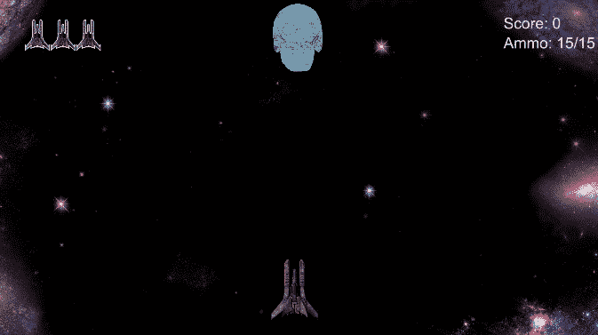
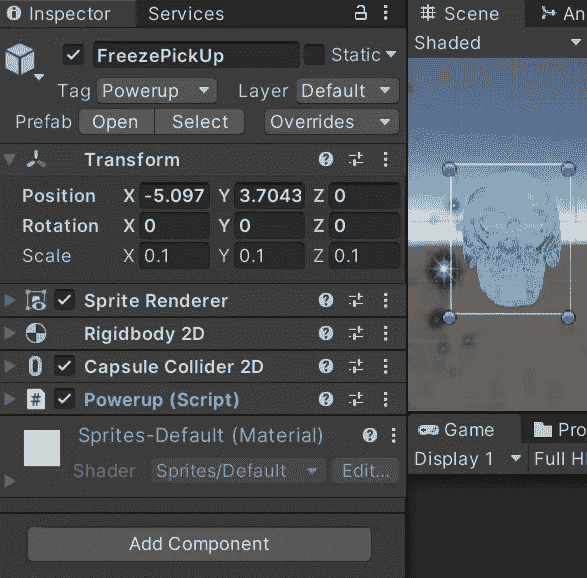
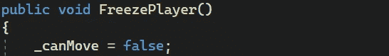
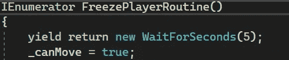
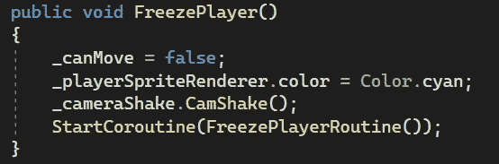
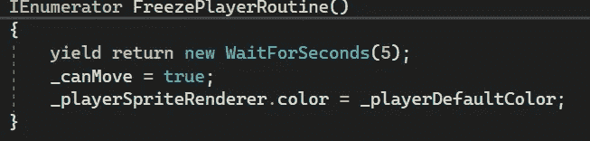
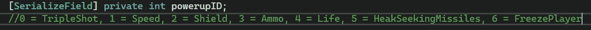
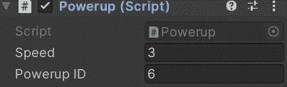
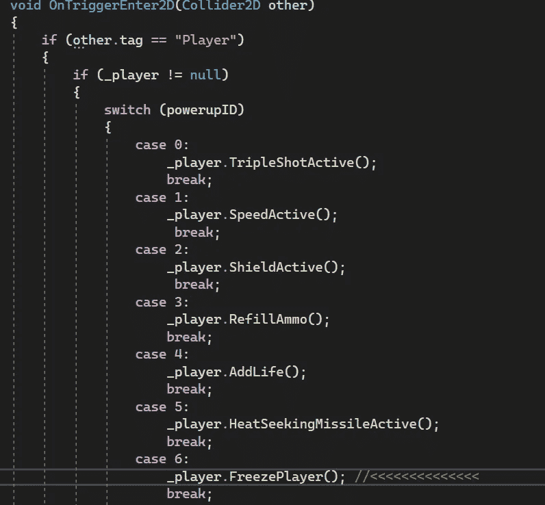

# 游戏开发的第 34 天:如何在 Unity 中给玩家创造一个冰冻的效果！

> 原文：<https://blog.devgenius.io/day-34-of-game-dev-how-to-create-a-freezing-effect-on-the-player-in-unity-3447a0c3d66c?source=collection_archive---------17----------------------->

**目标:**在我的游戏中创建一个负面的拾取，将玩家冻结在他们的位置上。

这将是最终的结果！

目前在我的游戏中，我为玩家提供了多种随机产生的选择，它们都有利于玩家，例如:加速，健康，热追踪导弹，三重射击等等。)

我想要一个消极的信号，让球员呆在原地。

在我看来，这是一个非常酷的效果，并且很容易设置。

我将首先创建 player player 调用代码所需的实际拾取。我找到了一个免费的 png 文件，它适合我的游戏，然后我添加了一个 collider2D 和 rigidbody2D，这样它就可以和我的玩家发生碰撞。确保碰撞器设置为触发器，刚体重力设置为 0。基本上只是复制我在其他皮卡上的设置。

我会将开机脚本添加到我的新皮卡中。每个不同的拾取都有一个不同的 _powerupID(它是一个 int)与之相关联。我用它来检查打给哪个收件人。另外，在我的定义中，powerup 是皮卡的同义词。我最初并没有计划在一个消极的皮卡，这不会使它成为一个技术上的“动力”。

现在我有了拾取设置，我需要在我的播放器脚本中使用这个方法来冻结播放器。

我将创建一个名为 FreezePlayer()的公共方法。我有多种方法可以让播放器冻结。但我不希望玩家能够投篮或移动或其他任何东西。如果我真的想让他们开枪，我会把他们的速度设置为 0。但是在我的例子中，我已经有了一个名为 _canMove 的 bool，当我的玩家死亡时，它被设置为 false。在 Update()中，当我调用球员移动代码时，我只在 _canMove 为真时调用代码。如果为假，则玩家不能移动。所以我还是用同一个布尔值。

每当我调用 FreezePlayer()方法时，我会将 _canMove 设置为 false，这样玩家就不能移动或射击。

我还将创建一个协程，让 sets _ can 在 5 秒钟后返回 true。

为了添加最后的润色，每当调用 FreezePlayer()方法时，我会将播放器的颜色更改为蓝色的冻结外观的颜色。我也让我的相机抖动，就像玩家被击中时一样，我还会启动协程，在 5 秒钟后解冻玩家。

然后，我将在 5 秒钟后将颜色设置回协程中的默认颜色。

最后，我需要从某个地方调用这个方法。该方法已设置，但尚未在任何地方调用。回到我的启动脚本中，我将调用这个公共的 FreezePlayer()方法。我将把 _powerupID 设置为 6。

在我的 switch 语句中，我将检查那个 powerup ID 的值是什么，并基于此调用我想要的代码。因此，如果冻结拾取上的 _powerupID 设置为 6，那么我可以像这样调用 FreezePlayer()方法:

***好了，正如你在文章开头看到的那样，它的工作和一切都准备好了。如果您有任何问题，或者试图在您的项目环境中设置这些，请随意提问。如果您对我的实现有任何建议或问题，请随时告诉我。让我们做一些很棒的游戏吧！***