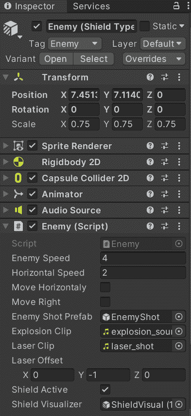
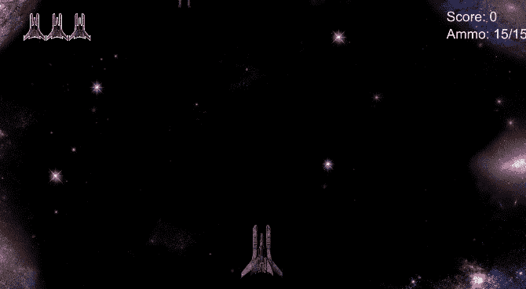
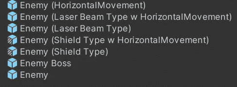
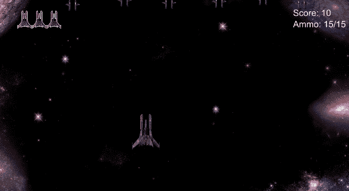

# 游戏开发的第 35 天:用预制的变体创造不同类型的敌人！

> 原文：<https://blog.devgenius.io/day-35-of-game-dev-creating-different-types-of-enemies-with-prefab-variants-f991a9a47aec?source=collection_archive---------7----------------------->

**目标**:为我的游戏创造不同类型的敌人。

我开始游戏时只有一种敌人。它从屏幕的顶部移动到底部，并不时拍摄。通常的做法是设置**职业**，让不同的敌人类型继承、覆盖等等。对于这个小原型，我用了一个更基本的设置。我只是在同一个**职业**中为我的敌人制作了不同的方法或特性，并使用一些**【serialized field】****布尔运算**来控制哪些敌人拥有哪些特性。然后检查不同的功能组合，并将每个组合保存为一个**预设变体**。

如果你看不清整幅图片，右击图片，在新的标签中打开。在这里，我只是滚动每个预设变体，以显示它们有不同的布尔检查。此外，速度和音频剪辑是不同的。

这是我最初的敌人:

到最后，我已经有了所有这些**预设变体**(除了老板，那是一个完全不同的设置):

对我来说，这是在这个小游戏中设置多个敌人的一个更快的方法，但是大多数时候职业是可行的。记住这一点。

这是我最后所有的敌人:

我只是想与那些需要一些快速原型来测试你需要测试的任何游戏特性的不同**变体**的人分享这个。一旦你对自己想做什么有了明确的想法，我会建议你开设一些课程。如果你不确定什么是**类**或者为什么要使用它们，一定要研究一下它们，因为它们是最好的和最常用的编程资源之一。

***如果您有任何问题或建议，请随时提问或告诉我。让我们做一些令人敬畏的游戏！***