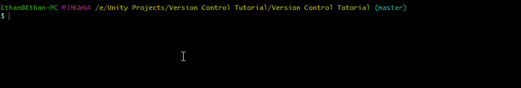
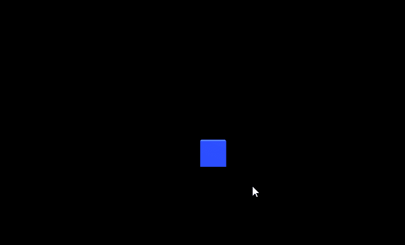

# 游戏开发的第 37 天:回顾游戏开发的 36 天..

> 原文：<https://blog.devgenius.io/day-37-of-game-dev-looking-back-on-36-days-of-game-dev-54aa40fd989f?source=collection_archive---------13----------------------->

**目的:**分享我 36 天游戏开发的经验。

游戏:【https://murkes.itch.io/galaxy-shooter 

我已经正式完成了来自 [**GameDevHQ**](https://gamedevhq.com/) 的 2D 课程，非常有趣。尽管游戏概念本身对我来说并不有趣，但我还是学到了很多。我说的很多是指很多。对我来说，这是一次坚实的学习经历。

它从建立一个新的 unity 项目和学习如何使用 Git Bash 开始，到最后我有了一个游戏！

这是“游戏性”的第一部分

然后这就随着一波 boss 变成了 30 天的玩法！

敌人繁殖的如此之快是为了演示的目的

我想带你简单回顾一下我从第一天到现在的想法和情绪。

开始时，我感到有点自信，但也很焦虑，因为我正带着这门课程走向未知。我不确定会涵盖哪些内容，以及我是否能按计划进行，诸如此类的事情。我之前已经和 Unity 一起工作了 8 个月，所以我并不害怕，但这对我来说绝对是新的，因为我以前从未经历过训练营。

然后，当我开始浏览课程并意识到“嘿，我知道这些东西”时，我的信心变得非常高。在 2 周内，我已经完成了我认为没有问题的全部课程。我已经知道了很多过去的东西，也更好地了解了我新学到的东西，但我也学到了很多很酷的新编程技术、内置方法等等。我以为我完成了..

但是…那时我意识到了一些事情。在课程结束时，有 2 张挑战纸。基本上每一页都给你一个单独的有特定要求的特性列表，你必须从 22 个中挑选 17 个来做。这感觉并不好，因为我以为我完成了，但老实说，听起来会很有趣。

所以我开始在列表上挑选我想要的特性。我的标准基于 1:确保我学到了新的东西，2:互相补充的功能，让游戏感觉有趣。

我花了两个多星期的开发时间来添加所有这些功能。

最后，我学到了新的东西，并在我已经知道的事情上做得更好，比如:

*   改变颜色
*   使用公共方法
*   清理代码
*   将对象移向或远离另一个对象
*   向另一个对象旋转对象
*   使相机抖动
*   设置不同类型的用户界面
*   向老板挥手
*   制造波浪系统
*   增加射击的冷却时间
*   让拾音器变得普通、稀有或特别稀有
*   在列表中寻找最近的敌人
*   仅在 4 周内就有如此多的内容！

我记得我在 8 小时内完成了 8 个特写，然后花了 3 天时间完成了 1 个特写。对我来说，有些比其他的更难。

最重要的是，我把它上传到了 **itch.io** ，并让我的朋友们都来玩它。我打赌，无论谁在那天晚上 12 点之前得到最多的分数，我都会给他们 10 美元的 rp (riot points，我们都经常玩英雄联盟)。这是一个爆炸，我几乎没有和他们一起玩。

相反，我打开了记事本，列出了他们会发现的所有错误或他们想要的功能，然后我添加了它们！那天晚上我做了大约 5 次。重新上传后，他们只需刷新浏览器，游戏就被更新了。在很短的时间内，通过玩家的直接输入来修复 bug 和添加特性，这是一个非常有趣的学习经历。

有许多令人沮丧的日子，也有许多轻松的日子。最后，我学到了很多东西，我很高兴我做到了。我也很高兴进入下一个课程。让我们做一些很棒的游戏吧！