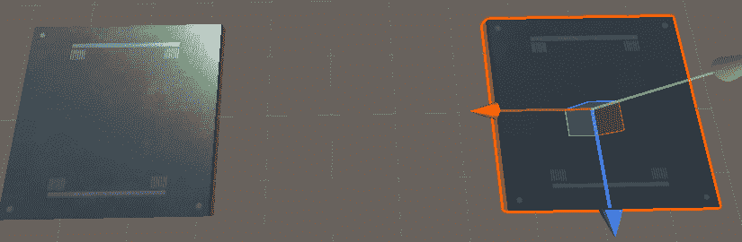
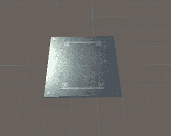
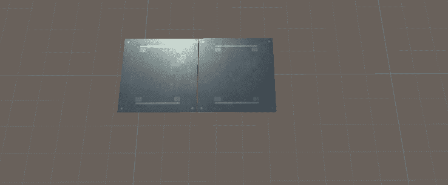
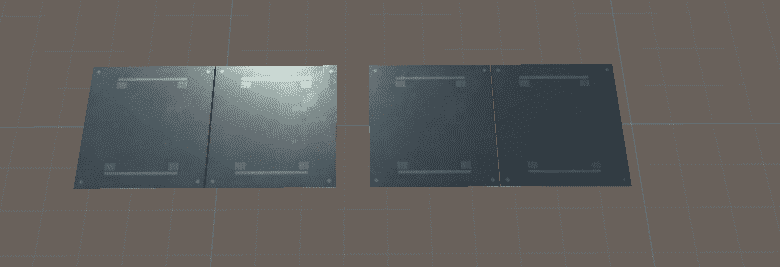
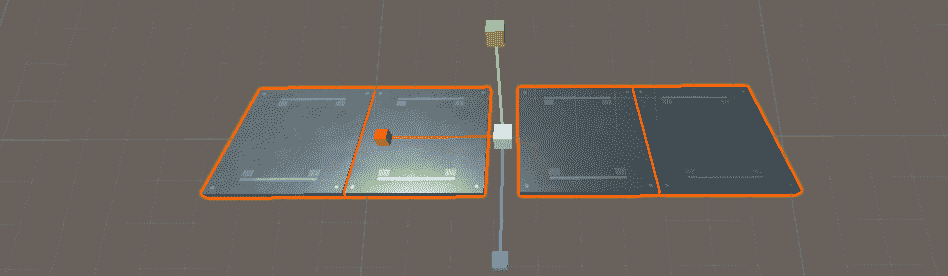
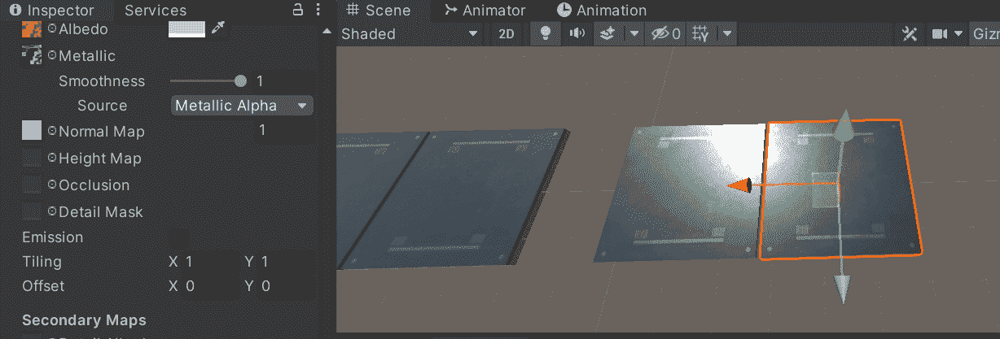
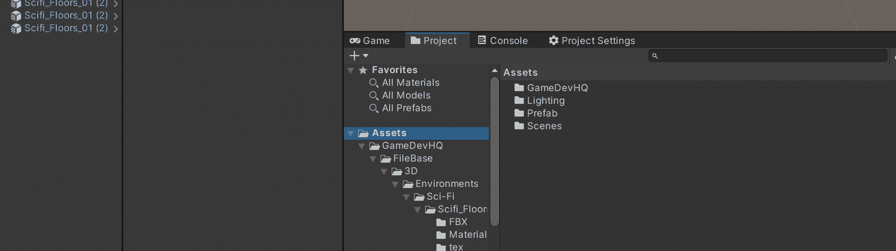
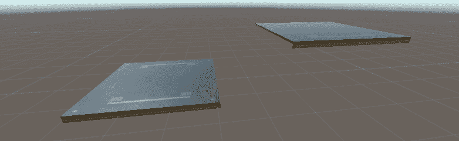

# 游戏开发的第 39 天:在 Unity 中快速升级的 4 个技巧！

> 原文：<https://blog.devgenius.io/day-39-of-game-dev-4-tips-for-level-building-in-unity-5b552d2519f2?source=collection_archive---------11----------------------->

**目的:**炫耀一些 **Unity 的**级建筑快捷方式。

**提示 1:** 要轻松地将对象并排放置而没有重叠或间隙，您可以在按住 ctrl 键的同时以 0.25 的增量移动对象。如果你拖动一个对象而不按住 ctrl 键，它会根据浮点值移动它们，这对于精确的小移动来说更好，但是如果你只是想把地砖拼在一起，这就更难了。

我首先不按住 ctrl 键移动地板，然后按住 ctrl 键移动地板

它有助于更容易地将事物“整合”在一起。只要确保你的对象在开始的时候在 0 变换或者另一个 0.25 的增量上，这样当你移动它们的时候它们都在同一个“游戏场”上。例如，如果您在 x 轴上从 0 开始移动一个对象，在 x 轴上从 0 开始移动另一个对象。那么当您以 0.25 的增量移动这两个对象时，第一个对象将从 0 移动到 0.25，而另一个对象从 0.12 移动到 0.37。如果有意义的话，就不会在同一个网格上。

这也适用于其他事物，比如旋转。

没有 ctrl 与按住 ctrl

**提示 2:** 你可以同时选择多个对象，一起操作。这包括复制。对于大型或复杂的对象也要记住这一点。

你也可以旋转所有选定的游戏对象

几乎可以随心所欲地操纵它们

**技巧三:**预制体。制造它们，使用它们，爱它们。因此，预置基本上是一个你保存的对象，可以重复使用。这不仅是非常有用的，而且如果你想改变一些关于预设的东西，并且你已经在你的场景中有了一堆，你可以很容易地改变它，保存这些改变，然后你所有的预设对象都会更新。

我也可以只改变 1 个预设为红色，然后将该对象保存为一个预设变体，而不影响原来的预设。要将一个物体保存为预设或预设变体，只需将物体从层级拖动到你的项目窗口中，它会询问你想对它做什么。

**提示 4:** 另一种将对象“吸附”在一起的方法是抓住它们的特定顶点，并将该顶点移动到另一个对象的顶点。为此，选择一个对象并按住 v。然后选择你想要的顶点。

***在 Unity 中有更多的帮助关卡建设的捷径，但我希望这能帮助你开始！让我们做一些令人敬畏的游戏！***