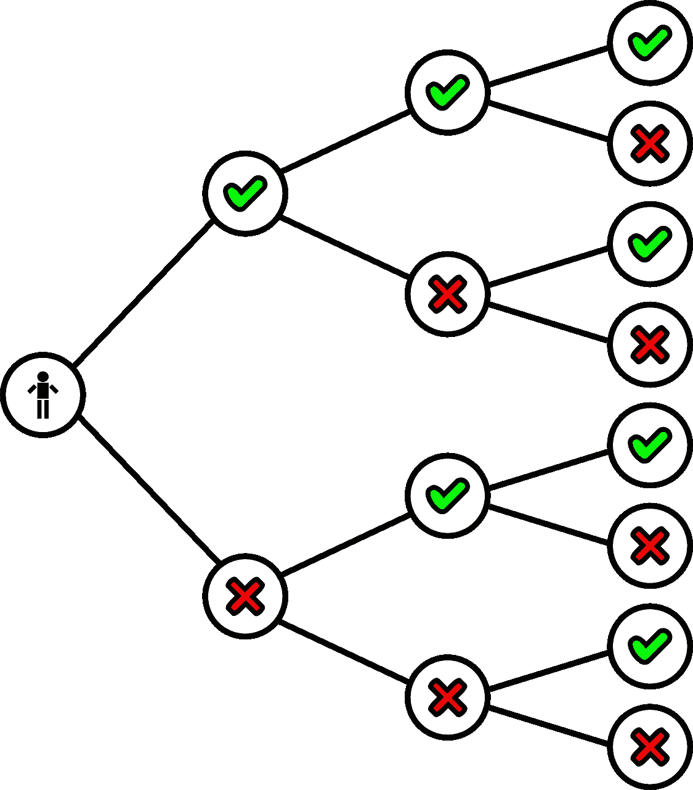
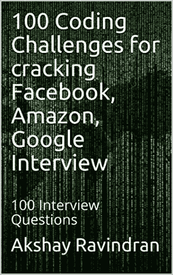

# 如何求解最接近的二叉查找树值 II？

> 原文：<https://blog.devgenius.io/day-4-closest-binary-search-tree-value-ii-8a2f88d79dbe?source=collection_archive---------7----------------------->

## 第 4 天——100 天去 LinkedIn、雅虎、甲骨文



图片来自 [Pixabay](https://pixabay.com/?utm_source=link-attribution&utm_medium=referral&utm_campaign=image&utm_content=34975) 的 [Clker-Free-Vector-Images](https://pixabay.com/users/Clker-Free-Vector-Images-3736/?utm_source=link-attribution&utm_medium=referral&utm_campaign=image&utm_content=34975)

*   100 天到领英、雅虎、甲骨文— [最接近二叉查找树价值二](https://leetcode.com/problems/closest-binary-search-tree-value-ii/)
*   出于免费的故事？下面是我的 [**好友链接。**](https://medium.com/@akshay_ravindran/day-4-closest-binary-search-tree-value-ii-8a2f88d79dbe?sk=5722a8b7c2e967c58d9a8d811a76402a)

# Introduction🛹

嘿，伙计们，今天是 LinkedIn 挑战 100 天的第 4 天。

[](https://amzn.to/2Y1mK88)

Kindle 阅读器免费

注:感谢大家关注我，记住我将为这些**电子书**举办**促销**。在特定的日子里，你可以免费得到它。我会把这些日子放在帖子里。你可以在 6 月 18 日到 6 月 19 日之间免费得到这本书。

如果你在准备面试。即使你已经在工作中安顿下来，让自己了解最新的面试问题对你的职业发展是至关重要的。从**这里**开始你的**准备**！

上个月，我一直在研究这些公司的常见问题。我已经收集了这些问题中的 100 个，我不能保证你会在面试中得到这些问题，但是我相信这些“面试问题”中的大多数都有相似的逻辑，并且从这些挑战中运用了相同的思维方式。

在我们进入今天的问题之前，如果你想知道我为什么选择 LinkedIn、雅虎和甲骨文而不是 FAANG，是因为我已经完成了一项挑战，重点是这个系列中的亚马逊和脸书面试问题:

[](https://medium.com/javarevisited/100-days-to-amazon-day-1-b9e07228f079) [## 亚马逊 100 天—第一天

### 亚马逊最常问的 100 个问题。代码和方法的解释。

medium.com](https://medium.com/javarevisited/100-days-to-amazon-day-1-b9e07228f079) 

# 新的一天，新的力量，新的想法🚀

# 第 4 天—最接近的二叉查找树值 II🏁

# 目的🏹

给定一个非空的二叉查找树和一个目标值，在 BST 中找出最接近目标的 k 值。

**注:**

*   给定的目标值是一个浮点数。
*   你可以假设 *k* 总是有效的，即: *k* ≤总节点数。
*   保证 BST 中只有一组唯一的最接近目标的 *k* 值。

# Example🕶

```
**Input:** root = [4,2,5,1,3], target = 3.714286, and *k* = 2

    4
   / \
  2   5
 / \
1   3

**Output:** [4,3]
```

# 密码👇

作者:[阿克谢·拉文德兰](https://www.linkedin.com/in/akshay-ravindran-096)

# 算法👨‍🎓

**这个问题背后的关键思想是，**

> BST 上的 Inorder 遍历→升序。
> 逆序遍历→降序

1.  将**常规**按顺序遍历存储在一个堆栈中。
2.  将顺序遍历的**反转**存储在另一个堆栈中。
3.  现在创建一个动态列表。
4.  当列表大小增长到 K 时，执行以下操作:
5.  找出堆栈 1 的**顶部**元素和**目标**值之间的**绝对差值**。
6.  将其与堆栈 2 的**顶部**元素和**目标**值之间的**绝对**差值进行比较。
7.  弹出最小差异元素并将其添加到结果中。
8.  当到达 K 个元素时，返回列表。🔚

[](https://medium.com/javarevisited/100-days-to-linkedin-challenge-10d84a92b63f) [## LinkedIn 挑战赛 100 天

### 第 1 天-嵌套列表重量总和

medium.com](https://medium.com/javarevisited/100-days-to-linkedin-challenge-10d84a92b63f) 

# 结论🐱‍🏍

恭喜你，你已经到了这篇博文的结尾。

> 你以前在面试中遇到过这个问题吗？分享到下面的评论区吧。🤝

[](https://medium.com/javarevisited/the-ultimate-guide-to-binary-trees-47112269e6fc) [## 二叉树的最终指南

### 任何你必须知道的关于二叉树的事情！

medium.com](https://medium.com/javarevisited/the-ultimate-guide-to-binary-trees-47112269e6fc) 

当我们发布新的编码挑战时，不要忘记点击**关注 button✅** 以接收更新。告诉我们你是如何**解决**这个问题的。🔥我们会很高兴阅读它们。❤:我们可以在一篇博文中介绍你的方法。

> 想在 java 编程方面出类拔萃？

[](https://www.amazon.in/Solved-Programming-Challenges-Coding-Interviews-ebook/dp/B07S5K4Z32/ref=sr_1_1?keywords=100%20best%20solved%20programming%20challenges&qid=1563392111&s=gateway&sr=8-1&source=post_page---------------------------)

已经解决的 **100 个 Java(面试)编程问题**汇编。**(黑客排名)🐱‍💻这是完全免费的🆓如果你订阅了亚马逊 kindle。**

# 你可能感兴趣的博客文章

[](https://medium.com/javarevisited/4-incredibly-useful-linked-list-tips-for-interview-79d80a29f8fc) [## 面试中非常有用的 4 个链表技巧

### 链表的最终指南

medium.com](https://medium.com/javarevisited/4-incredibly-useful-linked-list-tips-for-interview-79d80a29f8fc) [](https://medium.com/javarevisited/top-25-amazon-sde-interview-questions-cfe0ef70ba9e) [## 亚马逊 SDE 25 大面试问题

### 你在为亚马逊 SDE 的面试做准备吗？您是否希望改进您的算法和数据结构…

medium.com](https://medium.com/javarevisited/top-25-amazon-sde-interview-questions-cfe0ef70ba9e) 

作者:[阿克谢·拉文德兰](https://www.linkedin.com/in/akshay-ravindran-096)