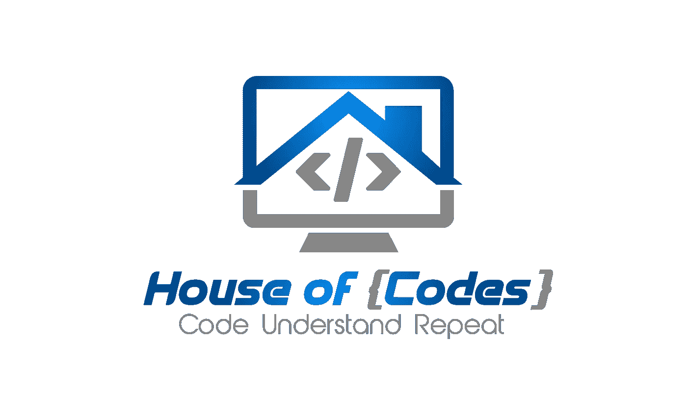

# 破解编码面试的 100 天挑战

> 原文：<https://blog.devgenius.io/day-4-most-common-word-699675d81cc5?source=collection_archive---------1----------------------->

## 第四天——最常用的词

> [**100 天到亚马逊—天**](https://leetcode.com/problems/merge-two-sorted-lists/) **4 — Leetcode🥇**


尼古拉斯·格林在 [Unsplash](https://unsplash.com/s/photos/group?utm_source=unsplash&utm_medium=referral&utm_content=creditCopyText) 上的照片

出免费故事？下面是我的 [**好友链接。**](https://medium.com/@akshay_ravindran/day-4-most-common-word-699675d81cc5?source=friends_link&sk=e88f422caec2f9e671268b106247621d)

# 介绍

嘿，伙计们，这是第四天。依然**坚挺**。

今天我解决了**最常见的单词。**

以上问题均摘自以下 [**电子书**](https://www.amazon.com/dp/B081969QH5/ref=cm_sw_r_cp_apa_i_wqVZDbCVY8RV6) **。🎓**

**继续读下去，你就能找出那些在真实面试中真正问过这些问题的公司。**

这是完全免费的🆓如果你订阅了亚马逊 kindle。

这本电子书包含了在**顶级技术面试问题**中被问到的 100 个编码问题。它还有解决所有问题的指南 **200+种方式。**这些问题我**向你保证**在之前的采访中已经问过了。

你必须决定你是想毫无准备地去参加技术面试，还是继续快速搜索这个指南来解决这 100 个问题。

# 开始你的伟大之旅🚀

> *注:本电子书仅包含* ***链接*** *到* *的解决方案。*

# 第 4 天— **最常用词**🏁

# 目标

给定一个**段落和一个**禁用单词列表，返回不在**禁用单词列表**中的最常用单词。可以保证至少有一个单词没有被禁止，并且**答案是独一无二的。**

禁用单词列表中的单词以**小写**给出，不含标点符号。段落中的单词**不区分大小写**。

> 答案是小写的。

**举例:**

```
**Input:** 
paragraph = "Bob hit a ball, the hit BALL flew far after it was hit."
banned = ["hit"]
**Output:** "ball"
**Explanation:** 
"hit" occurs 3 times, but it is a banned word.
"ball" occurs twice (and no other word does), so it is the most frequent non-banned word in the paragraph. 
Note that words in the paragraph are not case sensitive,
that punctuation is ignored (even if adjacent to words, such as "ball,"), 
and that "hit" isn't the answer even though it occurs more because it is banned.
```

# 密码👇

作者:阿克谢·拉文德兰

# 算法

1.  将禁用单词列表存储在一个**哈希表**中。为什么？HashSet 中的(搜索)是 **O(1)。**
2.  使用 split**(“”【^a-za-z]+】**)将给定的字符串拆分成不同的单词。这个正则表达式将删除所有的标点符号和空白。将单个的**字存储在一个字符串数组中。**
3.  现在字符串数组中的单词可能是大写或小写。按照标准将这些单词转换成小写字母🔡使用 **str.toLowerCase()。**
4.  遍历字符串数组，并将每个元素的频率添加到映射中。如果**特定映射**不包含**禁用词。**
5.  遍历地图，找到出现次数最多的元素。
6.  返回**那个字符串。🔚**

# 结论

当我们发布新的编码挑战时，不要忘记点击**关注 button✅** 接收更新。在下面的**评论区**告诉我们你**是如何解决**这个问题的。🔥我们会很高兴阅读它们。❤

我出版了一本**电子书**。已经解决的 **100 个 Java(面试)编程问题**汇编**。(黑客排名)🐱‍💻**

[点击这里](https://www.amazon.in/Solved-Programming-Challenges-Coding-Interviews-ebook/dp/B07S5K4Z32/ref=sr_1_1?keywords=100%20best%20solved%20programming%20challenges&qid=1563392111&s=gateway&sr=8-1&source=post_page---------------------------) 🧨🎊🎃

这是完全免费的🆓如果你订阅了亚马逊 kindle。

[](https://medium.com/@yashka.troy/100-day-challenge-to-cracking-the-coding-interview-cef2a745b7c0) [## 破解编码面试的 100 天挑战

### 第 5 天—最小堆栈

medium.com](https://medium.com/@yashka.troy/100-day-challenge-to-cracking-the-coding-interview-cef2a745b7c0) [](https://medium.com/@yashka.troy/100-day-challenge-for-cracking-the-coding-interview-a4adeabbbaac) [## 破解编码面试的 100 天挑战

### 第三天—两个夏天

medium.com](https://medium.com/@yashka.troy/100-day-challenge-for-cracking-the-coding-interview-a4adeabbbaac) 

# **参考文献**

1.  [***Groupon***](https://www.glassdoor.com/Interview/How-do-you-find-the-most-common-word-in-a-paragraph-QTN_1724332.htm)*[***Groupon 设计联盟***](https://medium.com/u/deee2f506fbe?source=post_page-----699675d81cc5--------------------------------)*
2.  *[**亚马逊**](https://www.glassdoor.com/Interview/-1-find-the-most-frequent-words-in-a-sentence-2-implementation-of-a-linkedlist-class-QTN_888780.htm) [**亚马逊视频游戏**](https://medium.com/u/5840ab154d41?source=post_page-----699675d81cc5--------------------------------)*
3.  *[**EA 体育**](https://www.glassdoor.com/Interview/I-was-asked-of-a-data-structure-that-can-be-used-to-find-the-20-most-common-words-in-a-large-corpus-QTN_622552.htm) **@EA***
4.  *[**脸书**](https://www.glassdoor.com/Interview/Given-a-really-big-file-with-a-lots-of-Facebook-posts-find-the-ten-most-used-words-QTN_600584.htm) [**脸书研究**](https://medium.com/u/25aae929dbb1?source=post_page-----699675d81cc5--------------------------------)*

**