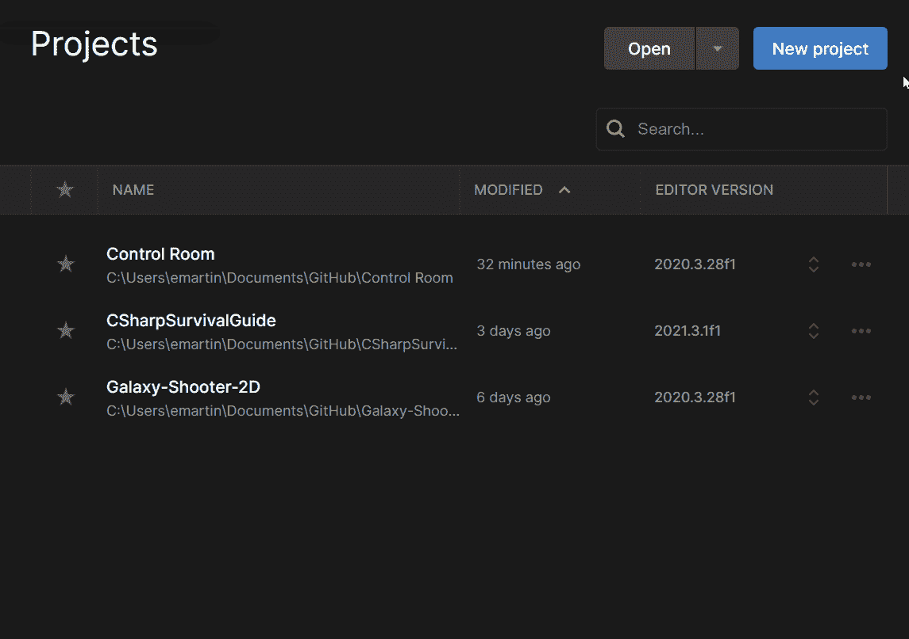
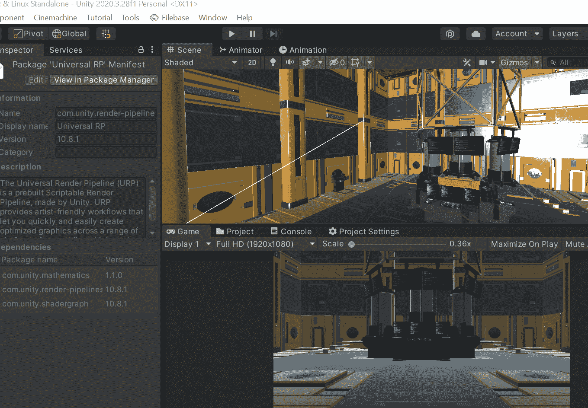
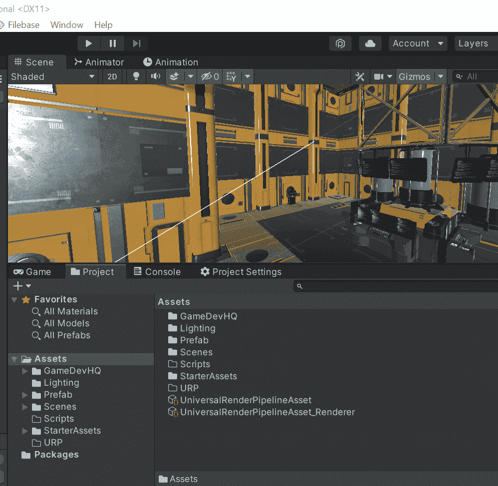
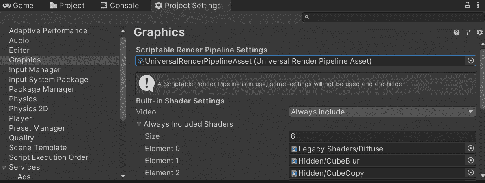
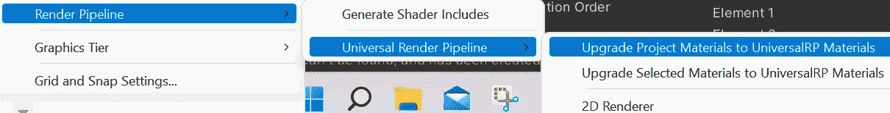

# 游戏开发的第 42 天:如何将 URP 添加到你的 Unity 项目中！

> 原文：<https://blog.devgenius.io/day-42-of-game-dev-how-to-add-urp-to-your-unity-project-126ab350b38e?source=collection_archive---------15----------------------->

**目的:**在我的 **Unity** 项目中安装通用渲染管道。

有两种方法可以将 **URP** 添加到你的 **Unity** 项目中。您可以使用模板中包含的 **URP** 创建一个新项目:

然后将您的其他项目导入其中。

或者您可以升级您当前的项目。无论哪种方式，确保在这样做之前有某种形式的备份，以防万一。

我走的是升级路线，这也是我在这篇文章中要关注的。

首先进入包管理器，下载并导入 **URP** 。

下载后，创建一个**通用渲染管道资产**

半途而废！然后转到**项目设置<图形**并将可脚本化的渲染管道更改为您刚刚创建的资产。

最后，你可能会注意到部分或全部场景是紫色的。那是因为这些材料还没有准备好和 URP 一起使用。要进行更改，请转到**编辑<渲染管道<通用渲染管道<将项目材质升级为通用 RP 材质**。

***你应该都弄好了。如果你有这个设置的问题或有任何建议，请随时评论。让我们做一些很棒的游戏吧！***