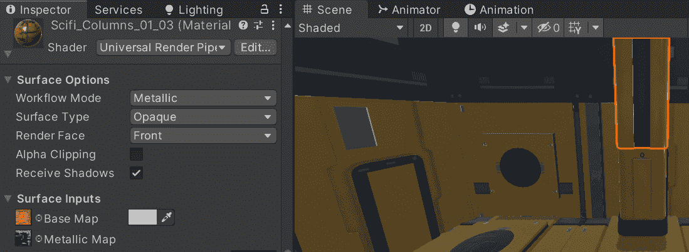
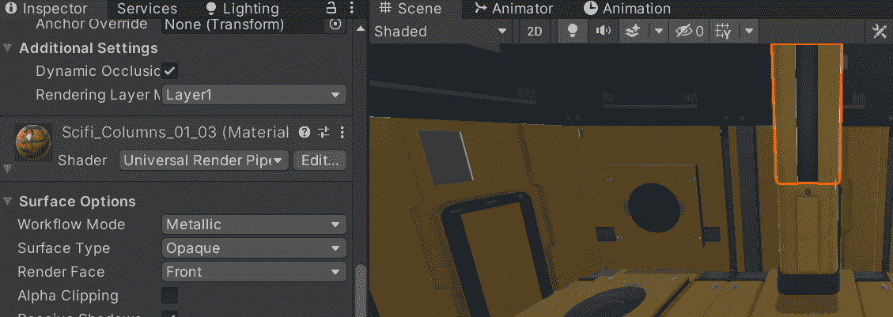
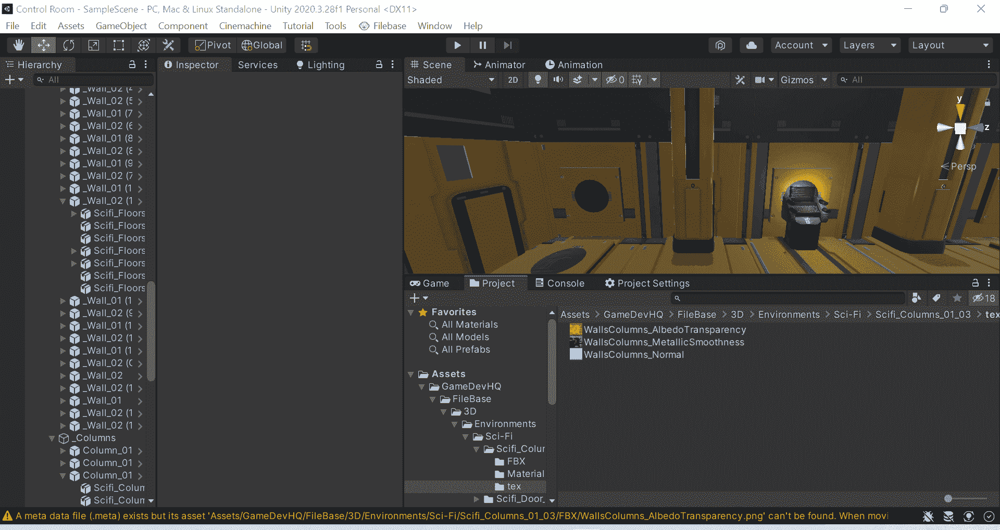
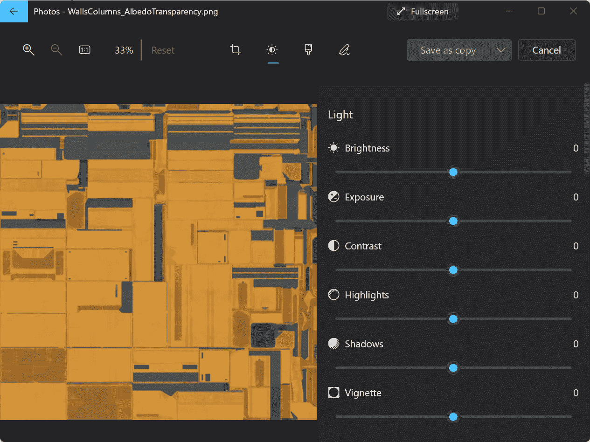
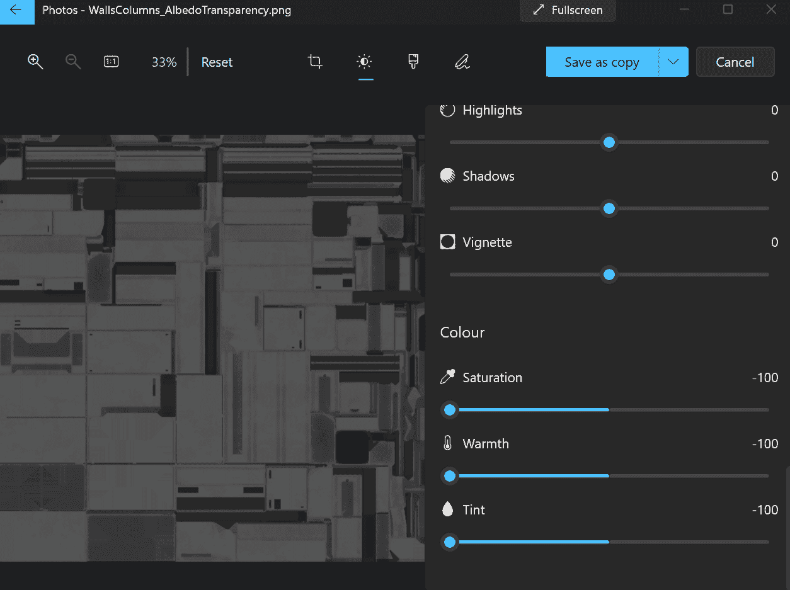
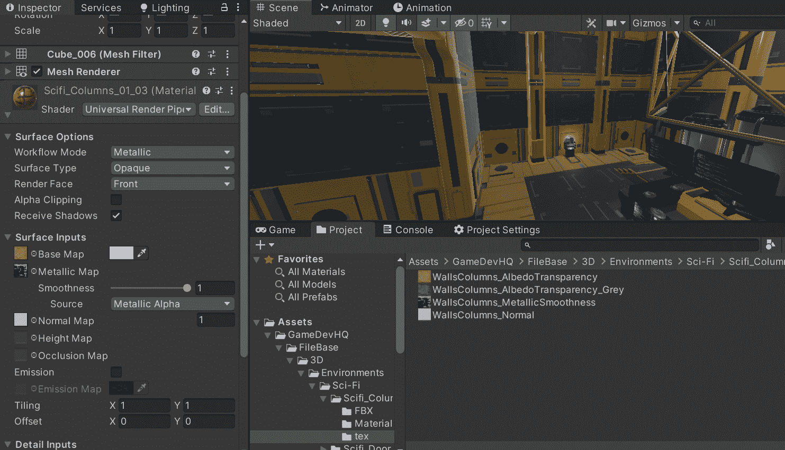
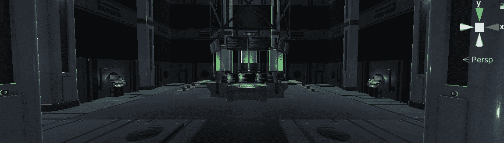

# 游戏开发的第 45 天:改变 Unity 中的纹理贴图！

> 原文：<https://blog.devgenius.io/day-45-of-game-dev-altering-texture-maps-in-unity-274605e8d21a?source=collection_archive---------7----------------------->

**目标:**把我的黄色科幻场景换成灰色。

首先，改变纹理颜色的一种方法是改变材质的颜色。唯一的问题是，有时某些颜色不会工作或看起来正确，因为已经有一种颜色嵌入在这种材料中。你用这种方式混合它们，然后真正改变颜色本身。这就是为什么有时候你不得不走一条不同的路线。

在这种情况下，灰色不起作用。

另一种方法是使用 **Photoshop** 、 **Gimp** 或者只是 windows 内置的**照片应用**。我敢肯定 mac 可能有自己的版本。

找到纹理，在浏览器或 finder for Mac 中打开。用你所有的编辑器打开纹理。我只是使用内置的 windows 照片编辑器。我后来用 Gimp 做了这个，但是在这个例子中，我将使用 windows 软件。

现在在这里，我可以很容易地改变纹理的某些东西，使它变成灰色。唯一的事情是这个免费的 windows 软件不允许太多，但它让我去我需要去的地方。

然后，我将它保存为副本，并将其移动到原始纹理存储的同一文件夹中。

在统一更换纹理和你的所有设置！

就这么简单。大多数情况下，你可能会想使用 Gimp，因为它比内置的 windows 软件有更多的功能。另外 **Gimp** 是免费的！

最后，我用同样的技术将我项目的其余部分从黄色改为灰色，结果如下:

***如有任何问题或建议，欢迎留言。让我们做一些很棒的游戏吧！***