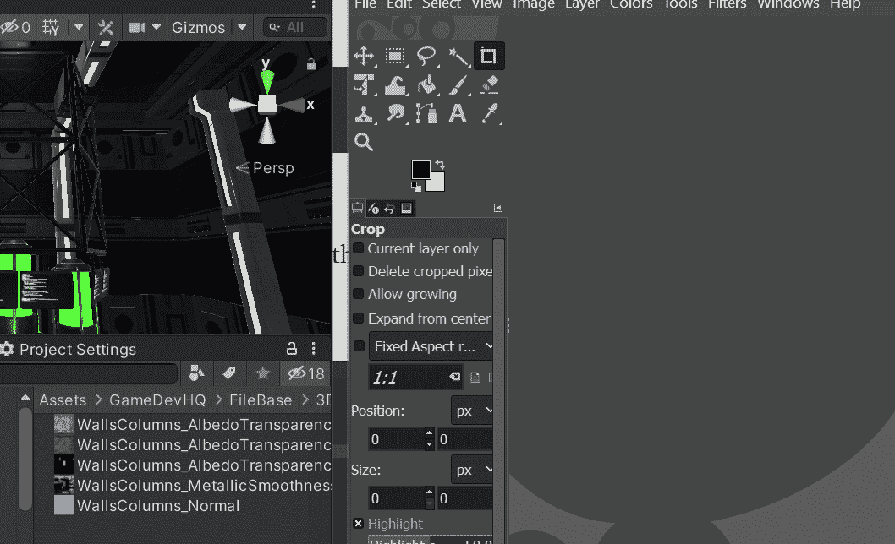

# 游戏开发的第 46 天:为你的 Unity 项目添加排放到纹理！

> 原文：<https://blog.devgenius.io/day-46-of-game-dev-adding-emissions-to-textures-for-your-unity-project-8cf0888d952d?source=collection_archive---------6----------------------->

**目的:**使用 Gimp 给我的 Unity 项目中的一些纹理添加发射。

你可以使用 **Photoshop** 、 **Gimp** 或其他软件，但在这篇文章中我将专注于 **Gimp** ，因为那是我熟悉的一个。

我希望场景中的试管和其他东西发光。

这将是最终的结果

我将使用列作为我的例子。

**第一步:**在场景中找到柱子，打开它的材质。

**第二步:**在项目窗口打开的情况下，点击底图纹理，它将高亮显示。

**步骤 3:** 将纹理拖放到 Gimp 中。

**步骤 4:** 在 Gimp 中创建新层。

步骤 5: 在新图层中高亮填充你想要发射白色的区域。

步骤 5: 在你创建的第一个图层下创建另一个新图层

第六步:在这个最新的图层中把其他的东西都涂成黑色。

步骤 7: 合并图层(确保你填充的黑色图层在白色图层的下面)。

**第八步:**关闭初始图像。

**第 9 步:**将发射层(或者你称之为什么)作为 **png** 导出到你的 **Unity** 项目中。

**第十步:**回到 **Unity** 上，我会打开发射，放入新的发射 **png** 。

**第 11 步:**您也可以更改排放强度。(我相信如果在 URP 的**或 T42 的**或 HDRP 的你会有那个选择)

我将对我想要排放的每个项目执行相同的步骤。

***如果您有任何问题或建议，请随时发表评论。让我们做一些很棒的游戏吧！***