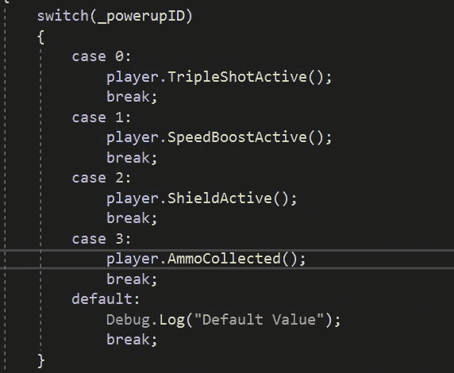

# 第 46 天:重装！弹药收藏品

> 原文：<https://blog.devgenius.io/day-46-reloading-the-ammo-collectible-3e501f4fa59c?source=collection_archive---------6----------------------->

**目的**:制造一个可以重新填充弹药数量的能量，让玩家可以再次开火。

现在我已经拥有了游戏的弹药功能，现在是时候实施一种方法，在游戏运行期间补充弹药了。是时候重装弹药了！

**创世:**

为了开始创建弹药加电，我想从创建一个可以用于弹药加电本身的新对象开始。可以通过各种商店和网站定制、购买或借用资产。我将使用的资产如下所示:

我的弹药加电

我想把这个资产拖到我的层次结构中，并开始添加 2D 刚体和碰撞器组件。我也想把我的启动脚本附加到这个对象上，因为它将继承与我的其他启动相同的行为。

添加刚体和碰撞器组件

在第 24 天，我介绍了使用一个从 0 号元素到 3 号元素的阵列进行加电。如果你还记得的话，使用数组对于这些情况是很好的，因为不用那么多 if 和 then 逻辑语句，这有助于在检查器中分配它，也有助于在我的代码行中使用 switch 语句使事情变得更简单。

在我的产卵管理器中，如果我查看我的检查员视图；我可以添加一个额外的加电，然后再添加一个额外的元素，我现在可以给元素 3 分配弹药加电了！

扩展阵列并分配弹药加电

在附加到弹药加电的脚本中，我想确保加电标识，一个我之前编写的 int 变量，将被分配给 3，从而成为弹药加电的标识。

将标识分配给指定的电源

然后，我想跳转到我的产卵管理器脚本，在那里我启动了 coroutine 来产卵加电，我现在可以扩展这个“random.range”的数字到(0，4)添加弹药加电到等式中。

现在在我的开机脚本里；我现在可以在我的 switch 语句中添加一个案例 3，其中弹药加电是为了测试而收集的。

在 powerups 脚本中添加案例 3

运行游戏时，一切都应该正常工作，我应该在收集弹药的控制台下得到一条信息:

**行为:**

一旦我有了代表游戏中可收集弹药的实际对象，我现在就可以在玩家拾取时实现这个对象的行为。

基本上，每次玩家拿起可收集的弹药，我希望玩家补充 10 个弹药。为了实现这一点，我跳到我的播放器脚本中，创建了一个新的方法，我可以在我的 powerup 脚本中通过 switch 语句的情况 3 传递这个方法。

在这个玩家脚本下的方法中，我想声明弹药数量等于当时的弹药数量，再加上 10。当然，我也不想忘记更新我的弹药界面。

增加 10 弹药时，弹药收集皮卡

现在这里的问题是，玩家可以连续收集没有上限的子弹。在这种情况下，我保持弹药上限在 30。所以我编辑了我的弹药上限方法，并在这个方法下传递它。因此每当该整数超过 30 时，它将默认回到 30 的值。

设置弹药上限，这样玩家就不会持续拾取弹药

实现这一点后，如果我运行游戏，一切都应该完美地工作，弹药收集应该补充我的弹药 10，每次游戏收集弹药上限为 30。

