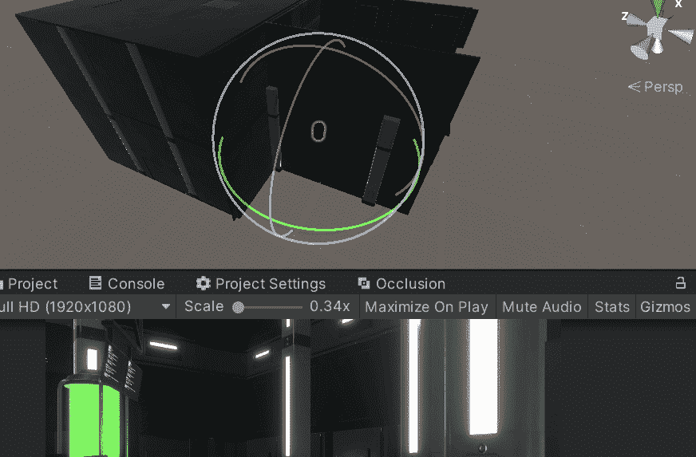

# 游戏开发的第 48 天:提高 Unity 中遮挡剔除的性能！

> 原文：<https://blog.devgenius.io/day-48-of-game-dev-improving-performance-with-occlusion-culling-in-unity-bd2877f6ff97?source=collection_archive---------7----------------------->

**目的:**回顾一下什么是**遮挡剔除**，在我的 **URP 团结**项目中测试一下。

遮挡剔除只渲染玩家视野内的东西。例如，如果有 4 面墙组成一个房间，玩家正看着前面的墙，前面的墙会被渲染，但是因为后面的墙不在玩家的视野中，所以不会被渲染。这对性能非常有益，因为你一次只需要加载游戏的一小部分。

为了在我的 **Unity** 项目中设置**遮挡剔除**，我需要记住，这只适用于**静态**元素或者标签被切换的元素，这样**动态**元素将被视为**静态**。

**第一步**:我要走标签路线，将我想要包含在**遮挡剔除**中的物体设置成静态标签。我需要启用 2 个静态标签，**遮光器**静态**和**遮光器静态**。**

如果您愿意，也可以启用或禁用其他选项。在我的情况下，我将启用除了 **Contribute GI** 之外的所有东西。做对你有用的事。只要确保您选择了**遮光器** **静态**和**遮光器静态**即可。

**第二步** : **烘焙**物体。打开**遮挡剔除**窗口，点击**烘焙**。

**第三步**:检查并确保这正在工作，并能够在编辑器中可视化，确保你选择了**遮挡窗口**，然后进入**场景视图**。你将有一个**可视化**选项。

如果你对某些对象不能使用**遮挡剔除**有任何问题，这可能与**最小遮挡**设置有关。基本上，如果你有较大的物体表现不正确，那么你可能需要减少**最小的遮光器。**一定要多研究一下**最小的封堵器**是什么，如果你有问题的话，就多研究一下它的值。

我希望这对你有用，如果你有任何问题或建议，欢迎评论。让我们做一些很棒的游戏吧！