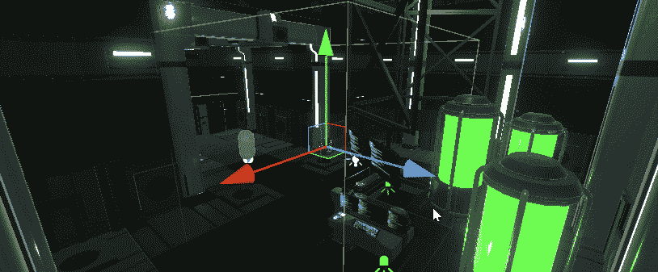
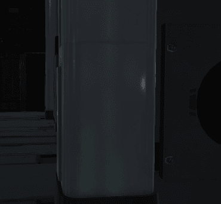

# 游戏开发的第 49 天:Unity 中的反射探针！

> 原文：<https://blog.devgenius.io/day-49-of-game-dev-reflection-probes-in-unity-90cb76fd54de?source=collection_archive---------6----------------------->

**目标**:回顾一下什么是**反射探头**并将其添加到我的 **Unity** 场景中。

一个**反射探头**使你场景中的材质反射。 **URP** 和 **HDRP** 的反射探头工作原理略有不同，但概念相同。**与 **URP** 相比，HDRP** 占用更多性能，但质量更高。在这个例子中，我将使用 **URP** 。

我将从给我的场景添加一个**反射探测器**开始。

**探头**确实有一个你可以定制的范围。当在场景中移动它时，你应该能够看到它周围区域的效果。

如果你打开了**小发明**，你应该能够看到**探头**的作用区域。

我调整了**探针**区域来适应我的场景

这是它的一点功能。第一个 gif 是没有**探头**的反射，第二个是有**探头**的反射。请注意，在第二个画面中，你可以看到 3 个绿色发光胶囊的倒影。

这是**探头**打开和关闭的场景。请记住，我在这个场景中还没有太多的反射物体，所以差异不是很大，但在场景中走动时有一些很酷的微妙变化，使它更具沉浸感。

在**探头**上有很多设置可以乱来，比如**强度**。

记住，你也可以调整单个游戏物体的平滑度，使它们更具反射性。

***用反射探头创造凉爽的环境！如果您有任何问题或建议，请随时评论。让我们做一些很棒的游戏吧！***