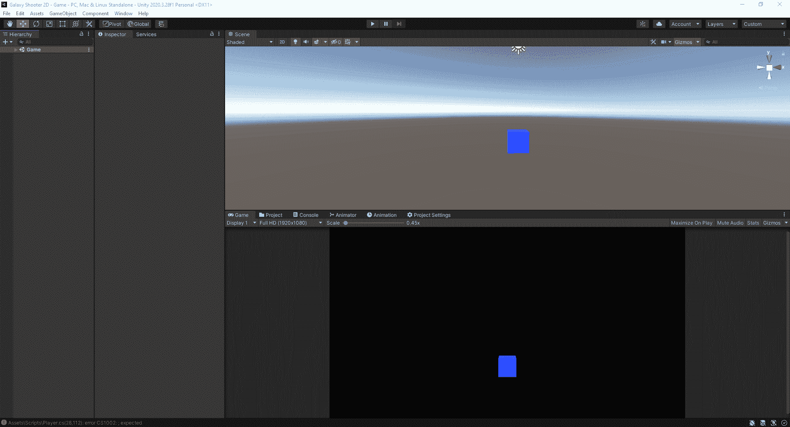

# 游戏开发的第 5 天:在 Unity 编辑器中建立一个高效的布局！

> 原文：<https://blog.devgenius.io/day-5-of-game-dev-establishing-a-productive-layout-in-the-unity-editor-d20d93d2d837?source=collection_archive---------10----------------------->

**目的:**移动 **Unity 编辑器**中的**窗口**来提高效率，让事情更有条理，更容易找到。

当涉及到定制布局时，有许多不同的方法来做，并且在整个项目中它可能会改变。不要强调创建完美的布局，但是尝试组织**编辑器**来更好地满足你的需求肯定会对你有帮助。请记住，您可以随时轻松移动**窗口**。

这篇文章至少应该给你一些关于如何定制你的**编辑器**的想法。

这是默认的**编辑器**布局。

要移动一个**窗口**，只需简单的左键点击然后拖动它。你会注意到它可以填充所有不同的区域。要移动的最有用的**窗口**之一是**游戏视图**，这样你就可以同时看到**游戏视图**和**场景视图**。

你还会注意到像**控制台** **窗口**这样的东西，为了能够轻松地查看它向你显示的信息，你会希望确保它有一个较长的布局，而不是一个较高的布局。

我推荐和使用的布局是这样的。你不必复制它，用它来获得灵感(除非你喜欢它:D)。我还有一些额外的标签，随着时间的推移，大多数 Unity 用户可能会将它们添加到他们的编辑器中。例如，我有**动画**、**动画师**、**项目设置**和其他**窗口**，它们没有使用默认设置。我倾向于不时地改变布局，这取决于我正在执行的任务或者我是否想尝试一些新的东西。

为了让你知道为什么我的**编辑器**是这样布局的，让我解释一下我的一些选择。我更喜欢我的**层级** **窗口**和我的**检查员** **窗口**紧挨着，因为它们大部分时间都是一起使用的。对我来说，这是一个相当简单的选择，至少把它们放在一起。我也喜欢将我的**控制台窗口**和**项目窗口**与**游戏视图** **窗口**放在同一个标签上，因为我并不总是想看到那些**窗口**中的内容，当我看到时，我会简单地切换到它们。从你的网站上删除不必要的信息，直到你需要它，这有助于你专注于你正在做的事情。

我喜欢做的另一件很酷的事情是把一个**窗口**放到一个完全不同的显示器上！简单地像平常一样拖动它，并把它带到另一个显示器上！很棒的功能！

要保存您的布局，请转到右上角的默认位置，然后单击保存布局。

记得和**编辑器**玩得开心，不要过分强调要让它变得完美，而且很容易在飞行中改变。

**继续学习，继续推，玩得开心！我希望这对你有一点帮助，快乐成长！**