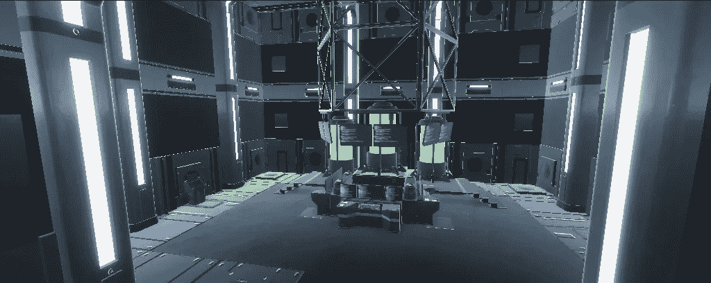
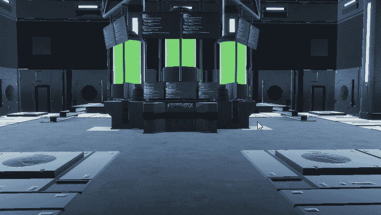

# 游戏开发的第 50 天:将我的 URP 项目转换到 Unity 中的 HDRP！

> 原文：<https://blog.devgenius.io/day-50-of-game-dev-converting-my-urp-project-to-hdrp-in-unity-8386b974a1ca?source=collection_archive---------6----------------------->

**目标:**将我的项目从 **URP** 转换为 **HDRP** 。

我会从一开始就说清楚…我搞砸了。最终目标是一个**统一**场景，我将在 **URP** 和 **HDRP** 设置这个场景来学习这两个场景。事实证明将一个转换成另一个几乎是不可能的。是时候告诉你我决定要做什么了。它的工作，但它需要更多的点击一个转换按钮..

HDRP 好漂亮:)

**概述:**

*   我创建了一个新的空文件夹。
*   在里面做了一个新的本地 git 回购。
*   从网上回购中撤出了这个项目。
*   为我的 git repo 创建一个新的分支。
*   在我将项目升级到 URP 之前，将分支恢复到提交状态。
*   然后通过包管理器将项目升级到 HDRP。
*   然后重拍 URP 升级后的场景，比如添加排放物之类的。我只是进入我最初的项目，取出我需要的文件。
*   HDRP 不工作的时候有点麻烦。基本上，每当我将所有的材质转换为 HDRP 时，我的场景就会变得不可见。
*   我尝试添加一个照明配置文件，看看是否可以修复它，它做到了。
*   我花了一段时间才弄明白为什么我的发射不起作用，尽管它说我已经应用了纹理并打开了发射。我必须把强度提高到我认为必要的程度，这样才能解决问题。
*   好几次我都差点放弃了。但是它现在工作了！

这篇文章主要是为了帮助那些有同样问题的人，因为我相信你已经谷歌过了，在寻找解决方案时，你希望人们开门见山。我希望这能帮助你。这些步骤中的大部分可以通过简单的谷歌搜索来完成。

***如需任何帮助，请随意评论。让我们做一些很棒的游戏吧！***