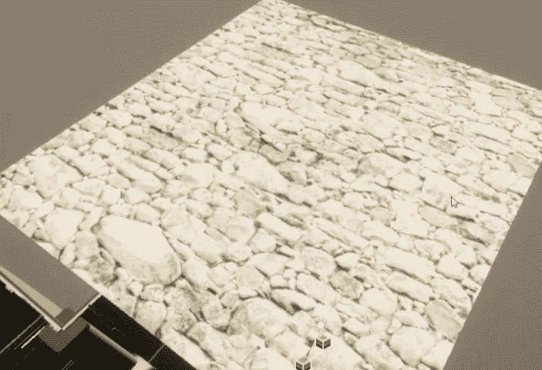
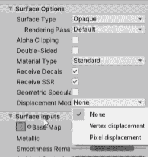
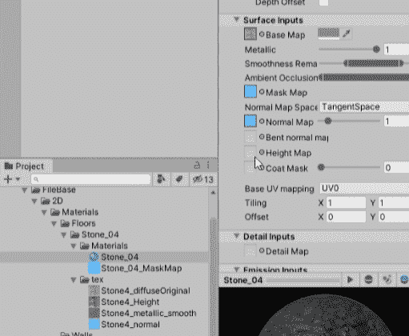
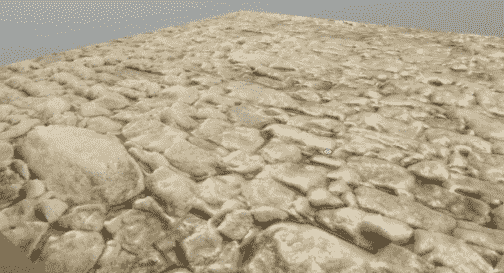
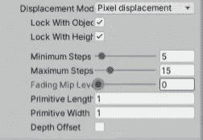
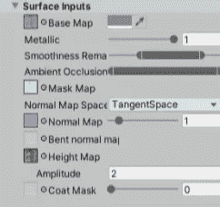

# 游戏开发第 51 天:如何在 Unity 中使用高度图和像素位移！

> 原文：<https://blog.devgenius.io/day-51-of-game-dev-how-to-use-height-maps-and-pixel-displacement-in-unity-64eb1c581e4?source=collection_archive---------8----------------------->

**目的:**复习什么是**高度图**以及如何在 **Unity** 中使用它们使 2D 物体呈现 3D。

对于我的例子，我将制作一个平面，并应用 2D 石材。我需要一个**高度图**，它会告诉计算机不同部分的材料需要提高或不使用黑白值进行比较。这要复杂一点，但这不是我们现在真正需要担心的事情。只要知道它是用来帮助实现这种三维外观。

你可以使用 **Gimp** 或 **Photoshop** 生成一个**高度图**，通过一些快速的谷歌搜索，你应该可以很快为你的素材生成一个。 **Gimp** 和 **Photoshop** 大概会把它们称为“**凹凸贴图**”。我不打算在这篇文章中讨论这些，因为每个都是不同的，它们也可能会更新。

回到你的素材上设置**位移模式**为**像素位移**。

一旦完成，更多的选项将会出现，你可以分配**高度图**。

一旦完成，你应该看到石头现在已经被移动，使用**高度图**。

还会有更多的选项来调整你想要的样子，但我希望这能让你开始！

***如有任何问题或建议可免费评论。让我们做一些很棒的游戏吧！***