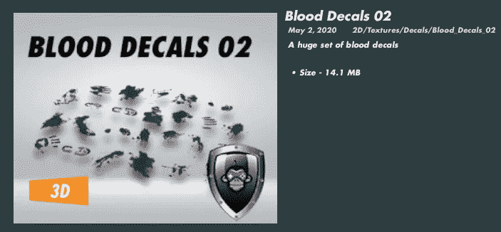
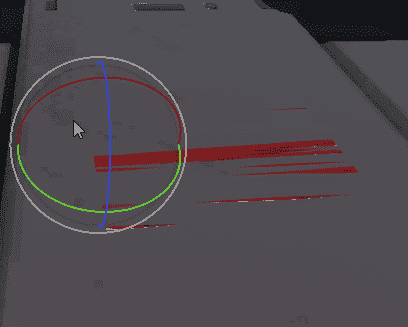
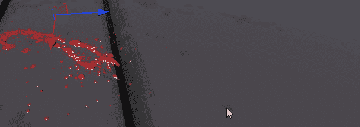
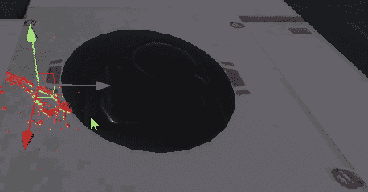
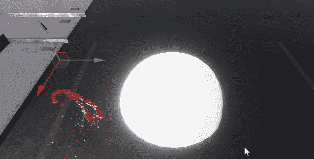

# 游戏开发第 53 天:Unity 中的贴花是什么，如何使用它们？

> 原文：<https://blog.devgenius.io/day-53-of-game-dev-what-are-decals-in-unity-and-how-to-use-them-6019e8e424a?source=collection_archive---------6----------------------->

**目标:**在我的项目中使用一些示例**贴花**并检查它们是什么。

一个**贴花**基本上是一个 **2d 精灵**的**投影**。为什么不用 2d 精灵呢？投射它有什么好处？

比方说，你使用一个投影仪，你必须把它放在一个平面上，否则图像会缠绕在其他表面上的凸起和不均匀的点上，使图像或视频更难看到。但有时像血液这样的东西会让 3D 游戏中的关卡构建看起来更加自然和真实。这就是贴花要达到的效果。

我会告诉你我的意思。

我先从**文件库**下载几张血贴花，这是一个非常可爱的艺术插件。(不是免费的，只是确保你知道这一点)。

这些已经是预制好的贴花，但是你也可以自己制作。

我将移动一个血液飞溅到我的场景中，我将旋转它以获得我想要的效果。请记住，这是一个投影，而不仅仅是一个 2D 精灵，所以如果你调整或旋转，感觉很奇怪，这可能是为什么。

这就是**贴花**的威力！它会缠绕不平整的物体！

有时你可能不得不抬起**投影仪**，以确保它不在**贴纸**应该在的物体下方。

在使用**贴花**时，试着记住**投影**和**投影仪**之间的区别。

如果您对贴花有任何问题或更多见解，而我在这个基本概述中没有涉及，请随时发表评论。让我们做一些很棒的游戏吧！