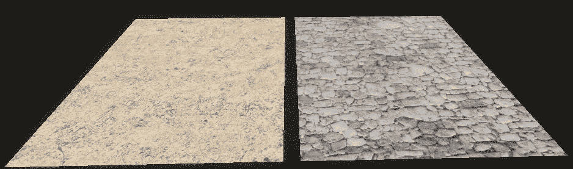
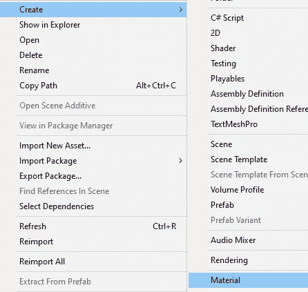
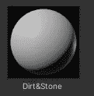
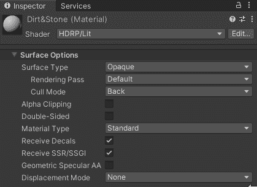
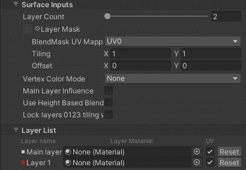
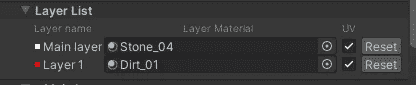
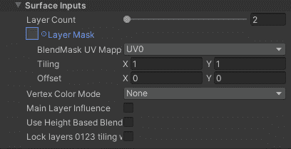
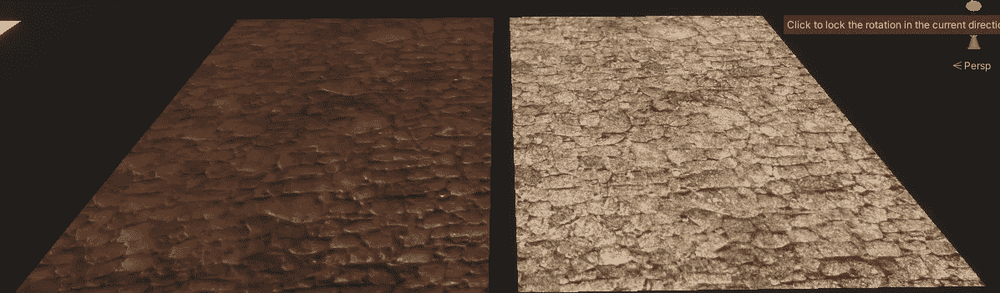

# 游戏开发的第 54 天:如何使用分层照明在 Unity 中结合纹理！

> 原文：<https://blog.devgenius.io/day-54-of-game-dev-how-to-combine-textures-in-unity-using-layered-lit-2ae04a0c2500?source=collection_archive---------13----------------------->

**目标:**在我的 **HDRP 联合**项目中添加我的泥土和石头纹理。

**第一步:**制作新材料。

**第二步:**将着色器类型改为**分层光照**。

这将给你**层列表**和**层计数**，你可以有多达 4 层。

步骤 3: 我将设置我的石头材料为第一层，我的泥土为第二层。

**步骤 4:** 添加一个**图层蒙版**。请记住，对于这个演示，我没有一个完美的图层蒙版，但这个例子会工作得很好。基本上，图层蒙版将是纹理的黑白版本，将使用黑白来比较和对比图层应该“混合”的地方。

这是我没有适当的图层蒙版的最终结果。

这两个物体实际上被设置为完全相同的颜色，但是右边的是泥土和石头的混合纹理，而左边的只是石头。你可以清楚地看到右边的颗粒。用一个合适的图层蒙版，我可以让污垢不覆盖所有的石头，而只是填充裂缝。这也适用于其他东西，比如草和苔藓！

***如有任何问题或建议，欢迎评论。让我们做一些很棒的游戏吧！***