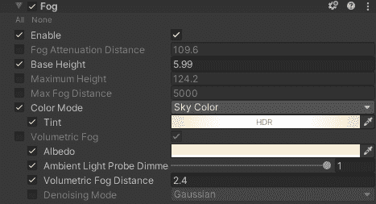

# 游戏开发的第 55 天:如何在 Unity 中使用 HDRP 添加雾！

> 原文：<https://blog.devgenius.io/day-55-of-game-dev-how-to-add-fog-using-hdrp-in-unity-3af0f8a9dfda?source=collection_archive---------11----------------------->

**目标:**在我的 **HDRP Unity** 项目中添加雾，并查看一些选项，包括雾照明。

我将从使用一个我从**文件库**得到的雾预设开始，这是一个非常可爱的艺术插件。有其他地方可以得到你的雾，或者你可以自己制造雾，但这只是一个例子。

有很多选项来调整我的雾。这是我开始做的。

在调整了速度、大小、颜色等等之后，我现在有了这个！

我还可以添加一些“雾照明”。我将从给我的场景添加一个点光源开始。

启用**点光源**上的**音量**。

在我的**全局音量**(如果使用 **HDRP** ，你的场景中很可能会有)上打开雾。

确保检查**雾衰减**和**体积雾**。

我可以使用灯光上的**倍增器**或者使用**全局音量**上的**雾衰减**来调整强度。

雾灯可以保持在一定的半径范围内，并且可以调节。

在这里，我正在调整灯光的倍增器，并将灯光放置在我的雾开始的地方。

这是给雾添加一些灯光的至少一个选择，还有很多其他的选择来帮助你调整它。我希望这能帮助你开始创建一个非常酷的雾效果。

***如有任何问题或建议，欢迎评论。让我们做一些很棒的游戏吧！***