# 游戏开发的第 56 天:在统一 HDRP 用灯光层控制你的灯光！

> 原文：<https://blog.devgenius.io/day-56-of-game-dev-controlling-your-lighting-with-light-layers-in-unity-hdrp-dcb4e5fb7cd5?source=collection_archive---------5----------------------->

**目标:**回顾一下有哪些光层，并把它们实现到我的场景中。

**光层**基本上是一种设置光源的方式，只投射在某一层的某些物体上。当你需要优化你的游戏时，这是非常有用的，你有一个昂贵的光源，只需要用来显示一些东西。就像我的例子，我想要一些雾射线类型的外观，这意味着我的光源应该只影响雾，而忘记其他一切。

开始我的例子，我将添加一个聚光灯到我的场景。

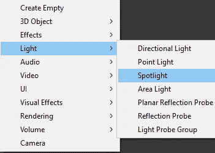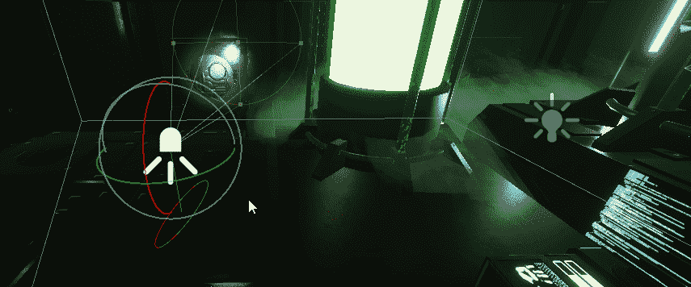

我会把它对准我的雾。

我也会调整半径。强度和颜色刚好匹配我的场景。

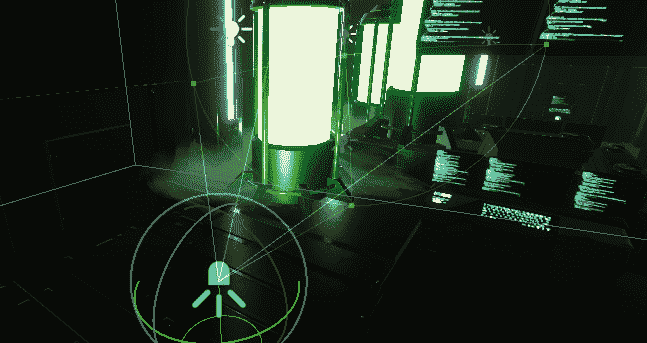

在项目的 HDRP 资源中，可以打开灯光层。

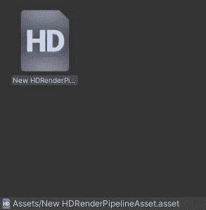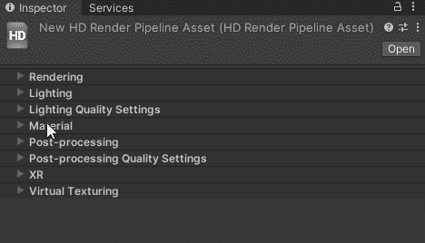

回到聚光灯下，我需要设置我的灯光层。

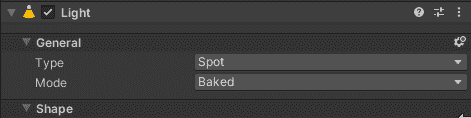

我将开始设置灯光图层为空，然后添加我想要灯光效果的图层。

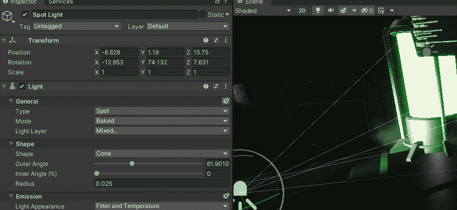

在这个例子中，我将它设置为层 1，以显示现在它有一个灯光效果，但它实际上并没有将灯光投射到其他对象上，除非它们在灯光层 1 上，而我的大多数(如果不是所有)对象都没有打开。

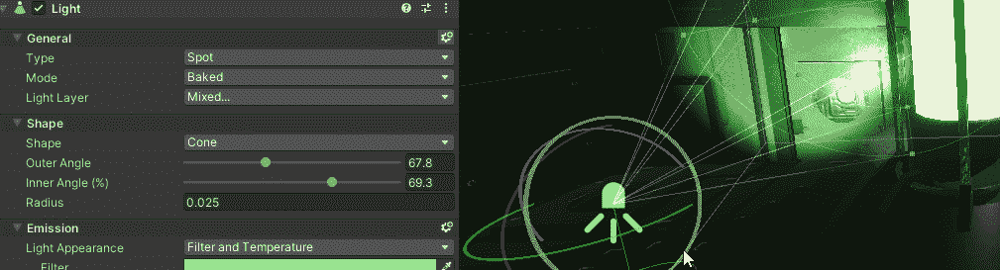

请记住，有些角度会让你更难看清。

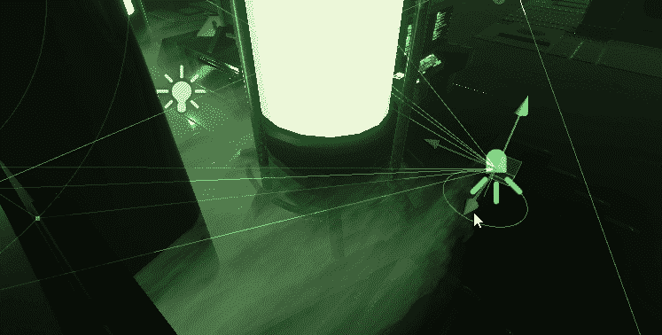

我还会把半径设置得离实际光源远一点，这样就不会看起来像是来自聚光灯。

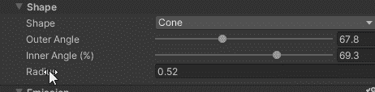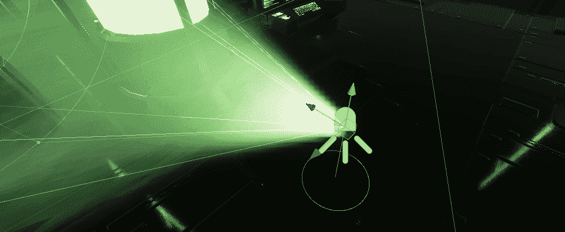

现在，我能够照亮雾，而不需要实际投射任何光线到我们的物体上。

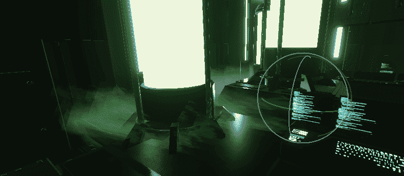

我肯定会调整这一点，因为我不喜欢看，但我希望这个例子有意义。

***如有任何问题或建议欢迎评论。让我们做一些很棒的游戏吧！***