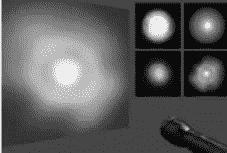
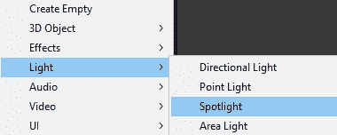

# 游戏开发的第 57 天:如何在 Unity 中使用 Cookies 进行逼真的照明！

> 原文：<https://blog.devgenius.io/day-57-of-game-dev-how-to-use-cookies-for-realistic-lighting-in-unity-5a72cba60119?source=collection_archive---------7----------------------->

**目标:**回顾什么是**cookie**并落实到我的 **Unity** 场景中。

在 **Unity** 中的 **cookie** 是一种只关心 alpha/透明通道的纹理或遮罩。你可以在聚光灯或点光源上使用它们来获得特定的效果，比如手电筒。

对于我的例子，我将把上面的第一张图片(在 google 上找到的)放到我的项目中。我们可以将这个 cookie 应用到聚光灯或点光源上，每个都有一点不同。

让我们从聚光灯开始。我将为我的场景添加一个聚光灯。提高强度和更多，使这真的很容易看到。

在纹理上，我需要设置纹理类型为 **cookie** 。

确保灯光类型设置为**聚光灯**。

然后将 alpha 源设置为**灰度**并检查 **alpha is transparency** 框。

应用更改

回到聚光灯下，将纹理分配给 **cookie** 槽。

点击**修复**。

看哪！

当使用手电筒时，这有助于你的灯光看起来令人惊叹和真实。当然，这可以用来实现许多不同的效果。到聚光灯上！

在我的场景中添加了点光源并提高了亮度以便于观察之后，我将再次处理纹理。做和上次一样的事情，除了不是选择聚光灯，而是选择**点**。并且还要检查**夹具**边缘接缝**盒。然后点击应用！**

然后我会应用纹理，点击**修复**。

使用它，我们可以制作一个非常酷的老式灯。这可以用来做吊灯、烛台等等。

***本文到此为止。如果您有任何问题或建议，请随时评论。让我们做一些很棒的游戏吧！***